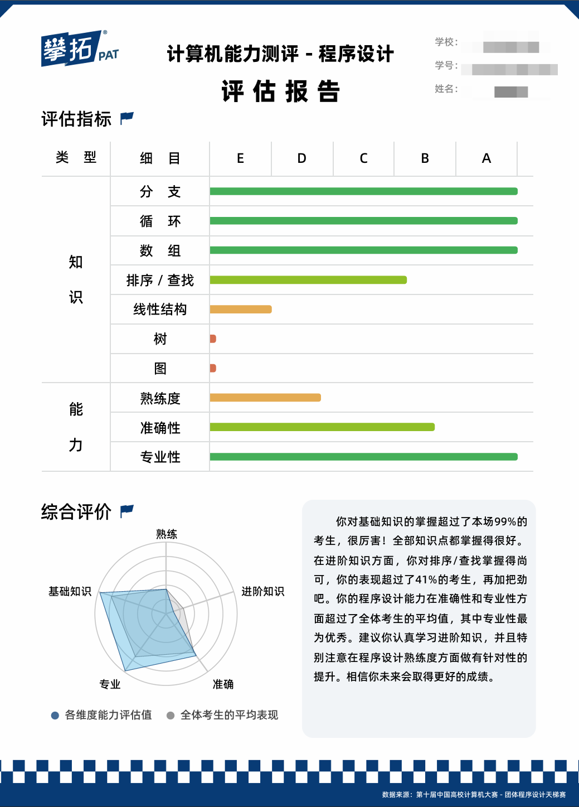

# 26天梯补题及吐槽

### 碎叨

赶到考场时间还是挺紧张的，学校给的双机位设备太差了，调试了好久好久,,,,,依旧干等30分钟，这30分钟想尽了~~悲欢大事~~

开赛PTA依旧卡死，直接看了L1的T3，今年L1非常简单（疑似近些年最简单的一场），快速AKL1(45min)，开L2，L2-1就抽象，读了几遍没太看懂，跳了做L2-2，一道排序二分题，赛时应该是写了一个O(n)查询，过了16分，正解想到了要用到bisect，但是好像要结合字典，脑子热没想出这么处理就摆了。

满怀期待的看了L2-3和L2-4，直接裂开，全部要存图DFS，图论的知识点一点没学过，直接原地退役，L2-3疑似树形结构，全都没学过。

无奈，只能回头看L2-1，读了好几遍，debug了1h，还是只拿了5分，心情很坏，距离结束还有15分钟发现会存在相同值，数据的存储要和第二题类似用字典，但是以及来不及了，遗憾退场。赛后看了二队的得分（二队个人排名2/10），团体省奖，也算是延续了历年苏科二队的实力了hhhhh

赛前准备了很多数学方面的还有区间问题之类的，一个没碰上，两道图论当场宣告退役仪式

赛后~~恶补图论知识~~，摆烂一周()，期待明年可以~~蒸一下个人奖(明年的今日，我会在做什么呢？)~~

PTA给的幽默个人报告(这越看越像“区........”)：



#### L1-1\~L1-6跳过

#### L1-7

[L1-119 网络流量监测 - 团体程序设计天梯赛-练习集](https://pintia.cn/problem-sets/994805046380707840/exam/problems/type/7?problemSetProblemId=2045820921833533446\&page=1 "L1-119 网络流量监测 - 团体程序设计天梯赛-练习集")

```python title="模拟即可"
n = int(input())
a = list(map(int,input().split()))
max_ = max(a)
min_ = min(a)
ave = sum(a)//n
print(max_,min_,ave)
t = []
for i,x in enumerate(a):
    if x > 2*ave:
        t.append(i+1)
if len(t) > 0:
    t.sort()
    print(*t)
else:
    print("Normal")
```


#### L1-8

[L1-120 智慧文本编辑器 - 团体程序设计天梯赛-练习集](https://pintia.cn/problem-sets/994805046380707840/exam/problems/type/7?problemSetProblemId=2045820921833533447\&page=1 "L1-120 智慧文本编辑器 - 团体程序设计天梯赛-练习集")

相比往年字符串题目简单很多，直接模拟即可，Py很好做，C++处理有点困难

#### L2-1

**题意：**

1. 有n本作业，按给定自顶向下顺序，每本有编号和混乱指数，给定初始阈值T。 &#x20;
2. 依次取最上方作业：混乱指数大于T放左堆；小于等于T直接批改，记录编号。 &#x20;
3. 原作业堆取完后，若左堆非空：把T更新为左堆混乱指数总和÷个数向下取整后再整除2，将左堆作为新作业堆重复流程。 &#x20;
4. 循环直到所有作业都批改完，按批改顺序输出作业编号。 &#x20;

**题解：**

赛时代码~~被我删了hhhh~~，相比往年的L2-1的栈模拟来说这个还是有点复杂的，可惜赛时忘记了数值会相同，调了好久错误代码...

细节还是挺多的

```python title="栈模拟"
n, t = map(int, input().split())
a = list(map(int, input().split()))
q = [(i + 1, a[i]) for i in range(n)]
ans = []
while q:
    left = []
    current_sum = 0
    for idx, cur in q:
        if cur <= t:
            ans.append(str(idx))
        else:
            left.append((idx, cur))
            current_sum += cur
    if left:
        t = current_sum // len(left)
        left.reverse()
        q = left
    else:
        break
print(' '.join(ans))
```


#### L2-2

**题意：**

1. 有 `n` 组超参数组合，编号从 10 开始依次递增，每组对应一个性能得分。 &#x20;
2. 先找出得分最高的所有组合编号，按升序输出。 &#x20;
3. 有 `m` 次查询，每次给一个目标值 `x`： &#x20;

- 找得分 ≥ x 里得分最小的组合； &#x20;
- 同分选编号最小； &#x20;
- 无满足条件则输出 10。 &#x20;

**题解：**

很好理解的题意，模拟即可，但是赛时~~昏头~~忘记怎么写map了

```python title="丑陋赛时代码"
n = int(input())
a = list(map(int, input().split()))
d = [(x,i+1) for i,x in enumerate(a)]
d.sort(key = lambda x:(x[0],x[1]))
max_ = max(a)
ans = []
for i, x in enumerate(a):
    if x == max_:
        ans.append(i + 1)
print(*ans)
m = int(input())
for _ in range(m):
    ok = 0
    t = int(input())
    for i in range(n):
        if d[i][0] > t:
            print(d[i][1])
            ok = 1
            break
    if ok == 0:
        print(0)
```


```python title="二分查找正解"
import bisect
def main2():
    n = int(input())
    s = list(map(int,input().split()))
    max_cur = -1
    max_idx = []
    for i,x in enumerate(s):
        if x > max_cur:
            max_cur = x
            max_idx = [i+1]
        elif x == max_cur:
            max_idx.append(i+1)
    print(*max_idx)
    s = sorted([(s[i],i+1) for i in range(n)])
    ss = [x[0] for x in s]
    m = int(input())
    for _ in range(m):
        x = int(input())
        idx = bisect.bisect_right(ss,x)
        if idx < n:
            print(s[idx][1])
        else:
            print(0)
if __name__ == "__main__":
    main2()
```


#### L2-3 &#x20;

**题意：**

1. 藏宝图是以100为根的树，节点分分叉路口和藏宝地（叶子节点）。 &#x20;
2. 每条路径有安全系数，一条路径的价值 = 路径上最小的安全系数。 &#x20;
3. 找所有藏宝地中价值最大的那些： &#x20;

- 第一行输出这个最大价值； &#x20;
- 第二行按非递增顺序输出对应藏宝编号。 &#x20;

**题解：**

从根节点100出发，维护当前路径上的最小安全系数

遍历所有叶子节点，找到最小安全系数最大的那些叶子并记录

```python title="树+DFS遍历"
n = int(input())
g = [[] for _ in range(n)]
out_degree = [0] * n
for i in range(1, n):
    p, s = map(int, input().split())
    g[p].append((i, s))
    out_degree[p] += 1
stack = [(0, 101)]
res = [0] * n
while stack:
    u, cur = stack.pop()
    for v, s_edge in g[u]:
        v_min = cur if cur < s_edge else s_edge
        res[v] = v_min
        stack.append((v, v_min))
ans = -1
best = []
for i in range(n):
    if out_degree[i] == 0:
        val = res[i]
        if val > ans:
            ans = val
            best = [i]
        elif val == ans:
            best.append(i)
print(ans)
best.sort()
print(*(best))
```


#### L2-4

**题意：**

1. 有 n 个想法，编号 1\~n；m 条单向思维跳跃边：`id1 id2 p` 表示从 `id1` 可以跳到 `id2`，概率为 `p%`，边是单向不重复。 &#x20;
2. 给 K 个起点，逐个作为根思维节点，模拟模型推理路径： &#x20;

- 从当前节点出发，在没走过的后继子想法里，选概率p最大的； &#x20;
- 若概率相同，选编号最小的； &#x20;
- 走到没有未访问后继时，路径结束； &#x20;
- 路径不能重复走节点。 &#x20;

1. 对每个起点，按顺序输出推理路径，节点间用 `->` 连接。 &#x20;

**题解：**

实际上就是图上模拟加上一点点贪心（我~~不会~~告诉你我赛时不会建图......）

```python title="模拟+贪心"
def main():
    n, m = map(int,input().split())
    g = [[] for _ in range(n + 1)]
    for _ in range(m):
        u, v, p = map(int, input().split())
        g[u].append((-p, v))
    for u in range(1, n + 1):
        if g[u]:
            g[u].sort()
    t = list(map(int,input().split()))
    roots = t[1:]
    for root in roots:
        path = [root]
        vis = {root}
        cur = root
        while True:
            ok = False
            for neg_p, v in g[cur]:
                if v not in vis:
                    vis.add(v)
                    path.append(v)
                    cur = v
                    ok = True
                    break
            if not ok:
                break
        print("->".join(map(str, path)))
if __name__ == "__main__":
    main()
```


#### L3

L3有点困难，暂时补不动，~~等我在深造深造~~
