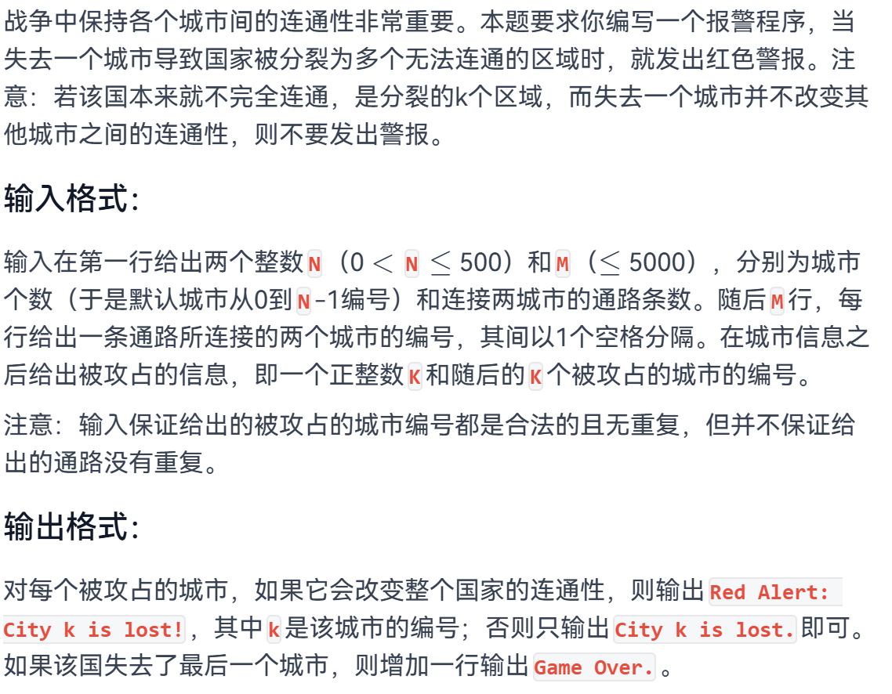
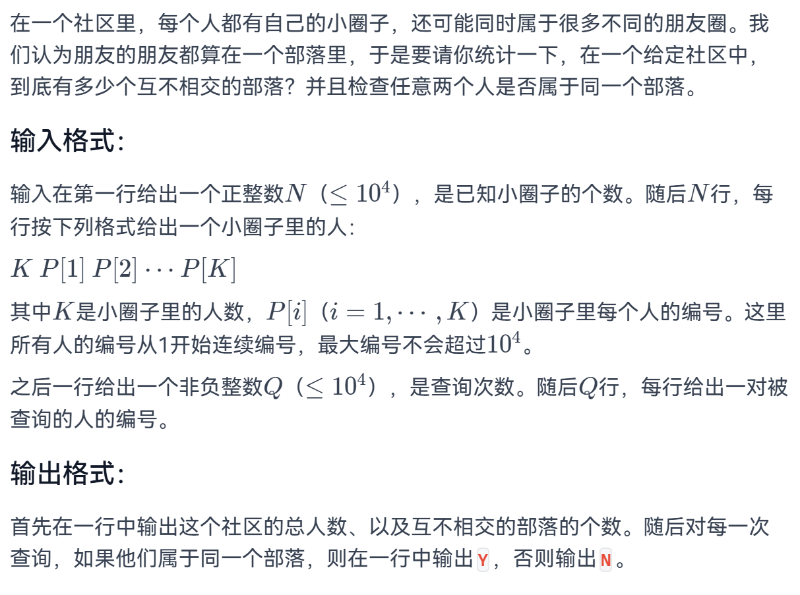
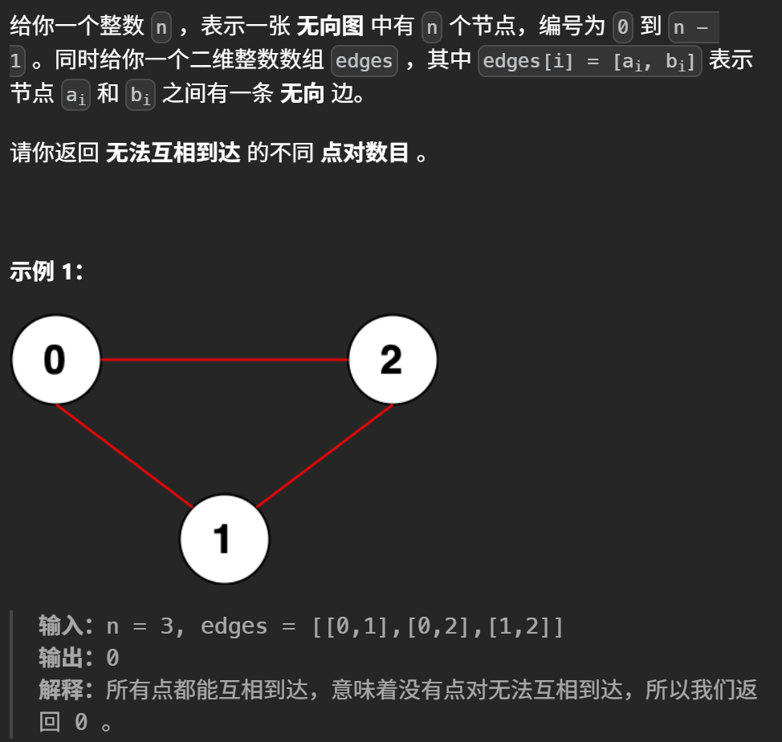
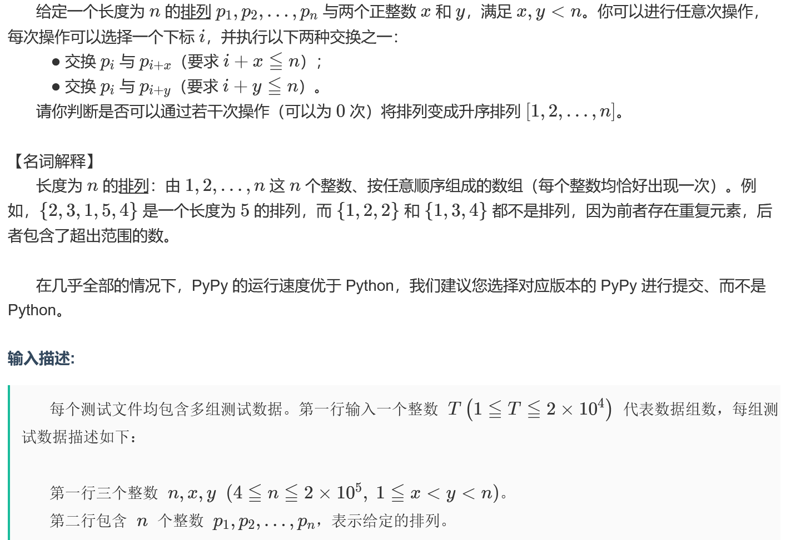

# 并查集

### 原理和板子

并查集（Union-Find）是一种用于处理**不相交集合**合并与查询的数据结构，常用于判断连通性、检测环、求解最小生成树等场景。它主要支持两种操作：

- **查找（find）**：确定某个元素属于哪个集合，通常返回集合的“根”元素（代表元）。
- **合并（union）**：将两个不同的集合合并为一个集合。

```python title="find"
def find(p, x):
    if p[x] != x:
        p[x] = find(p, p[x])   # 路径压缩
    return p[x]
```


- `p` 数组存储每个元素的父节点，根节点的父节点为自身。
- 递归查找根节点，同时将路径上的节点直接指向根，加速后续查找。

```python title="union"
def union(p, rank, x, y):
    rx, ry = find(p, x), find(p, y)
    if rx == ry:
        return False          # 已属同一集合
    # 按秩合并：将秩较小的树接到秩较大的树下
    if rank[rx] < rank[ry]:
        p[rx] = ry
    elif rank[rx] > rank[ry]:
        p[ry] = rx
    else:
        p[ry] = rx
        rank[rx] += 1
    return True
```


- `rank` 数组记录树的“高度”近似值，合并时让矮树挂到高树上，避免树退化为链。

#### 核心功能

- **连通性判断**：`find(x) == find(y)` 表示 `x` 和 `y` 在同一集合中。
- **动态添加关系**：通过 `union` 合并两个节点所在的集合。
- **统计集合个数**：遍历所有节点，`find(i) == i` 的个数即为集合数。

### 天梯L2-013-并查集模拟

- 问题描述

  

```python title="并查集"
def find(p,x):
    if p[x] != x:
        p[x] = find(p,p[x])
    return p[x]
def union(p,rank,x,y):
    rx,ry = find(p,x),find(p,y)
    if rx == ry:
        return
    if rank[rx] < rank[ry]:
        p[rx] = p[ry]
    elif rank[rx] > rank[ry]:
        p[ry] = p[rx]
    else:
        p[ry] = p[rx]
        rank[rx] += 1
def count_components(n, edges, lost):
    p = list(range(n))
    rank = [0]*n
    for u, v in edges:
        if not lost[u] and not lost[v]:
            union(p,rank,u,v)
    res = 0
    for i in range(n):
        if not lost[i] and p[i] == i:
            res += 1
    return res

def main():
    n, m = map(int, input().split())
    edges = []
    for _ in range(m):
        u, v = map(int, input().split())
        edges.append((u, v))
    k = int(input())
    lost = [False] * n
    prev_cnt = count_components(n, edges, lost)

    attacks = list(map(int, input().split()))
    for city in attacks:
        lost[city] = True
        cur_cnt = count_components(n, edges, lost)
        if cur_cnt > prev_cnt:
            print(f"Red Alert: City {city} is lost!")
        else:
            print(f"City {city} is lost.")
        prev_cnt = cur_cnt
    if all(lost):
        print("Game Over.")
if __name__ == "__main__":
    main()
```


### 天梯L2-024-并查集模拟

- 问题描述

  

```python title="并查集"
def find(p,x):
    if p[x] != x:
        p[x] = find(p,p[x])
    return p[x]
def union(p,rank,x,y):
    rx,ry = find(p,x),find(p,y)
    if rx == ry:
        return
    if rank[rx] < rank[ry]:
        p[rx] = p[ry]
    elif rank[rx] > rank[ry]:
        p[ry] = p[rx]
    else:
        p[ry] = p[rx]
        rank[rx] += 1
def main():
    n = int(input())
    MX = 10005
    p = list(range(MX))
    rank = [0]*MX
    people = set()
    for _ in range(n):
        d = list(map(int,input().split()))
        k = d[0]
        ids = d[1:]
        for id in ids:
            people.add(id)
        fir = ids[0]
        for pid in ids[1:]:
            
            union(p,rank,fir,pid)
    tot = len(people)
    root = set()
    for pid in people:
        root.add(find(p,pid))
    t = len(root)
    print(tot,t)
    q = int(input())
    for _ in range(q):
        a,b = map(int,input().split())
        if find(p,a) == find(p,b):
            print("Y")
        else:
            print("N")
if __name__ == "__main__":
    main()
```


### 力扣2316-统计每个连通块的大小

- 问题描述

  给定一个无向图，有 `n` 个节点，编号从 `0` 到 `n-1`。再给定一个边列表 `edges`，每条边连接两个节点。要求计算所有无法互相到达的节点对（即不存在路径连接的两个节点）的数目。注意，点对 `(u, v)` 和 `(v, u)` 视为同一个点对，只计一次。

```python title="统计每个连通块的大小"
class Solution:
    def countPairs(self, n: int, edges: List[List[int]]) -> int:
        def find(p,x):
            if p[x] != x:
                p[x] = find(p,p[x])
            return p[x]
        def union(p,rank,x,y):
            rx,ry = find(p,x),find(p,y)
            if rx == ry:
                return
            if rank[rx] < rank[ry]:
                p[rx] = p[ry]
            elif rank[rx] > rank[ry]:
                p[ry] = p[rx]
            else:
                p[ry] = p[rx]
                rank[rx] += 1
        p = list(range(n))
        rank = [1]*n
        for x,y in edges:
            union(p,rank,x,y)
        # 统计每个连通块的大小
        root_cnt = Counter()
        for i in range(n):
            root = find(p,i)
            root_cnt[root] += 1
        tot = comb(n,2)
        r = 0
        for size in root_cnt.values():
            r += comb(size,2)
        return tot - r

```


### 洛谷P1197-连通块 + 离线逆序处理+邻接表（摧毁后连通块的个数）

- 问题重述

  有一个由 $n$ 个星球组成的星系，初始时某些星球之间通过双向的“以太隧道”相连（这些隧道构成一个无向图）。现在帝国会按顺序摧毁 $k$ 个星球（每次摧毁一个星球，该星球及其相连的所有隧道都会消失）。你需要计算每次摧毁后，剩下的星球之间形成的连通块的数量。输出初始状态（摧毁前）的连通块数，以及每摧毁一个星球后当前的连通块数。

```python title="连通块 + 离线逆序处理+邻接表（摧毁后连通块的个数）"
import sys
sys.setrecursionlimit(200000)

def find(p, x):
    if p[x] != x:
        p[x] = find(p, p[x])
    return p[x]

def union(p, rank, x, y):
    rx, ry = find(p, x), find(p, y)
    if rx == ry:
        return
    if rank[rx] < rank[ry]:
        p[rx] = ry
    elif rank[rx] > rank[ry]:
        p[ry] = rx
    else:
        p[ry] = rx
        rank[rx] += 1

def solve():
    input = sys.stdin.readline
    n, m = map(int, input().split())
    edges = [[] for _ in range(n)]
    for _ in range(m):
        u, v = map(int, input().split())
        edges[u].append(v)
        edges[v].append(u)

    k = int(input())
    order = [int(input()) for _ in range(k)]
    destroyed = [False] * n
    for x in order:
        destroyed[x] = True

    parent = list(range(n))
    rank = [0] * n
    cnt = n - k  # 初始时，未被摧毁的星球都是孤立的

    # 先合并未被摧毁的星球之间的边
    for u in range(n):
        if not destroyed[u]:
            for v in edges[u]:
                if not destroyed[v] and u < v:  # 避免重复
                    if find(parent, u) != find(parent, v):
                        union(parent, rank, u, v)
                        cnt -= 1

    ans = [cnt]  # 最后一个状态（摧毁所有后）的连通块数

    # 逆序添加星球
    for x in reversed(order):
        destroyed[x] = False
        cnt += 1  # 新加一个孤立点
        for v in edges[x]:
            if not destroyed[v]:
                if find(parent, x) != find(parent, v):
                    union(parent, rank, x, v)
                    cnt -= 1
        ans.append(cnt)

    # 输出逆序结果（正序输出）
    for res in reversed(ans):
        print(res)

if __name__ == "__main__":
    solve()
```


### 力扣2316

- 问题描述

  

```python title="统计每个连通块的大小"
class Solution:
    def countPairs(self, n: int, edges: List[List[int]]) -> int:
        '''
        def find(p,x):
            if p[x] != x:
                p[x] = find(p,p[x])
            return p[x]
        def union(p,rank,x,y):
            rx,ry = find(p,x),find(p,y)
            if rx == ry:
                return
            if rank[rx] < rank[ry]:
                p[rx] = p[ry]
            elif rank[rx] > rank[ry]:
                p[ry] = p[rx]
            else:
                p[ry] = p[rx]
                rank[rx] += 1
        p = list(range(n))
        rank = [1]*n
        for x,y in edges:
            union(p,rank,x,y)
        # 统计每个连通块的大小
        root_cnt = Counter()
        for i in range(n):
            root = find(p,i)
            root_cnt[root] += 1
        tot = comb(n,2)
        r = 0
        for size in root_cnt.values():
            r += comb(size,2)
        return tot - r
        '''
        g = [[] for _ in range(n)]
        for x,y in edges:
            g[x].append(y)
            g[y].append(x)
        vis = [False]*n
        # DFS求连通块的数量
        def dfs(x):
            vis[x] = True
            size = 1
            for y in g[x]:
                if not vis[y]:
                    size += dfs(y)
            return size
        size = []
        for i in range(n):
            if not vis[i]:
                size.append(dfs(i))
        tot = comb(n,2)
        r = 0
        for s in size:
            r += comb(s,2)
        return tot - r
```


### AWC53D-用并查集实现快速跳过已涂色的位置+倒序处理

逆序遍历，用并查集实现快速跳过已染色的位置

- 问题描述

  我们有 N 个位置（1 到 N），初始时全部未涂色。
  我们要从后往前处理区间 `[l, r]`，将区间内**尚未涂色**的位置涂上颜色。
  每个位置一旦被涂色，就不再处理（因为后面的操作会覆盖前面的，我们从后往前，所以第一次涂色就是最终颜色）。

  我们需要一种方法，能快速找到区间 `[l, r]` 中**下一个未涂色的位置**。

```python title="并查集+逆序"
import sys
def solve():
    input = sys.stdin.readline
    n, m = map(int, input().split())
    ops = [tuple(map(int, input().split())) for _ in range(m)]
    p = list(range(n + 3))
    def find(x):
        while p[x] != x:
            p[x] = p[p[x]]
            x = p[x]
        return x
    ans = [0] * (n + 1)
    for l, r, c in reversed(ops):
        pos = find(l) # 找到第一个未涂色的位置
        while pos <= r:
            ans[pos] = c
            p[pos] = find(pos + 1) # 将当前位置指向下一个位置
            pos = find(pos) # 继续找下一个未涂色位置
    print(' '.join(map(str, ans[1:])))
if __name__ == "__main__":
    solve()
```


### 力扣1722-使用并查集形成连通分量

- 问题描述和题解思路

  给定两个长度均为 $  n  $ 的整数数组 `source` 和 `target`，以及一个允许交换的索引对列表 `allowedSwaps`。你可以无限次交换 `allowedSwaps` 中任意一对索引对应的元素（交换操作可以传递，即如果 `(a,b)` 和 `(b,c)` 允许交换，那么 `a` 和 `c` 之间也可以间接交换）。通过任意次交换后，你可以重新排列 `source` 中那些属于同一连通分量的元素。目标是使最终 `source` 与 `target` 的 **汉明距离** 最小。汉明距离定义为不同位置上元素值的个数。求这个最小可能的汉明距离。

  **注意**：交换只能在 `allowedSwaps` 给出的索引对之间进行（可传递），且每个连通分量内的元素可以任意排列（因为交换图是传递的）。因此，我们可以将数组索引视为图节点，`allowedSwaps` 为边，形成若干连通分量。在每个分量内，`source` 中的元素可以重新排列成任意顺序。为了最小化汉明距离，我们希望在每个位置上，尽量让 `source` 的元素与 `target` 对应位置的元素相等。因此，对于每个连通分量，我们统计该分量内 `source` 中各元素的频次和 `target` 中各元素的频次，然后可以匹配的数量就是两个频次对应元素的最小值之和，该分量内无法匹配的元素个数即为该分量的贡献。总汉明距离即为所有分量贡献之和。

  具体解法：使用并查集合并所有可以交换的索引对，然后按根分组，对每个组分别统计 `source` 和 `target` 的元素频次，用 `Counter` 计算可匹配的对数（或者直接累加无法匹配的个数），最后求和得到最小汉明距离。

```python title="并查集"
class Solution:
    def minimumHammingDistance(self, source: List[int], target: List[int], allowedSwaps: List[List[int]]) -> int:
        def find(p,x):
            if p[x] != x:
                p[x] = find(p,p[x])
            return p[x]
        def union(p,rank,x,y):
            rx,ry = find(p,x),find(p,y)
            if rx == ry:
                return
            if rank[rx] < rank[ry]:
                p[rx] = p[ry]
            elif rank[rx] > rank[ry]:
                p[ry] = p[rx]
            else:
                p[ry] = p[rx]
                rank[rx] += 1
        n = len(source)
        p = list(range(n))
        rank = [0]*n
        for a,b in allowedSwaps:
            union(p,rank,a,b)
        g = defaultdict(list)
        for i in range(n):
            root = find(p,i)
            g[root].append(i)
        # print(g.values())
        ans = 0
        for idx in g.values():
            cnt = Counter()
            for i in idx:
                cnt[source[i]] += 1
            for i in idx:
                if cnt[target[i]] > 0:
                    cnt[target[i]] -= 1
                else:
                    ans += 1
        return ans
```


### 牛客140周赛E-使用并查集形成连通分量

- 问题描述

  

```python title="并查集"
def find(p, x):
    if p[x] != x:
        p[x] = find(p, p[x])
    return p[x]
def union(p, rank, x, y):
    rx, ry = find(p, x), find(p, y)
    if rx == ry:
        return False
    if rank[rx] < rank[ry]:
        p[rx] = p[ry]
    elif rank[rx] > rank[ry]:
        p[ry] = p[rx]
    else:
        p[ry] = p[rx]
        rank[rx] += 1
    return True
for _ in range(int(input())):
    n, x, y = map(int, input().split())
    p = list(map(int, input().split()))
    pa = list(range(n))
    rank = [0] * n
    for i in range(n):
        if i + x < n:
            union(pa, rank, i, i + x)
        if i + y < n:
            union(pa, rank, i, i + y)
    comp = {}
    for i in range(n):
        root = find(pa, i)
        if root not in comp:
            comp[root] = []
        comp[root].append(i)
    ok = True
    for idx in comp.values():
        val = [p[i] - 1 for i in idx]
        val.sort()
        if val != idx:
            ok = False
            break
    print("Yes" if ok else "No")
```
