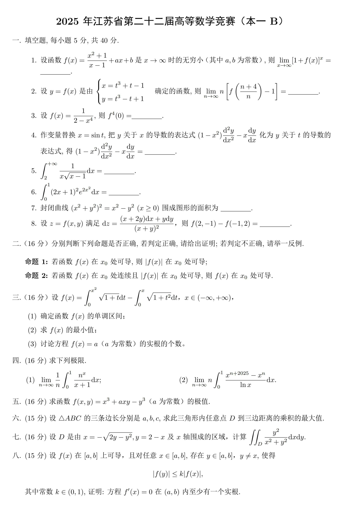

# 数学-5/21-vp25年江苏省数竞(一级B)

 
试题

 
赛时

<embed src="file/2025江苏数竞一级BVP(1)_OYsjDNbnEL.pdf" width="100%" height="600px" type="application/pdf" />

**字如其人这一块（byd，这字诗人写的，也太丑了....）**

 
赛况

花了大概2hvp了一下，得分大概是87(应该是有~~一等水平~~,,,,吗？？)

**先说一、填空题：**

第1题很常规的极限题，根据题目给出的条件求出$a$和$b$的值得到$f(x)$的表达式带入所求极限即可。

第2题通过换元后直接求即可。

第3题是一个有关高阶导数的题目，注意到右式的导数在4次后均为0，故做法是将右式乘到左边，用莱布尼茨公式求解高阶导数。

第4题是一个有关多元微分的题，直接计算即可。

第5题有关定积分的计算，换元后直接计算即可。

第6题是一个可以循环法消掉的一个积分。

第7题和第八题赛时没做出来(好菜)，第7题赛时是往画出函数图像的路子上去了，直接大错特错；第8题看出来是全微分后，第一想法是求积分，但是赛时不知道莫名其妙的为什么没有写出来 ~~(GG)~~

**来到大题，**

第二题命题1是显然的，直接有反列$y = x$；命题2就很有难度了，主要是在于x = 0 时导数是否存在其次需要分别讨论$f(x_{0})$与0的大小关系以此来脱掉绝对值。

第三题计算定积分后按照高中的思路即可求解得到答案，值得注意的是题目给定的积分还是挺难算的($\int sec^3\theta d\theta和\int sec\theta d\theta$)，这张卷子除了第四大题那两个雷霆积分，第二有计算和技巧难度的积分就是这道题目了。

第四题给的两个定积分都挺困难，第一个要用到[积分中值定理](https://baike.baidu.com/item/%E7%A7%AF%E5%88%86%E4%B8%AD%E5%80%BC%E5%AE%9A%E7%90%86/538584 "积分中值定理")(~~不会有人现在还没看证明题相关的定理吧，没错就是我~~)，还有一种解法是夹逼准则；第二个要熟悉$\begin{aligned}\frac{x^{a}-x^{b}}{\ln x}=\int_{b}^{a} x^{t} \mathrm{~d} t\end{aligned}$，然后进行交换积分次序。

第五题主要问题在于$a=0$的情况如何确定驻点是否为极值 **(基础三十讲P326)**。

第六题可以利用柯西不等式或者条件极值 **(基础三十讲P327)**

第七题二重积分的计算，通过极坐标转化即可，赛时忘记右侧边界如何确定了，只算出来了第一个积分,,,值得注意的是，第二个积分既可以：

$$
\begin{aligned}\\I_{1} &= \iint_{D_{1}} \frac{y^{2}}{x^{2} + y^{2}} \, \mathrm{d} x \, \mathrm{d} y = \int_{0}^{\frac{\pi}{2}} \mathrm{d} \theta \int_{0}^{\cos \theta + \sin \theta} \sin^{2} \theta \cdot r \, \mathrm{d} r = \int_{0}^{\frac{\pi}{2}} \frac{2 \sin^{2} \theta}{(\sin \theta + \cos \theta)^{2}} \, \mathrm{d} \theta \\\\&= \int_{0}^{\frac{\pi}{2}} \frac{2 \tan^{2} \theta}{(1 + \tan \theta)^{2}} \, \mathrm{d} \theta (\tan \theta = t) = \int_{0}^{+\infty} \frac{2t^{2}}{(1 + t)^{2}} \frac{1}{1 + t^{2}} \, \mathrm{d} t \\\\&= \int_{0}^{+\infty} \left[ \frac{t}{t^{2} + 1} - \frac{1}{t + 1} + \frac{1}{(t + 1)^{2}} \right] \, \mathrm{d} t = \frac{1}{2} \left( \ln |t^{2} + 1| - \frac{2}{t + 1} - 2 \ln |1 + t| \right)_{0}^{+\infty} = 1.\\\end{aligned}
$$

也可以通过轮换对称性：$\begin{aligned}\\\iint_{D_2}\frac{y^2}{x^2+y^2}\mathrm{d}x\mathrm{d}y=\frac{1}{2}\iint_{D_2}\frac{x^2+y^2}{x^2+y^2}\mathrm{d}x\mathrm{d}y=\frac{1}{2}\cdot\frac{1}{2}\cdot2\cdot2=1\\\end{aligned}$

显然的，在计算有对称性的二重积分，轮换对称性很重要

第八题这个证明，怎么说，看不太懂，要用到反证法，有一种做法是构造辅助函数$g(x) = e^{-x} f(x)$

**个人觉得下面这些题在计算和思维上有难度的"教育意义"：**

填空题7和8

答题第二题的命题2、和第八大题两个证明题

第第三大题、四大题和第七大题积分计算

**知识点上有难度的"教育意义"：**

填空题4（高阶导数计算）

第四大题极限1（夹逼准则+积分中值定理）、极限2（交换积分次序）

第五大题(无条件极值)

第六大题(条件最值)
