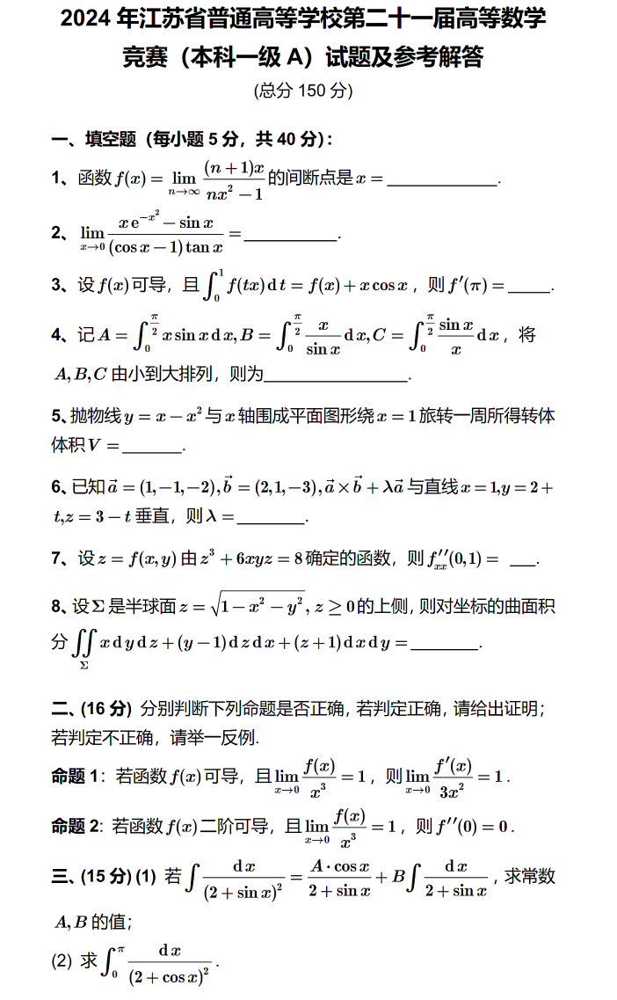
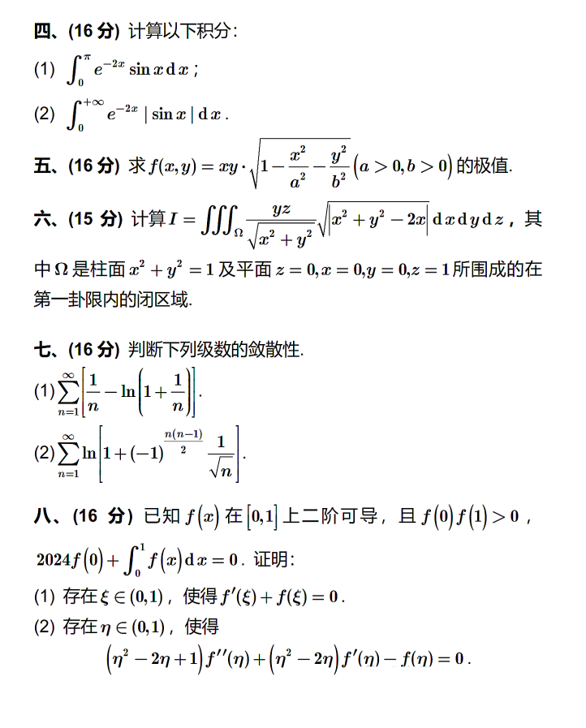

# 数学-5/25-vp24年江苏省数竞(一级B)

[更好的阅读体验](https://www.wolai.com/hyyQDaw9scEsxvChJ1rNYR "更好的阅读体验")

### 试题

 
赛时

[https://www.wolai.com/wQ7cAGPv22PGV234sd844K](https://www.wolai.com/wQ7cAGPv22PGV234sd844K "https://www.wolai.com/wQ7cAGPv22PGV234sd844K")

 
赛况

#### 填空题

**第1题判断**[**间断点**](https://zhuanlan.zhihu.com/p/562120799 "间断点")**，** 当$x=0$时$f(0) = 1$；当$x≠0$时，计算极限得$1/x$，那么显然$x=0$为间断点；

**第2题函数性质，** 首先通过周期性得到等价的所求值，再根据奇函数得到在该区间上的函数表达式即可；

**第3题求极限，** 分母补-x+x即可；

**第4题变上限积分，** 令$tx=u$即可；

**第5题积分性质**，感觉是很阴的一道题，赛时水灵灵的错了；$A=1$是显然的；由$sinx/x<1$可知C<$\pi/2$$=1.57$，又$sinx/x$是单调减函数，故C>$\int_{0}^{\pi/2} 2/\pi dx$$= 1 >A$；B是显然大于A和C的，故而A\<C\<B；

**第6题**[**圆盘法壳层法求旋转体体积**](https://blog.csdn.net/weixin_38291577/article/details/154573988 "圆盘法壳层法求旋转体体积")**，** 由于旋转轴与积分变量垂直，采用壳层法即可；

**第7题多元函数微分**，直接计算就行；

**第8题二重积分+对称性，** 用$y=-x$将积分分割为两部分，一个关于$x$对称，一个关于$y$对称，第二拓积分关于$x$和$y$都是奇函数利用二重积分的对称性即可；

### 大题

**第二大题函数证明题**，两个命题的证明都挺简单，值得注意的是证明命题1的语言规范性；

**第三大题积分计算题**，(1)对等式两边直接求导即可；

(2)由$\begin{aligned}\\\int_{0}^{\pi / 2} f(\sin x) d x=\int_{0}^{\pi / 2} f(\cos x) d x\\\end{aligned}$可得(1)中左侧，计算右侧即可，在计算右侧第二个积分($\begin{aligned}\int_{0}^{\frac{\pi}{2}} \frac{dx}{2 + \sin x}\end{aligned}$)时，可采用三角代换转化为有理函数积分；

**第四大题积分计算，**

(1)$\int e^{-x} \sin x \, dx$直接克拉默法则，如果你~~感兴趣~~，可以试一下欧拉公式求解(hhhh)

2）$a_{n}=\int_{0}^{n\pi}e^{-x}\left|\sin x\right|\mathrm{d}x，求\lim_{n\to\infty}a_{n}$，需要利用周期性，赛时没开出来，等着补题

**第五大题曲线面积**，(1)的凹凸性直接参数方程求导即可；(2)忘记了参数方程形式求面积的公式，，，，等着补题

**第六大题求极值**，$f(x,y) = xy \cdot \sqrt{1 - x^2 - y^2}$，这个极值求导计算量太大，赛时直接不想写了，**实际上通过取对数即可大大减少计算量**，等着补题

**第七大题求二重积分，** 看到绝对值直接不想写了，到这个时候以及没有状态了，最后一个证明也做不出什么，直接放弃，等着补题

 
补题

#### 第四大题(2)

$$
a_n = \int_{0}^{n\pi} e^{-x} |\sin x| \, dx
$$

要计算 &#x20;

$$
\lim_{n \to \infty} a_n
$$

***

利用周期性分段

$|\sin x|$ 的周期为 $\pi$，即 &#x20;

$$
|\sin(x+\pi)| = |-\sin x| = |\sin x|
$$

因此可将积分按每个长度为 $\pi$ 的区间拆分。

对于第 $k$ 个区间 $[(k-1)\pi, k\pi]$，令 &#x20;

$$
x = (k-1)\pi + t,\quad t \in [0,\pi]
$$

则 &#x20;

$$
\sin x = \sin\big((k-1)\pi + t\big) = (-1)^{k-1} \sin t
$$

所以 &#x20;

$$
|\sin x| = |(-1)^{k-1} \sin t| = \sin t
$$

因为 $\sin t \ge 0$ 当 $t \in [0,\pi]$。

于是该区间上的积分为：

$$
= e^{-(k-1)\pi} \int_{0}^{\pi} e^{-t} \sin t \, dt
$$

***

计算单个区间的积分

记

$$
I = \int_{0}^{\pi} e^{-t} \sin t \, dt
$$

$$
\int e^{-t} \sin t \, dt = -\frac12 e^{-t}(\sin t + \cos t)
$$

在 $[0,\pi]$ 上计算：

$$
I = \left[ -\frac12 e^{-t}(\sin t + \cos t) \right]_{0}^{\pi}
$$

当 $t = \pi$ 时，$\sin\pi = 0$，$\cos\pi = -1$，所以值为：

$$
-\frac12 e^{-\pi}(0 - 1) = \frac12 e^{-\pi}
$$

当 $t = 0$ 时，$\sin 0 = 0$，$\cos 0 = 1$，得：

$$
-\frac12 (0+1) = -\frac12
$$

因此：

$$
= \frac12 e^{-\pi} + \frac12
$$

***

$$
a_n = \sum_{k=1}^{n} e^{-(k-1)\pi} \cdot I
$$

$$
= I \sum_{k=1}^{n} e^{-(k-1)\pi}
$$

这是一个有限等比数列求和，公比 $q = e^{-\pi}$，首项为 1（当 $k=1$ 时指数为 0），所以

$$
a_n = I \cdot \frac{1 - e^{-n\pi}}{1 - e^{-\pi}}
$$

***

当 $n \to \infty$，$e^{-n\pi} \to 0$，于是

$$
\lim_{n \to \infty} a_n = \frac{I}{1 - e^{-\pi}}
$$

代入 $I$ 的值：

$$
\lim_{n \to \infty} a_n = \frac{\frac12 (1 + e^{-\pi})}{1 - e^{-\pi}}
$$

#### 第五大题(2)

条件 $y > 0$：

$$
t - t^2 > 0 \implies 0 < t < 1
$$

此时 $L$ 与 x 轴的交点： &#x20;

当 $t = 0$ 时，$y=0$，对应点 $(1, 0)$； &#x20;

当 $t = 1$ 时，$y=0$，对应 $x = 1 - 2 - 1 = -2$，交点为 $(-2, 0)$

面积公式（参数形式）：

$$
A = \int_{t_1}^{t_2} y(t) \cdot \dot{x}(t) \, dt
$$

注意这里参数方向：从交点 $(1,0)$ 到 $(-2,0)$，对应 $t$ 从 0 到 1，且 $\dot{x}<0$，这与沿 x 轴正向积分的方向要匹配。

沿 x 轴正向看，上方的面积计算公式（绝对值形式）为：

$$
A = \left| \int_{0}^{1} y \, \dot{x} \, dt \right|
$$

因为 $y \ge 0$、$\dot{x} < 0$，所以 $y\dot{x} \le 0$，积分结果为负，取绝对值即可。

计算积分：

展开：

$$
(t - t^2)(2 + 3t^2) = 2t + 3t^3 - 2t^2 - 3t^4
$$

积分：

$$
= 1 - \frac{2}{3} + \frac{3}{4} - \frac{3}{5}
$$

通分分母 60：

$$
\frac{60 - 40 + 45 - 36}{60} = \frac{29}{60}
$$

因此：

$$
\int_{0}^{1} y \, \dot{x} \, dt = -\frac{29}{60}
$$

面积：

$$
A = \left| -\frac{29}{60} \right| = \frac{29}{60}
$$

#### 第六大题

求极值：

$$
f(x,y) = xy\sqrt{1 - x^2 - y^2}  
$$

***

$$
1 - x^2 - y^2 \ge 0 \implies x^2 + y^2 \le 1  
$$

所以定义域是闭单位圆盘。

***

首先在**内部**（$x^2 + y^2 < 1$）找驻点。为方便，令

$$
g(x,y) = \ln|f(x,y)| = \ln|x| + \ln|y| + \frac12\ln(1 - x^2 - y^2)  
$$

**二者的驻点等价**

对非零 $x,y$ 可求偏导。

对 $x$ 求偏导： &#x20;

$$
\frac{\partial g}{\partial x} = \frac1x - \frac{x}{1 - x^2 - y^2} = 0  
$$

同理： &#x20;

$$
\frac{\partial g}{\partial y} = \frac1y - \frac{y}{1 - x^2 - y^2} = 0
$$

由第一式： &#x20;

$$
\frac1x = \frac{x}{1 - x^2 - y^2} \implies 1 - x^2 - y^2 = x^2  
$$

由第二式： &#x20;

$$
1 - x^2 - y^2 = y^2  
$$

于是 $x^2 = y^2$，且共同等于 $1 - x^2 - y^2$，因此 &#x20;

$$
x^2 = y^2 = 1 - 2x^2 \implies 3x^2 = 1 \implies x^2 = \frac13  
$$

所以 &#x20;

$$
y^2 = \frac13
$$

可能解：

$$
(x,y) = \left( \pm\frac{1}{\sqrt{3}}, \pm\frac{1}{\sqrt{3}} \right)
$$

***

若 $x,y$ 同号，乘积为正，函数值为：

这是极大值的候选（因为边界上函数值为零）。

若 $x,y$ 异号，函数取负值：

$$
f = -\frac{1}{3\sqrt{3}}
$$

为极小值的候选。

***

当 $x^2+y^2 = 1$ 时，$\sqrt{1-x^2-y^2} = 0$，因此 &#x20;

$$
f(x,y) = 0  
$$

所以边界上的函数值全是 0。

***

当 $x=0$ 或 $y=0$ 时，$f=0$。

***

在定义域内：

- **极大值**：当 $(x,y) = \left(\pm\frac{1}{\sqrt{3}}, \pm\frac{1}{\sqrt{3}}\right)$（同号）时， &#x20;

  $f_{\max} = \frac{1}{3\sqrt{3}}$
- **极小值**：当 $(x,y) = \left(\pm\frac{1}{\sqrt{3}}, \mp\frac{1}{\sqrt{3}}\right)$（异号）时， &#x20;

  &#x20;$f_{\min} = -\frac{1}{3\sqrt{3}}$

#### 第七大题

**题目** &#x20;

$$
I = \iint_{D} \frac{y}{\sqrt{x^{2} + y^{2}}} \sqrt{\left|x^{2} + y^{2} - 2x\right|} \, dx \, dy
$$

$$
D=\left\{(x,y)\mid x^{2}+y^{2}\leq 1,\; x\geq 0,\; y\geq 0\right\}
$$

***

转化为极坐标

令 &#x20;

$$
x = r\cos\theta,\; y = r\sin\theta
$$

则 &#x20;

$$
\frac{y}{\sqrt{x^{2}+y^{2}}} = \sin\theta
$$

$$
|x^2+y^2-2x| = |r^2 - 2r\cos\theta|
$$

雅可比为 $r$，积分区域 $0\leq r\leq 1,\; 0\leq \theta \leq \frac{\pi}{2}$。 &#x20;

于是 &#x20;

$$
I = \int_{0}^{\pi/2} \sin\theta \left[ \int_{0}^{1} r \sqrt{|r^2-2r\cos\theta|}\; dr \right] d\theta
$$

***

交换积分次序

将积分顺序改为先 $\theta$ 后 $r$：

$$
I = \int_{0}^{1} r \left[ \int_{0}^{\pi/2} \sin\theta \sqrt{|r^2 - 2r\cos\theta|} \; d\theta \right] dr
$$

对固定的 $r \in [0,1]$，处理绝对值： &#x20;

$$
|r^2 - 2r\cos\theta| = r|r - 2\cos\theta|
$$

由于 $r\le 1$ 且 $\cos\theta \in [0,1]$， &#x20;

当 $r \le 2\cos\theta$ 时，$r-2\cos\theta \le 0$，绝对值部分为 $2\cos\theta - r$； &#x20;

当 $r \ge 2\cos\theta$ 时，$r-2\cos\theta \ge 0$，绝对值部分为 $r-2\cos\theta$。 &#x20;

分界条件 $r = 2\cos\theta$ 即 $\cos\theta = \frac{r}{2}$，对应 $\theta = \arccos\frac{r}{2}$ （它在 $[0,\frac{\pi}{2}]$ 内）。

因此内层积分分为两段：

***

计算内层积分

令 $u = \cos\theta$，则 $du = -\sin\theta\, d\theta$，上下限依次变换。 &#x20;

第一段：$\theta=0 \to u=1$，$\theta=\arccos(r/2) \to u = r/2$，化为

$$
\int_{r/2}^{1} \sqrt{2u - r}\; du
$$

令 $w = 2u - r$，得

$$
\int_{0}^{2-r} \sqrt{w}\, \frac{dw}{2} = \frac{1}{3}(2-r)^{3/2}
$$

第二段：$\theta=\arccos(r/2) \to u=r/2$，$\theta=\pi/2 \to u=0$，化为

$$
\int_{0}^{r/2} \sqrt{r - 2u}\; du
$$

令 $z = r - 2u$，得

$$
\int_{0}^{r} \sqrt{z}\, \frac{dz}{2} = \frac{1}{3} r^{3/2}
$$

所以内层积分等于

$$
\sqrt{r} \left[ \frac{1}{3}(2-r)^{3/2} + \frac{1}{3} r^{3/2} \right] = \frac{\sqrt{r}}{3} \left[ (2-r)^{3/2} + r^{3/2} \right]
$$

***

计算外层积分

代回 $I$：

第二项简单：

$$
\int_{0}^{1} r^3 \, dr = \frac{1}{4}
$$

第一项：

$$
\int_{0}^{1} r^{3/2} (2-r)^{3/2} dr
$$

令 $r = 2t$，则 $dr = 2dt$，$t$ 从 $0$ 到 $1/2$：

$$
\int_{0}^{1/2} (2t)^{3/2} (2-2t)^{3/2} \cdot 2\, dt = 2^{4} \int_{0}^{1/2} t^{3/2} (1-t)^{3/2} dt
$$

再令 $t = \sin^2\phi$，$dt = 2\sin\phi\cos\phi\, d\phi$，积分限 $0 \to \pi/4$：

$$
16 \int_{0}^{\pi/4} \sin^3\phi \cos^3\phi \cdot 2\sin\phi\cos\phi \, d\phi = 32 \int_{0}^{\pi/4} \sin^4\phi \cos^4\phi \, d\phi
$$

利用 $\sin^4\phi \cos^4\phi = \frac{1}{16}\sin^4(2\phi)$ 并展开：

$$
\sin^4(2\phi) = \frac{3}{8} - \frac{1}{2}\cos4\phi + \frac{1}{8}\cos8\phi
$$

于是积分

$$
= 2 \left[ \frac{3}{8}\phi - \frac{1}{8}\sin4\phi + \frac{1}{64}\sin8\phi \right]_{0}^{\pi/4}
$$

***

合并

$$
I = \frac{1}{3} \left( \frac{3\pi}{16} + \frac{1}{4} \right) = \frac{\pi}{16} + \frac{1}{12}
$$
