# 月总结

## 目录

- [暴力](#暴力)
  - [蓝桥寒假训练营2D3-T4](#蓝桥寒假训练营2D3-T4)
- [思维题+博弈](#思维题博弈)
  - [35蓝桥算法挑战赛T2](#35蓝桥算法挑战赛T2)
  - [35蓝桥算法挑战赛T3](#35蓝桥算法挑战赛T3)
  - [34蓝桥算法入门赛T4](#34蓝桥算法入门赛T4)
  - [35蓝桥算法入门赛T5](#35蓝桥算法入门赛T5)
- [复杂模拟](#复杂模拟)
  - [ABC452-C](#ABC452-C)
  - [蓝桥寒假训练营1D1-T1](#蓝桥寒假训练营1D1-T1)
- [子序列子串类](#子序列子串类)
  - [蓝桥寒假训练营2D4-T2-板子\*](#蓝桥寒假训练营2D4-T2-板子)
  - [ABC452-D](#ABC452-D)
  - [力扣300](#力扣300)
  - [最长公共子串](#最长公共子串)
  - [最长公共子序列](#最长公共子序列)
  - [洛谷P1020](#洛谷P1020)
  - [洛谷1439](#洛谷1439)
  - [CF-264B(难)](#CF-264B难)
  - [牛客周赛Round137-D](#牛客周赛Round137-D)
  - [35蓝桥算法挑战赛T4](#35蓝桥算法挑战赛T4)
- [区间类问题/贪心](#区间类问题贪心)
  - [蓝桥寒假训练营2D1-T6](#蓝桥寒假训练营2D1-T6)
  - [牛客Round137周赛-E](#牛客Round137周赛-E)
  - [力扣986](#力扣986)
  - [力扣435](#力扣435)
- [反悔贪心](#反悔贪心)
  - [AWC40-D](#AWC40-D)
  - [力扣1642](#力扣1642)
  - [36蓝桥算法入门赛-T5](#36蓝桥算法入门赛-T5)
  - [36蓝桥算法入门赛-T6](#36蓝桥算法入门赛-T6)
- [线性DP](#线性DP)
  - [苯环杯蓝桥省赛模拟赛-H](#苯环杯蓝桥省赛模拟赛-H)
- [01背包类](#01背包类)
  - [蓝桥寒假训练营2D5-T3](#蓝桥寒假训练营2D5-T3)
  - [P2347-01背包](#P2347-01背包)
  - [P1048-01背包](#P1048-01背包)
  - [CF-687/C](#CF-687C)
- [完全背包类](#完全背包类)
  - [力扣279](#力扣279)
  - [蓝桥寒假训练营2D4-T5](#蓝桥寒假训练营2D4-T5)
  - [蓝桥寒假训练营2D3-T6](#蓝桥寒假训练营2D3-T6)
- [前缀和/差分](#前缀和差分)
  - [AWC42-D-板子\*](#AWC42-D-板子)
  - [AWC36-D](#AWC36-D)
  - [力扣238](#力扣238)
  - [力扣1314](#力扣1314)
- [二分+双指针/滑动窗口](#二分双指针滑动窗口)
  - [AWC41-B](#AWC41-B)
  - [AWC36-C](#AWC36-C)
  - [AWC41-C](#AWC41-C)
  - [蓝桥寒假训练营2D1-T4](#蓝桥寒假训练营2D1-T4)
  - [蓝桥寒假训练营2D3-T4](#蓝桥寒假训练营2D3-T4)
  - [力扣719](#力扣719)
  - [力扣287](#力扣287)
  - [AWC37-C](#AWC37-C)
  - [蓝桥寒假训练营1D3-T3](#蓝桥寒假训练营1D3-T3)
  - [AWC45-E](#AWC45-E)
- [字典/集合](#字典集合)
  - [力扣3741](#力扣3741)
  - [力扣36有效的数独](#力扣36有效的数独)
- [优先队列heapq](#优先队列heapq)
  - [AWC41-D](#AWC41-D)
  - [力扣347](#力扣347)
- [双端队列](#双端队列)
  - [牛客周赛Round137-B](#牛客周赛Round137-B)
  - [苯环杯蓝桥省赛模拟赛-E](#苯环杯蓝桥省赛模拟赛-E)
- [单调栈](#单调栈)
  - [力扣739](#力扣739)
  - [AWC41-E](#AWC41-E)
  - [苯环杯蓝桥省赛模拟赛-F](#苯环杯蓝桥省赛模拟赛-F)
- [DFS](#DFS)
  - [排列行回溯与子集型回溯](#排列行回溯与子集型回溯)
  - [蓝桥寒假训练营2D4-T1](#蓝桥寒假训练营2D4-T1)
  - [蓝桥寒假训练营2D3-T4](#蓝桥寒假训练营2D3-T4)
  - [蓝桥寒假训练营1D5-T2](#蓝桥寒假训练营1D5-T2)
  - [ABC451-D](#ABC451-D)
  - [力扣-51](#力扣-51)
- [并查集](#并查集)
  - [蓝桥寒假训练营2D1-T6板子\*](#蓝桥寒假训练营2D1-T6板子)
  - [洛谷P1551](#洛谷P1551)
  - [CF227A](#CF227A)
- [时间处理datetime](#时间处理datetime)
  - [蓝桥寒假训练营2D1-T3](#蓝桥寒假训练营2D1-T3)
- [矩阵问题](#矩阵问题)
  - [力扣48](#力扣48)
  - [力扣36](#力扣36)
  - [洛谷1784](#洛谷1784)
- [数学-GCD](#数学-GCD)
  - [蓝桥寒假训练营2D1-T5](#蓝桥寒假训练营2D1-T5)
- [数学-质因数分解](#数学-质因数分解)
  - [蓝桥寒假训练营2D4-T5](#蓝桥寒假训练营2D4-T5)
  - [洛谷1414-快速求一个数的所有正因子](#洛谷1414-快速求一个数的所有正因子)
  - [34蓝桥算法入门赛-T5](#34蓝桥算法入门赛-T5)
  - [AWC45-D](#AWC45-D)
- [数学-博弈](#数学-博弈)
  - [CF-1033](#CF-1033)
- [数学-进制转换-板子\*](#数学-进制转换-板子)
- [数学-奇偶](#数学-奇偶)
  - [蓝桥寒假训练营2D5-T5](#蓝桥寒假训练营2D5-T5)
- [数学-逆元/组合数学](#数学-逆元组合数学)
  - [AWC42-C](#AWC42-C)
  - [AWC38-D](#AWC38-D)
  - [AWC37-D](#AWC37-D)
  - [蓝桥寒假训练营1D4-T5](#蓝桥寒假训练营1D4-T5)
  - [蓝桥寒假训练营2D5-T4](#蓝桥寒假训练营2D5-T4)
- [数学-位运算](#数学-位运算)

## 暴力

### 蓝桥寒假训练营2D3-T4

- 问题描述

  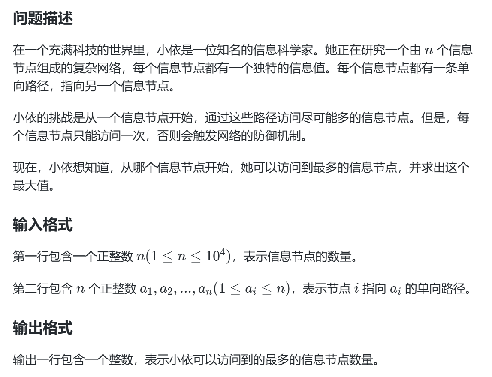

```python title="遇到自己时停止"
n = int(input())
a = [0] + list(map(int,input().split()))
ans = 0
for i in range(1,n+1):
    cur = i
    s = set()
    while cur not in s:
        s.add(cur)
        cur = a[cur]
    ans = max(ans,len(s))
print(ans)
```


## 思维题+博弈

### 35蓝桥算法挑战赛T2

- 问题描述

  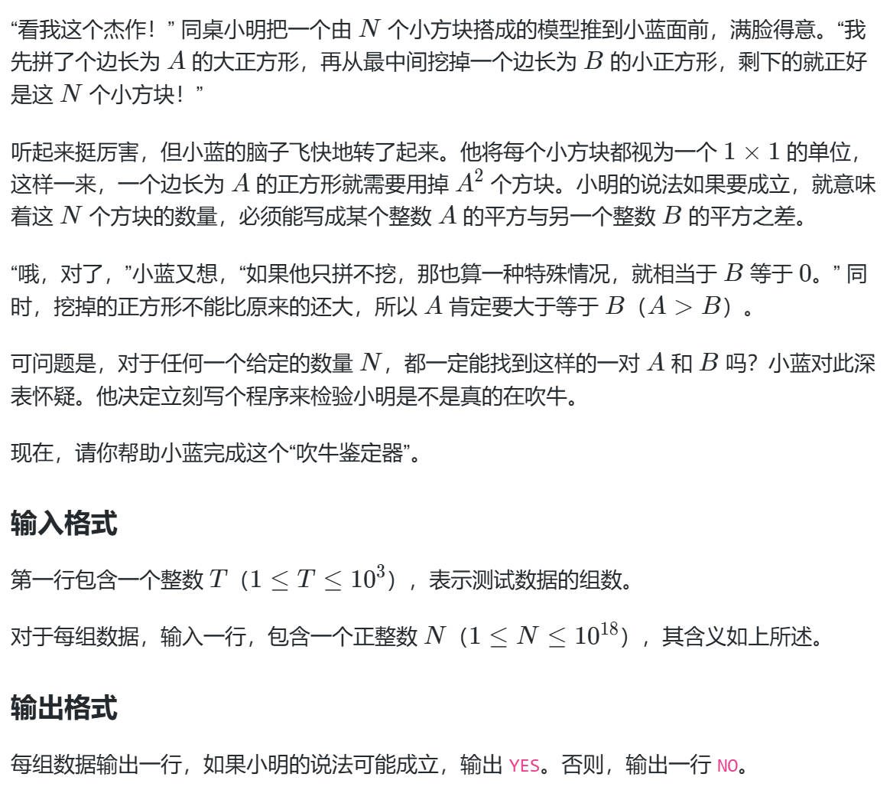

```python title="题解代码"
def solve():
    T = int(input())
    for _ in range(T):
        N = int(input())
        if N % 2 == 1:
            print("YES")
        else:
            if N % 4 == 0:
                print("YES")
            else:
                print("NO")

if __name__ == "__main__":
    solve()
```


### 35蓝桥算法挑战赛T3

- 问题描述

  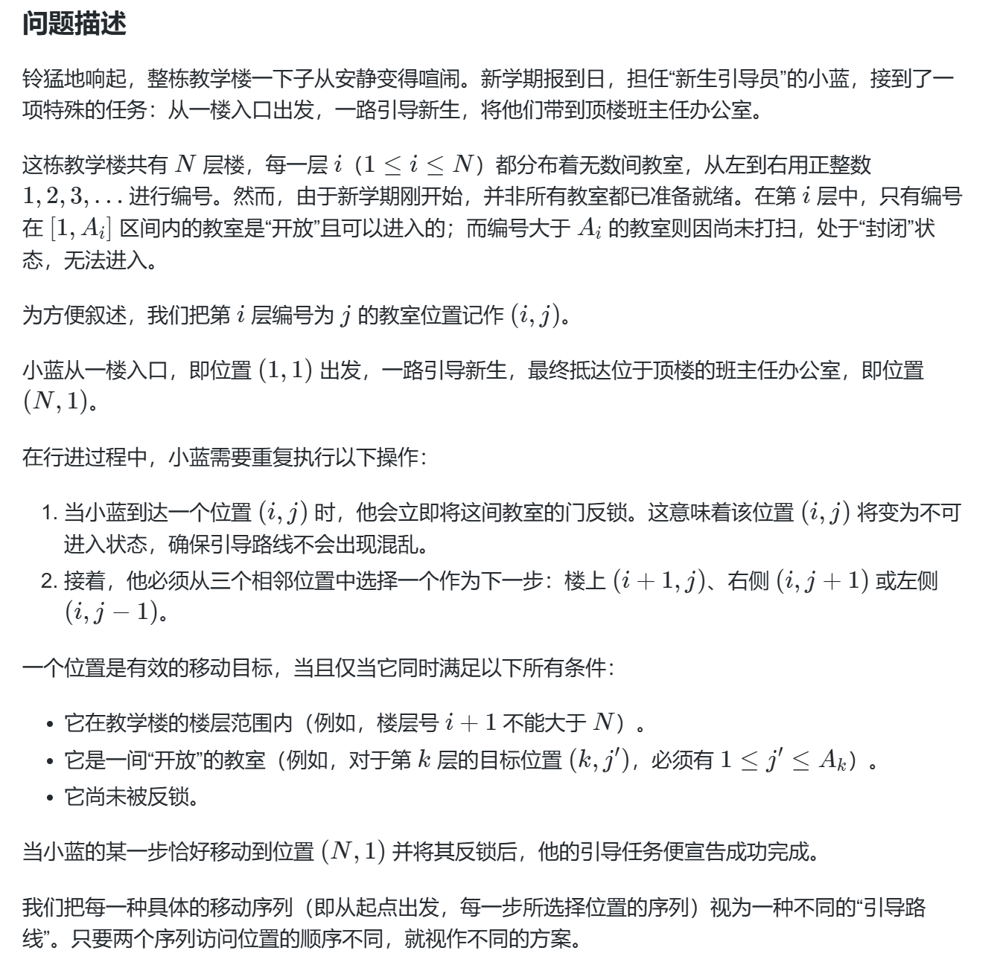

```python title="题解代码"
import sys
def solve():
    n = int(input())
    a = list(map(int,input().split()))
    ans = 1
    mod = 998244353
    # 每一层的移动决策点数量即为 min(A[i], A[i+1])
    for i in range(n - 1):
        common = min(a[i], a[i+1])
        ans = (ans * common) % mod
    print(ans)
if __name__ == "__main__":
    solve()
```


### 34蓝桥算法入门赛T4

- 问题描述

  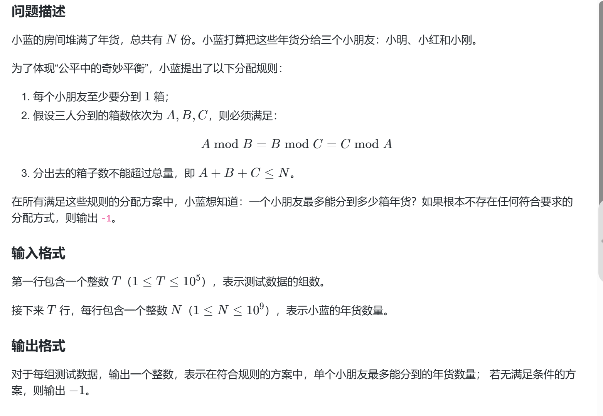

```python title="题解代码"
def main():
    for _ in range(int(input())):
        n = int(input())
        # a,b,c有共同的公因子
        # a <= n - b - c
        ans = n//3
        if ans > 0:
            print(ans)
        else:
            print(-1)
if __name__ == '__main__':
    main()
```


### 35蓝桥算法入门赛T5

- 问题描述

  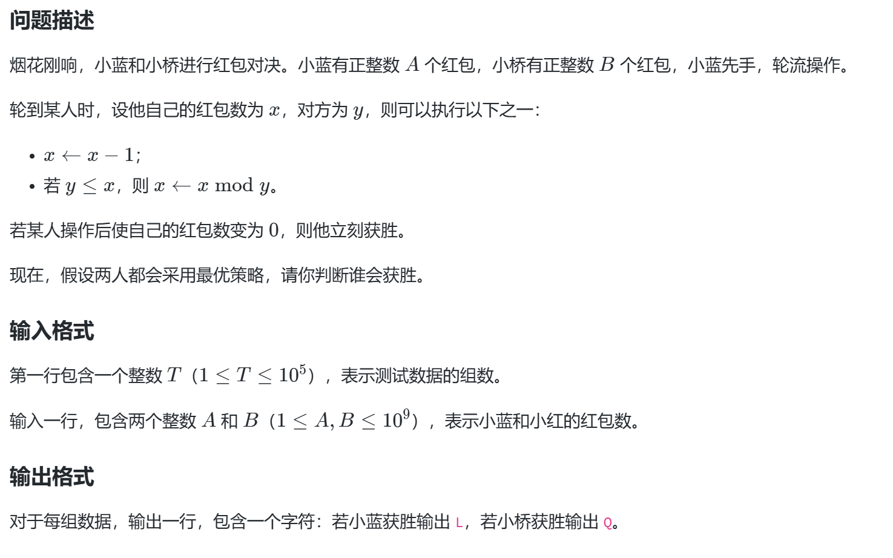

```python title="题解代码"
for _ in range(int(input())):
    a,b = map(int,input().split())
    if a%b == 0:
        print('L')
    elif a == 1:
        print('L')
    elif a < b:
        print('Q')
    elif a == b + 1:
        print('Q')
    else:
        print("L")
```


## 复杂模拟

### ABC452-C

[Tasks - AtCoder Beginner Contest 452](https://atcoder.jp/contests/abc452/tasks "Tasks - AtCoder Beginner Contest 452")

- 问题描述

  艺术家高砂创造了一个鱼骨架形状的物体。

  该物体由 N 肋骨和一根脊柱组成。肋骨编号为 1 到 N 。

  他想在每块 N+1 骨头上写一个字符串，满足以下所有条件。
  - 书脊上写的字符串长度是 N 。
  - 对于每根肋骨 i=1,…,N ，保持以下操作。
    - 肋条上写的字符串 i 的长度是 Ai 。
    - 写在肋骨上的字符串的第 Bi 个字符 i 等于写在书脊上的字符串的第 i 个字符。
  - N+1 骨头上写的每个字符串都是 S1,⋯,SM 之一（允许重复）。
    S1,⋯,SM 是由小写英文字母组成的字符串，并且它们都是不同的。
  对于每个 j=1,⋯,M ，回答以下问题。
  - 在满足条件的字符串写法中，有没有一种写在书脊上的字符串是 Sj ？

```python title="模拟"
def main2():
    n = int(input())
    r = []
    for _ in range(n):
        a,b = map(int,input().split())
        r.append((a,b))
    m = int(input())
    S = []
    ex = [set() for _ in range(n)]
    for _ in range(m):
        S.append(input())
    for s in S:
        s_len = len(s)
        for i in range(n):
            tar_len,tar_pos = r[i]
            if s_len == tar_len:
                ch = s[tar_pos - 1]
                ex[i].add(ch)
        # print(ex)
    for s in S:
        if len(s) != n:
            print("No")
            continue
        is_p = True
        for i in range(n):
            ch_need = s[i]
            if ch_need not in ex[i]:
                is_p = False
                break
        print("Yes" if is_p else "No")
if __name__ == "__main__":
    main2()
```


### 蓝桥寒假训练营1D1-T1

- 问题描述

  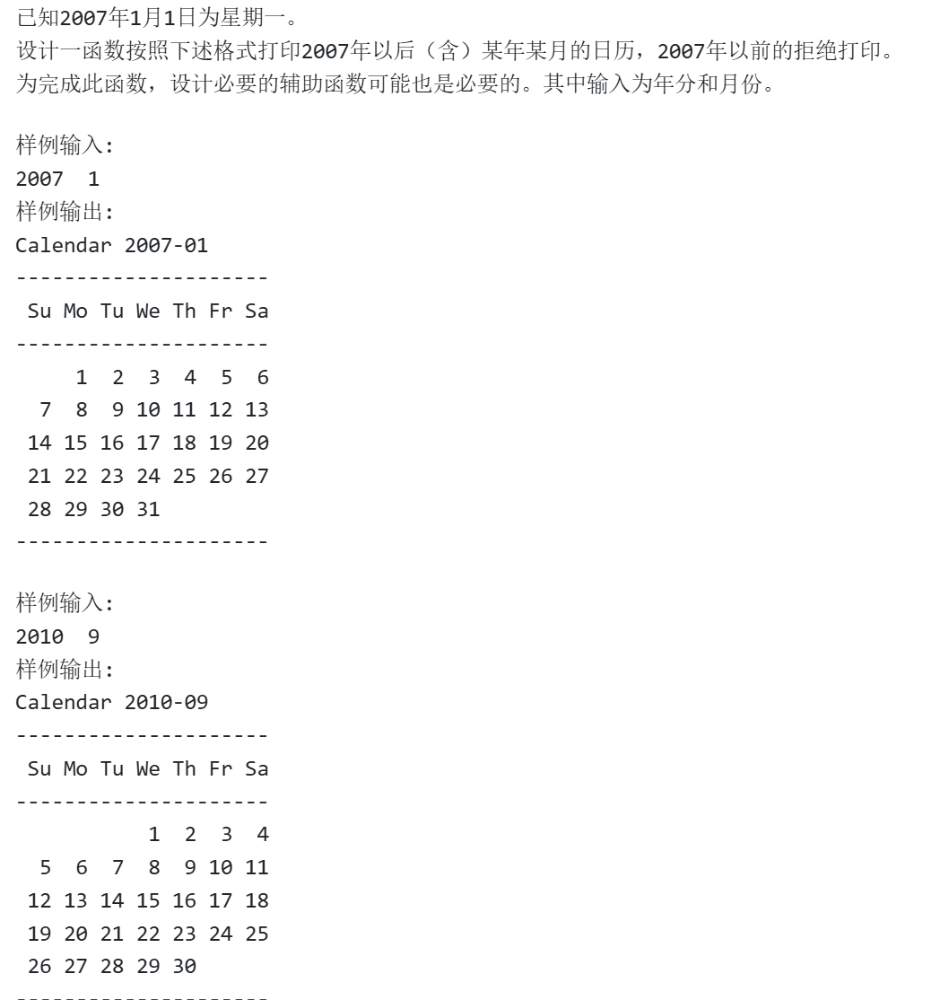

```python title="时间处理+输出模拟"
import datetime
def print_calendar1(year, month):
    if year < 2007:
        print("Year must be >= 2007")
        return
    # 获取该月第一天是星期几（0=星期一，6=星期日）
    first_day = datetime.date(year, month, 1).weekday()
    # 转换为星期日=0的格式（calendar 模块的格式）
    # weekday(): 0=星期一, 1=星期二, ..., 6=星期日
    # 我们需要 0=星期日, 1=星期一, ..., 6=星期六
    start_weekday = (first_day + 1) % 7
    # 获取该月的天数
    if month == 12:
        next_month = datetime.date(year + 1, 1, 1)
    else:
        next_month = datetime.date(year, month + 1, 1)
    days = (next_month - datetime.date(year, month, 1)).days
    # 输出表头
    print(f"Calendar {year}-{month:02d}")
    print("---------------------")
    print(" Su Mo Tu We Th Fr Sa")
    print("---------------------")

    # 输出日期
    # 先输出第一行的空格
    print(" " * (3 * start_weekday), end="")
    for d in range(1, days + 1):
        print(f"{d:3d}", end="")
        if (start_weekday + d) % 7 == 0:
            print()  # 换行
        else:
            print(" ", end="")
    # 如果最后一行没有换行，补一个换行
    if (start_weekday + days) % 7 != 0:
        print()
    print("---------------------")
if __name__ == "__main__":
    y, m = map(int, input().split())
    print_calendar1(y, m)
```


## 子序列子串类

### 蓝桥寒假训练营2D4-T2-板子\*

**长度为k的严格递增子序列的个数**

- **题目描述**

  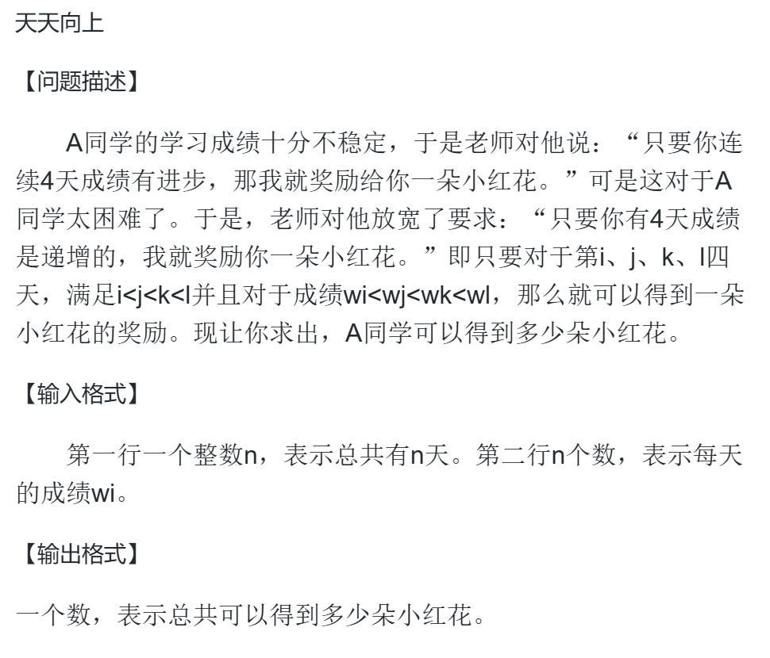

```python title="长度为k的严格递增子序列的个数"
def f(a,k):
    n = len(a)
    if k == 0:
        return 1
    dp = [[0]*n for _ in range(k+1)]
    for i in range(n):
        dp[1][i] = 1
    for t in range(2,k+1):
        for i in range(n):
            for j in range(i):
                if a[j] < a[i]:
                    dp[t][i] += dp[t - 1][j]
    ans = sum(dp[k][i] for i in range(n))
    return ans
n = int(input())
a = list(map(int,input().split()))
print(f(a,4))
```


### ABC452-D

**字符串S的所有连续子串中，统计出那些不包含T作为子序列的个数**

- 问题描述

  给你由小写英文字母组成的字符串 $S$ 和 $T$ 。

  在 $S$ 的非空子串 $s$ 中，请计算那些不包含 $T$ 的子串（不一定连续）。

  在这里， $S$ 的两个子串如果取自不同的位置，即使它们作为字符串是相等的，也会被区分开来。

  什么是子串？字符串 $X$ 的子串是通过删除 $X$ 开头的零个或多个字符和结尾的零个或多个字符得到的字符串。字符串 $X$ 的子串是指从 $X$ 中删除零个或多个元素，并将剩余元素按原来的顺序排列得到的字符串。

```python title="子序列自动机"
def main2():
    s = input().strip()
    t = input().strip()
    n,m = len(s),len(t)
    # 序列自动机
    # n_p[i][ch]储存的是：从s的第i个位置开始往后看，字符ch第一次出现的下标
    n_p = [[n]*26 for _ in range(n+1)] # n代表不存在
    for i in range(n-1,-1,-1):
        for j in range(26):
            n_p[i][j] = n_p[i+1][j]
        n_p[i][ord(s[i]) - ord('a')] = i

    ans = 0
    end = [n]*(n+1)
    for i in range(n-1,-1,-1):
        cur = i
        pos = True
        for ch in t:
            ch_p = ord(ch) - ord('a')
            if cur >= n or n_p[cur][ch_p] == n:
                pos = False
                break
            cur = n_p[cur][ch_p] + 1
        if pos:
            end[i] = cur - 1
        else:
            end[i] = n
        ans += (end[i] - i)
    print(ans)
if __name__ == "__main__":
    main2()
```


### 力扣300

**最长递增子序列**

- 问题描述

  

```python title="最长递增子序列"
class Solution:
    def lengthOfLIS(self, a: List[int]) -> int:
        t = []
        for x in a:
            pos = bisect.bisect_left(t,x)
            if pos == len(t):
                t.append(x)
            else:
                t[pos] = x
        return len(t)
```


### 最长公共子串

```python title="最长公共字串"
# 最长公共字串
s1 = input().strip()
s2 = input().strip()
n,m = len(s1),len(s2)
max_ = end_ = 0
dp = [[0]*(m+1) for _ in range(n+1)]
for i in range(1,n+1):
    for j in range(1,m+1):
        if s1[i-1] == s2[j-1]:
            dp[i][j] = dp[i-1][j-1] + 1
            if dp[i][j] > max_:
                max_ = dp[i][j]
                end_ = i
        else:
            dp[i][j] = 0
print(s1[end_ - max_:end_])

```


### 最长公共子序列

```python title="最长公共子序列"
# 最长公共子序列
n,m = map(int,input().split())
a = list(map(int,input().split()))
b = list(map(int,input().split()))
dp = [[0]*(m+1) for _ in range(n+1)]
for i in range(1,n+1):
    for j in range(1,m+1):
        if a[i-1] == b[j-1]:
            dp[i][j] = dp[i-1][j-1] + 1
        else:
            dp[i][j] = max(dp[i][j-1],dp[i-1][j])
print(dp[n][m])
```


### 洛谷P1020

**最长不上升子序列+最长递增子序列**

- 问题描述

  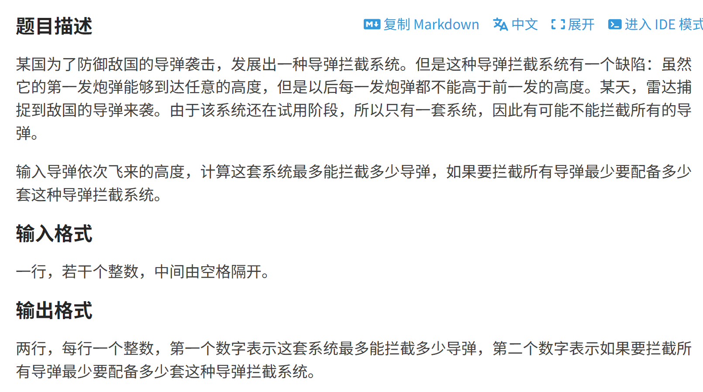

```python title="最长不上升子序列+最长递增子序列"
import bisect
a = list(map(int,input().split()))
t1 = []
# 最长不上升子序列(可以相等)
for x in a:
    pos = bisect.bisect_right(t1,-x)
    if pos == len(t1):
        t1.append(-x)
    else:
        t1[pos] = -x
# 最长递增子序列(严格递增)
t2 = []
for x in a:
    pos = bisect.bisect_left(t2,x)
    if pos == len(t2):
        t2.append(x)
    else:
        t2[pos] = x
print(len(t1))
print(len(t2))
```


### 洛谷1439

**最长公共子序列→最长递增子序列**

- 问题描述

  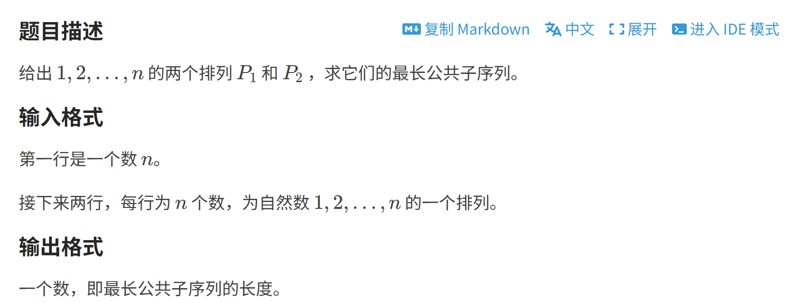

```python title="映射+最长递增子序列"
import bisect
# 求最长递增子序列
def f(a):
    t = []
    for x in a:
        pos = bisect.bisect_left(t,x)
        if pos == len(t):
            t.append(x)
        else:
            t[pos] = x
    return t
# 求最长公共子序列
def f2(a,b):
    n = len(a)
    m = len(b)
    dp = [[0] * (m + 1) for _ in range(n+1)]
    for i in range(1,n+1):
        for j in range(1,m+1):
            if a[i-1] == b[j-1]:
                dp[i][j] = dp[i-1][j-1] + 1
            else:
                dp[i][j] = max(dp[i-1][j],dp[i][j-1])
    return dp[n][m]
# TLE
def main():
    s = int(input())
    s1 = list(map(int,input().split()))
    s2 = list(map(int,input().split()))
    t1 = f(s1)
    t2 = f(s2)
    ans = f2(s1,s2)
    print(ans)
# 映射
def main2():
    n = int(input())
    a = list(map(int,input().split()))
    b = list(map(int,input().split()))
    pos = [0]*(n+1)
    for idx,val in enumerate(b):
        pos[val] = idx
    c = [pos[val] for val in a]
    ans = f(c)
    print(len(ans))
if __name__ == "__main__":
    main2()
```


### CF-264B(难)

- 问题描述

  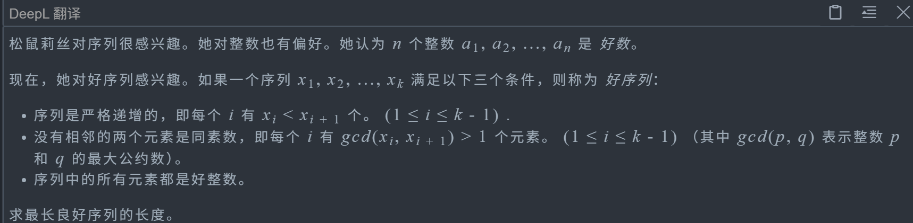

```python title="质因数分解+最长递增子序列"
def main():
    n = int(input())
    a = list(map(int, input().split()))
    if n == 1:
        print(1)
        return
    max_val = max(a)
    lpf = list(range(max_val + 1))
    for i in range(2,int(max_val**0.5) + 1):
        if lpf[i] == i:
            for j in range(i*i,max_val + 1,i):
                if lpf[j] == j:
                    lpf[j] = i
    b = [0]*(max_val + 1)
    ans = 0
    for x in a:
        fa = set()
        y = x
        while y > 1:
            p = lpf[y]
            fa.add(p)
            while y % p == 0:
                y //= p
        cur = 1
        for p in fa:
            cur = max(cur,b[p] + 1)
        ans = max(ans,cur)
        for p in fa:
            b[p] = max(b[p],cur)
    print(ans)
if __name__ == "__main__":
    main()
```


### 牛客周赛Round137-D

- 问题描述

  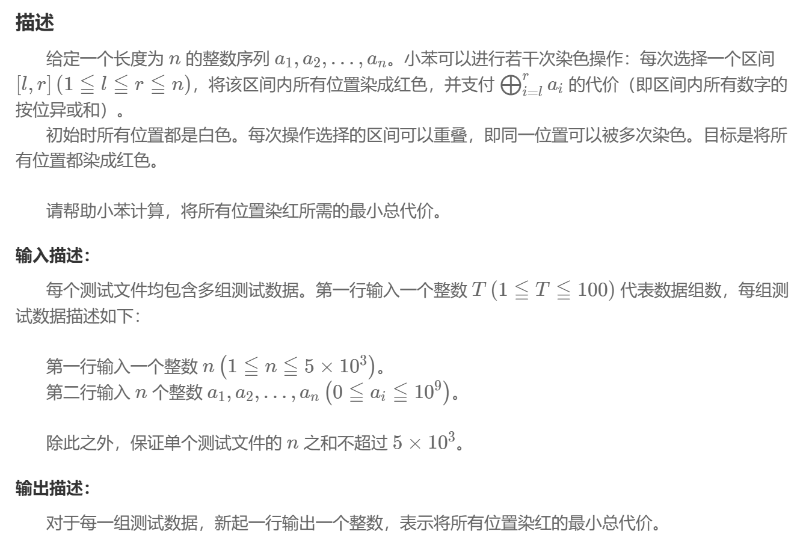

```python title="线性dp"
for _ in range(int(input())):
    n = int(input())
    a = list(map(int,input().split()))
    acc = [0]*(n+1)
    for i in range(n):
        acc[i+1] = acc[i] ^ a[i]
    dp = [float("inf")] * (n + 1)
    dp[0] = 0
    for i in range(n):
        for j in range(i+1,n+1):
            dp[j] = min(dp[j],dp[i] + (acc[j] ^ acc[i]))
        for j in range(n,0,-1):
            dp[j-1] = min(dp[j-1],dp[j])
    print(dp[n])
```


- **那为什么需要反向传播？**

  因为第一段代码中，我们只用了 `i` 去更新 `j > i`，但 `dp[j]` 可能通过 `j-1` 得到更优值，而 `j-1` 又可能通过 `j` 得到更优值？这看起来矛盾，因为 `j > j-1`，所以 `j` 不能从 `j-1` 转移过来？

  实际上，这里的反向传播是为了**让 ****`dp[j-1]`**** 能够利用 ****`dp[j]`**** 的信息**。但按照转移方向，`j` 比 `j-1` 大，所以理论上 `j` 不可能帮助更新 `j-1`。

  **所以这个反向传播的真正作用是：**

  在第一段循环中，我们按顺序 `i=0,1,2,...` 更新。当 `i=1` 时，我们可能更新了 `dp[2]`，但 `dp[2]` 可能比 `dp[1]` 更小，而 `dp[1]` 已经在前面的 `i=0` 步中被处理过了。反向传播让后面的小值能够“传”回前面，使得下一次循环时 `dp[i]` 是最小值。

  这实际上是在模拟**动态规划中的“后效性”处理**——因为我们的转移不是按拓扑序进行的，需要多轮松弛。

### 35蓝桥算法挑战赛T4

- 问题描述

  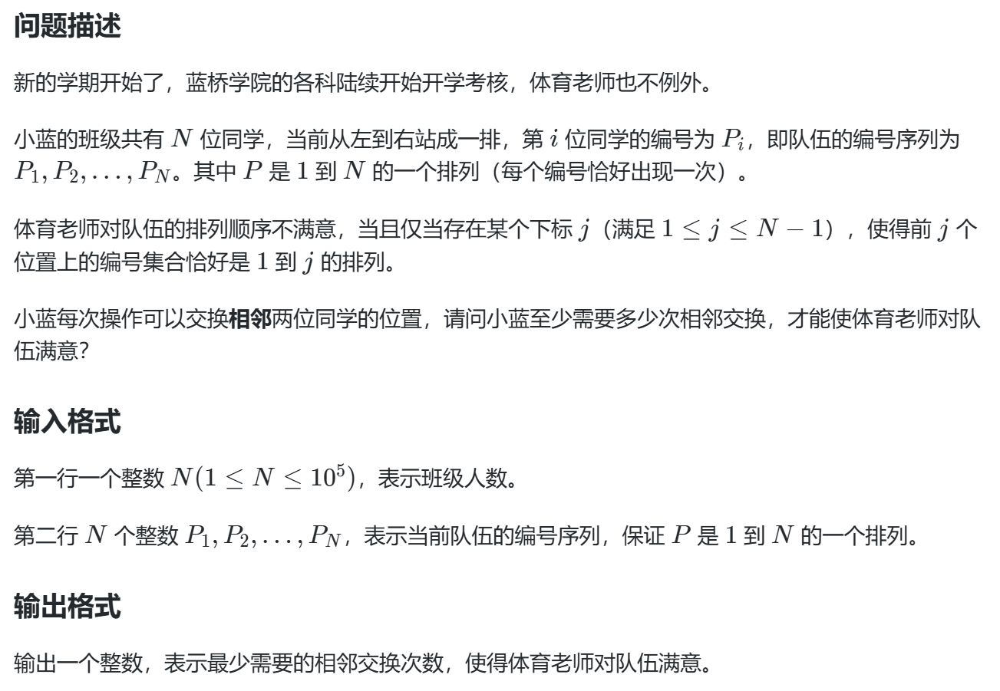

```python title="逆排列"
import sys
def solve():
    n = int(input())
    p = [0] + list(map(int,input().split()))
    ans = 0
    current_max = 0
    # 遍历序列，直到倒数第二个元素（因为 j 必须满足 1 <= j <= N-1）
    for i in range(1,n):
        if p[i] > current_max:
            current_max = p[i]
        if current_max == i:
            ans += 1
    print(ans)
if __name__ == "__main__":
    solve()
```


## 区间类问题/贪心

### 蓝桥寒假训练营2D1-T6

**最小覆盖区间线段**

- 问题描述

  给出一段长度为n的区间和m条线段，每条线段有其起始点xi和终止点yi，现在我们想知道最少用几条线段就可以覆盖这一个区间。 &#x20;
  【输入格式】 &#x20;
  第一行包含两个整数n，m

```python title="贪心"
def main():
    n, m = map(int, input().split())
    if n <= 0:
        print(0)
        return
    if m == 0:
        print(-1)
        return
    t = []
    for _ in range(m):
        t.append(list(map(int,input().split())))
    t.sort()
    ans = 0
    cur = 0
    last_ = 1
    i = 0
    if t[0][0] > 1:
        print(-1)
        return
    # 选取左侧小于last_的最大的右侧
    while last_ < n:
        max_ = 1
        # 有更大的右侧，更新
        while i < m and t[i][0] <= last_:
            if t[i][1] > max_:
                max_ = max(max_,t[i][1])
            i += 1
        # 最大的右侧都比该左侧小，则无法实现
        if max_ <= last_:
            print(-1)
            return
        ans += 1
        last_ = max_
    print(ans)
if __name__ == "__main__":
    main()
```


### 牛客Round137周赛-E

- 问题描述

  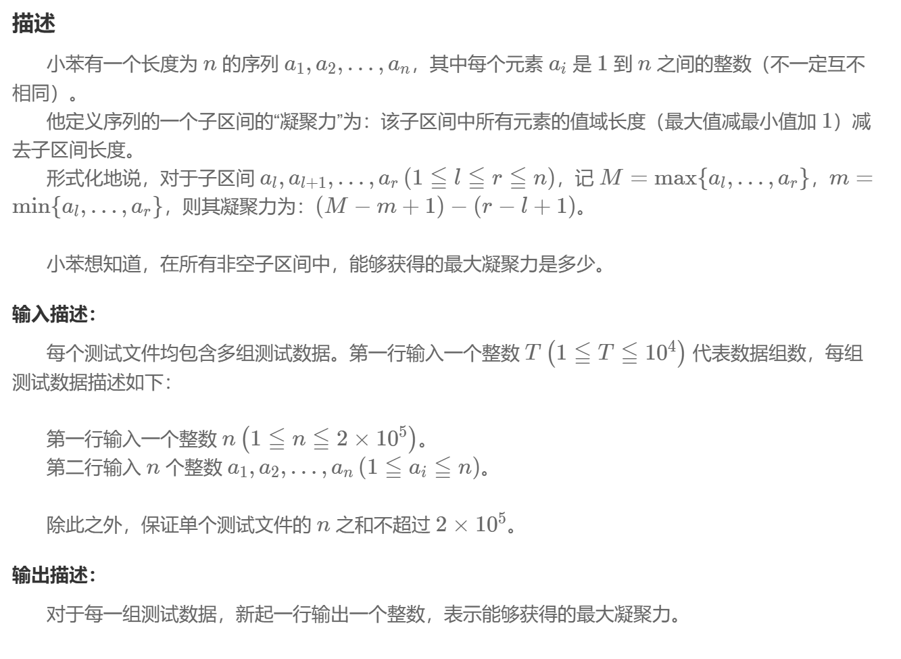

```python title="线性问题"
def main1():
    for _ in range(int(input())):
        n = int(input())
        a = [0] + list(map(int, input().split()))
        ans = 0
        min_b = 10**9
        # c = (M - m + 1) - (r - l + 1)
        # c = M - r - (m - l)
        # 情况1:最大值在右侧
        # b[r] - b[l],b[i] = a[i] - i
        for i in range(1,n+1):
            b = a[i] - i
            ans = max(ans,b - min_b)
            min_b = min(min_b,b)

        max_d = -10**9
        # c = M + l - (m + r)
        # 情况2:最小值在右侧
        # d[l] - d[r],d[i] = a[i] + i
        for i in range(1,n+1):
            d = a[i] + i
            ans = max(ans,max_d - d)
            max_d = max(max_d,d)
        print(ans)
```


### 力扣986

**区间交集**

- 问题描述

  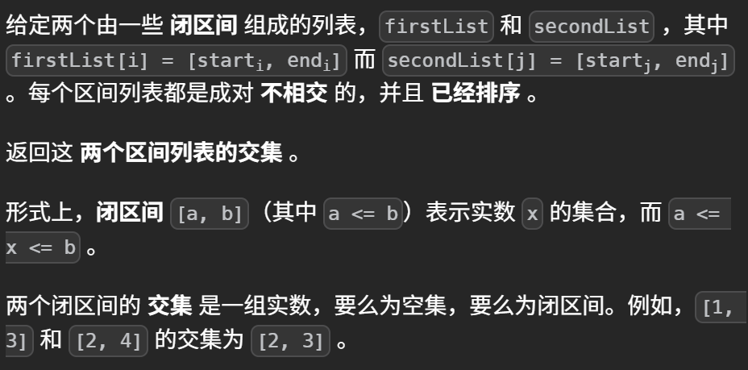

```python title="区间交集"
class Solution:
    def intervalIntersection(self, one: List[List[int]], two: List[List[int]]) -> List[List[int]]:
        if len(one) == 0 or len(two) == 0:
            return []
        ans = []
        l = 0
        r = 0
        while l < len(one) and r < len(two):
            x,y = one[l][0],one[l][1]
            m,n = two[r][0],two[r][1]
            a = max(x,m)
            b = min(y,n)
            if a <= b:
                ans.append([a,b])
            if y < n:
                l += 1
            else:
                r += 1
        return ans

```


### 力扣435

**无重叠区间** **- 按结束时间排序**

- 问题描述

  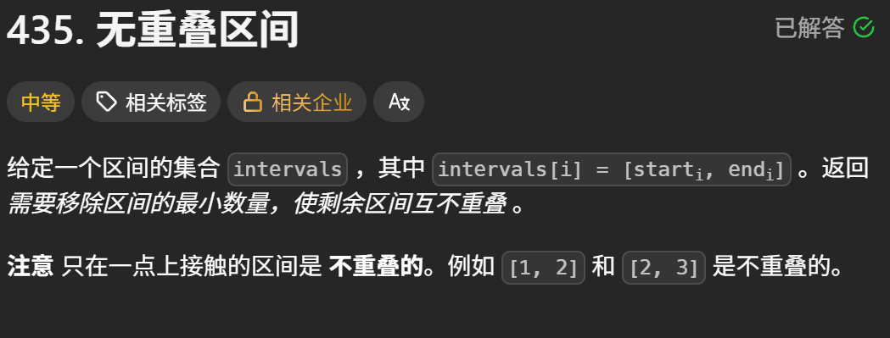

```python title="按结束时间排序-贪心"
# 写法1
class Solution:
    def eraseOverlapIntervals(self, a: List[List[int]]) -> int:
        if len(a) == 1:
            return 0
        a.sort(key = lambda x:x[1])
        ans = 0
        last_y = -inf
        for x,y in a:
            if x < last_y:
                ans += 1
                last_y = min(last_y,y)
            else:
                last_y = y
        return ans
 # 写法2
 class Solution:
    def eraseOverlapIntervals(self, a: List[List[int]]) -> int:
        if len(a) == 1:
            return 0
        a.sort(key = lambda x:x[1])
        ans = 0
        last_y = -inf
        for x,y in a:
            if x >= last_y:
                ans += 1
                last_y = y
        return len(a) - ans
```


## 反悔贪心

### AWC40-D

[D - Crossing the Desert](https://atcoder.jp/contests/awc0040/tasks/awc0040_d "D - Crossing the Desert")

- 题目描述

  高桥正试图驾车沿一条公路穿越沙漠。高桥目前位于点 0 ，需要到达位于点 G 的绿洲。这里，点 x 代表距离起点 x 的位置。

  高桥的汽车最初装有 F 升燃料。汽车可以使用 1 升燃料行驶 1 的距离，一旦燃料耗尽就无法继续行驶。高桥只能从点 0 向点 G 单向行驶，不能折返。到达 G 点时刚好剩余 0 升燃料，仍视为到达目的地。

  在 0 点和 G 点之间有 N 个加油站。其中 i 个加油站位于 Pi 点（ 0\<Pi\<G ），可加油 Ri 升。对于每个加油站，高桥都可以选择停留或通过。如果他在加油站停留， Ri 升油量会添加到他当前的油量中。他最多只能在每个加油站停留一次。此外，如果他路过加油站，他必须加满 Ri 升油（不能加部分油）。需要注意的是，汽车油箱容量没有上限，因此无论加油后油量增加多少都没有问题。即使高桥到达加油站的时候正好是 0 升，他仍然可以在该加油站停车。

  求高桥要到达位于 G 点的绿洲至少需要停靠多少个加油站。如果无论高桥在哪个加油站停留都无法到达 G 点，则输出 −1 。

```python title="反悔贪心"
import heapq
def main():
    n,g,f = map(int,input().split())
    t = []
    for _ in range(n):
        p,r = map(int,input().split())
        t.append([p,r])
    t.append([g,0])
    t.sort(key = lambda x:x[0])
    heap = []
    cur_pos = 0
    cur_ful = f
    stop = 0
    for pos,ful in t:
        d = pos - cur_pos
        while cur_ful < d:
            if not heap:
                print(-1)
                return
            cur_ful += -heapq.heappop(heap)
            stop += 1
        cur_ful -= d
        cur_pos = pos
        heapq.heappush(heap,-ful)
    print(stop)
if __name__ == "__main__":
    main()
```


- **题解思路**

  这是一道非常经典的**贪心算法**结合**优先队列（大根堆）** 的问题，通常被称为“反悔贪心”或“时光倒流贪心”。

  这类问题的难点在于：当你到达一个加油站时，你不知道未来会不会缺油，所以很难立刻决定现在要不要加油。如果见站就加，可能会导致加油次数过多；如果不加，又可能在半路抛锚。

  核心思想：把加油站“装进后备箱”

  为了解决这个两难的选择，我们可以换一种思路：

  **不提前做决定，先往前开。沿途遇到的加油站，我们不立刻加油，而是把这些加油站的油桶“虚拟地”装进汽车后备箱。只有当汽车真的没油、马上要抛锚时，我们才从后备箱里挑出一个油量最多的油桶加进去。**

  这就相当于时光倒流，假装我们“当初在这个加油站停过车”。
  ***
  **具体算法步骤**

  **终点抽象化**

  把目的地变成最后一个加油站

  为了统一处理逻辑，我们可以把终点$G$也看作是一个加油站，它位于位置$G$，但能提供的油量为 0。这样，问题就变成了：我们能否成功开到这最后一个“加油站”。

  **按距离排序**

  整理沿途站点

  将所有加油站按照距离起点的距离$P_i$ 从小到大进行排序，保证我们是按照真实行车顺序遇到它们的。

  **模拟行车过程**

  核心贪心循环

  维护几个变量：当前位置`pos`（初始为 0）、当前油量`tank`（初始为$F$）、加油次数`ans`（初始为 0），以及一个存放备用油桶的**最大堆（优先队列）**。

  遍历排序好的加油站，对于每一个遇到的加油站：
  1. **计算距离**：计算从当前位置`pos`到这个加油站的距离$D$。
  2. **检查油量**：如果当前油量`tank`不足以开过距离$D$，我们就必须“反悔”了。不断从最大堆中取出最大的油量加到`tank`中，并且让`ans`加 1，直到`tank`大于等于$D$。
  3. **判断无解**：如果在需要加油时，发现最大堆是空的（后备箱没油桶了），说明无论怎么加油都开不到这里，直接返回`-1`。
  4. **到达并更新**：成功开到当前加油站后，扣除消耗的油量（`tank = tank - D`），将当前位置更新为该加油站位置（`pos = P_i`），然后把这个加油站的油量$R_i$ 扔进最大堆里备用。

### 力扣1642

- 问题描述

  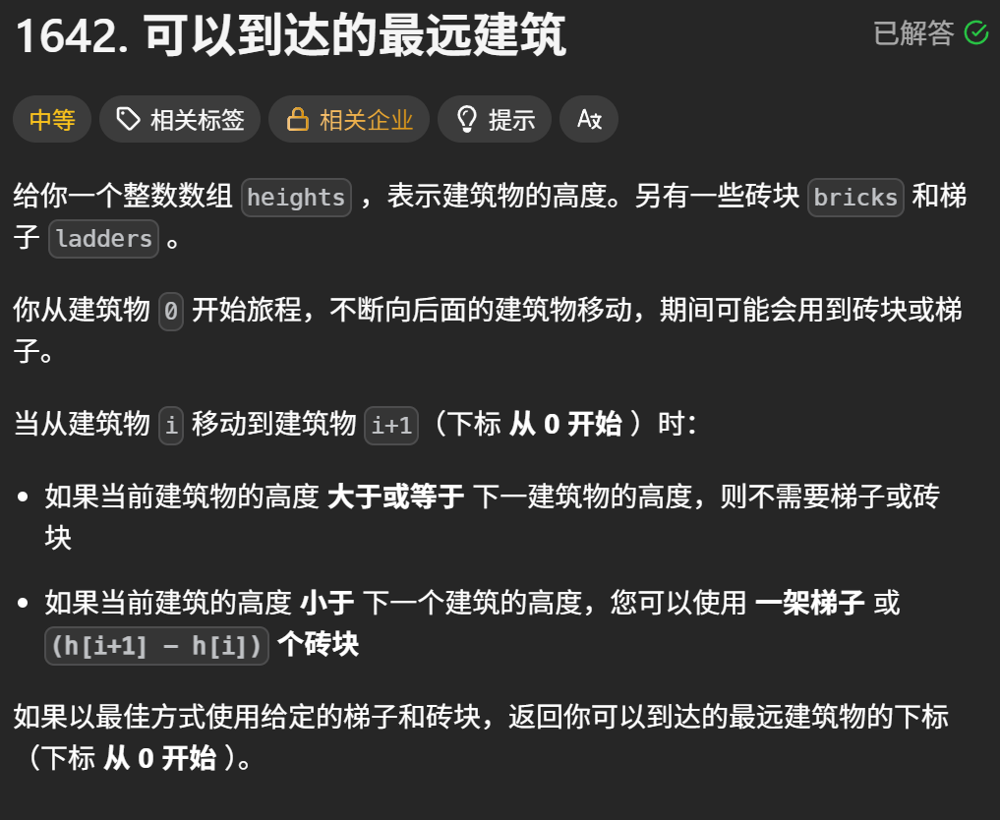

```python title="反悔贪心"
class Solution:
    def furthestBuilding(self, heights: List[int], bricks: int, ladders: int) -> int:
        q = []
        n = len(heights)
        for i in range(n-1):
            if heights[i+1] <= heights[i]:
                continue
            d = heights[i+1] - heights[i]
            if bricks >= d:
                bricks -= d
                heapq.heappush(q,-d)
            else:
                if (not q or -q[0] <= d) and ladders:
                    ladders -= 1
                else:
                    while bricks < d and ladders and q:
                        top = -heapq.heappop(q)
                        bricks += top
                        ladders -= 1
                    if bricks < d:
                        return i
                    bricks -= d
                    heapq.heappush(q,-d)
        return n - 1
```


### 36蓝桥算法入门赛-T5

- 问题描述

  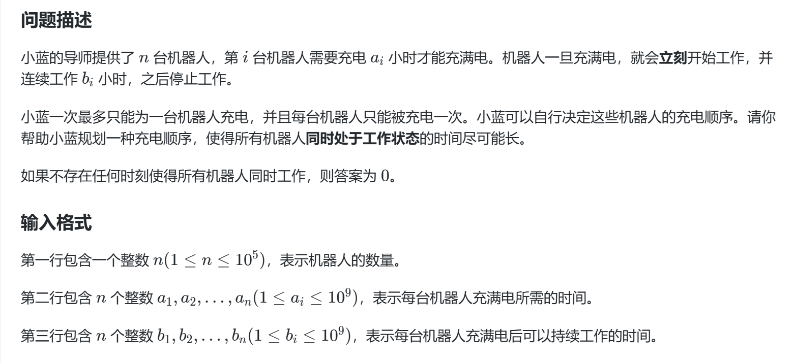

```python title="贪心"
def main():
    n = int(input())
    a = list(map(int,input().split()))
    b = list(map(int,input().split()))
    rot = sorted(zip(a,b),key = lambda x:-x[1])
    tot = 0
    min_ = 10**18
    # 找到最晚的充电结束时间和最早的工作结束时间
    for ch,wo in rot:
        tot += ch
        min_ = min(min_,tot + wo)
    ans = min_ - tot
    print(max(0,ans))
if __name__ == '__main__':
    main()
```


### 36蓝桥算法入门赛-T6

- 问题描述

  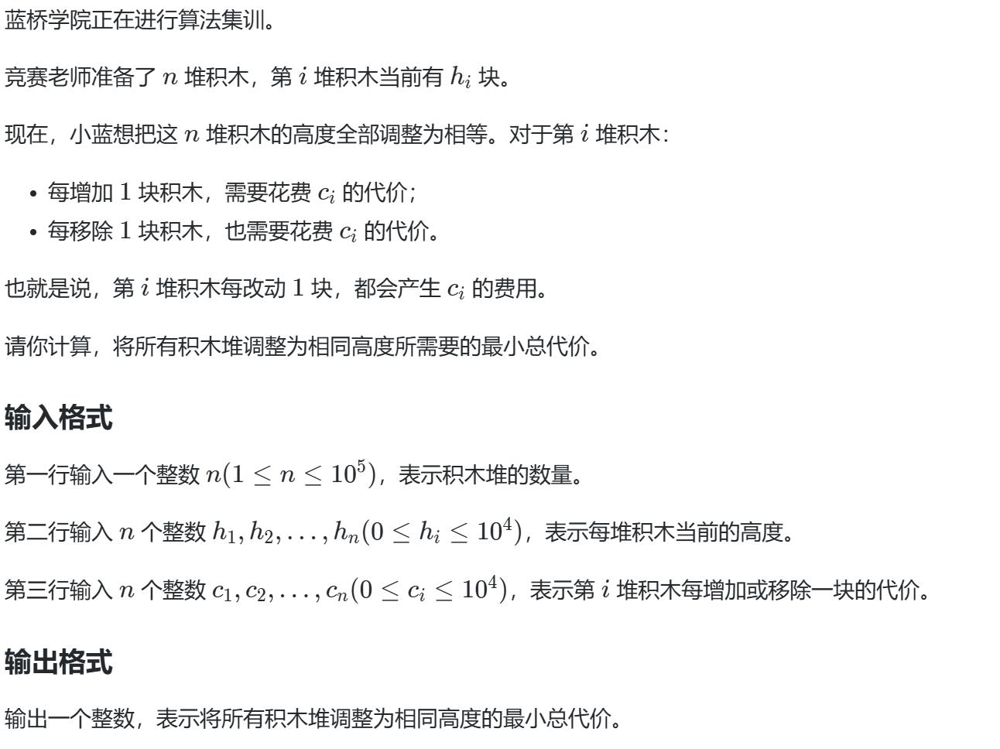

```python title="带权中位数-贪心"
def main2():
    n = int(input())
    h = list(map(int, input().split()))
    c = list(map(int, input().split()))
    com = []
    tot = 0
    for i in range(n):
        com.append((h[i],c[i]))
        tot += c[i]
    com.sort()
    tot = tot/2
    cur = best = 0
    for he,we in com:
        cur += we
        if cur >= tot:
            best = he
            break
    ans = 0
    for i in range(n):
        ans += abs(h[i] - best)*c[i]
    print(ans)
if __name__ == '__main__':
    main2()
```


## 线性DP

### 苯环杯蓝桥省赛模拟赛-H

- 题解思路

  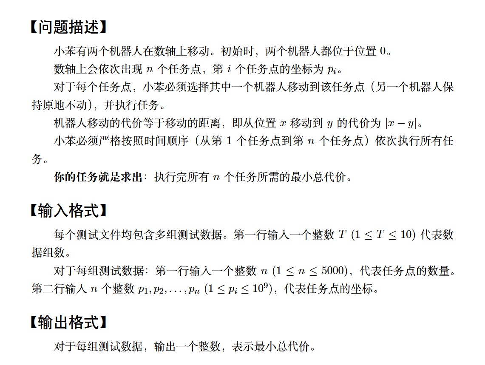

```python title="任务序列DP"
for _ in range(int(input())):
    n = int(input())
    p = [0] + list(map(int,input().split()))
    INF = 10 ** 18
    dp = [[INF]*(n + 1) for _ in range(n+1)]
    dp[1][0] = abs(p[1] - 0)
    for i in range(1,n):
        for j in range(i):
            if dp[i][j] == INF:
                continue
            dp[i+1][j] = min(dp[i+1][j],dp[i][j] + abs(p[i+1] - p[i]))
            dp[i+1][i] = min(dp[i+1][i],dp[i][j] + abs(p[i+1] - p[j]))
    ans = min(dp[n][j] for j in range(n))
    print(ans)
```


## 01背包类

### 蓝桥寒假训练营2D5-T3

- 题目描述

  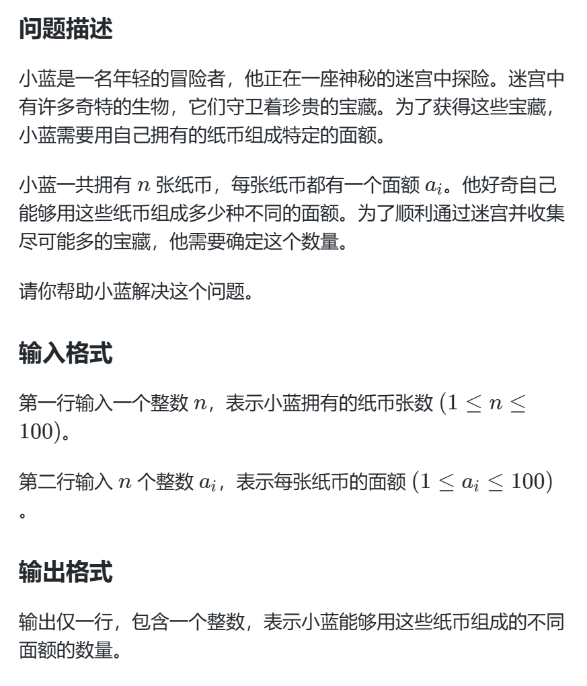

```python title="01背包"
# n = int(input())
# a = list(map(int,input().split()))
# dp = [False]*(sum(a) + 1)
# dp[0] = True
# # 从大到小遍历，保证每个物品只使用一次
# for x in a:
#     for s in range(sum(a),x-1,-1):
#         # 如果s-x面值是可达的，那么s也是可达的
#         if dp[s-x]:
#             dp[s] = True
# ans = sum(1 for s in range(1,sum(a) + 1) if dp[s])
# print(ans)
n = int(input())
a = [0] + list(map(int,input().split()))
m = sum(a)
dp = [[False] * (m+1) for _ in range(n+1)]
dp[0][0] = True
for i in range(1,n+1):
    x = a[i]
    for j in range(m+1):
        dp[i][j] = dp[i-1][j]
        if j >= x and dp[i-1][j-x]:
            dp[i][j] = True
ans = sum(1 for j in range(1,m+1) if dp[n][j])
print(ans)
```


### P2347-01背包

- 题目描述

  P2347 \[NOIP 1996 提高组] 砝码称重

  题目描述

  设有 $1\mathrm{g}$、$2\mathrm{g}$、$3\mathrm{g}$、$5\mathrm{g}$、$10\mathrm{g}$、$20\mathrm{g}$ 的砝码各若干枚（其总重 \$ \le 1000\$），可以表示成多少种重量？

  输入格式

  输入方式：$a_1 , a_2  ,a_3 , a_4 , a_5 ,a_6$

  （表示 $1\mathrm{g}$ 砝码有 $a_1$ 个，$2\mathrm{g}$ 砝码有 $a_2$ 个，$\dots$，$20\mathrm{g}$ 砝码有 $a_6$ 个）

  输出格式

  输出方式：`Total=N`

  （$N$ 表示用这些砝码能称出的不同重量的个数，但不包括一个砝码也不用的情况）

  输入输出样例 #1

  输入 #1
  ```markdown 
  1 1 0 0 0 0
  ```

  输出 #1
  ```python 
  Total=3
  ```


```python title="01背包-一维写法"
t = list(map(int,input().split()))
w = [1,2,3,5,10,20]
a = []
# 注意这里的extend
for i in range(6):
    a.extend([w[i]] * t[i])
n = sum(a)
dp = [False]*(n + 1)
dp[0] = True
for x in a:
    for s in range(n,x-1,-1):
        if dp[s-x]:
            dp[s] = True
ans = sum(1 for x in range(1,n+1) if dp[x])
print("Total={}".format(ans))
```


```python title="01背包-二维写法"
t = list(map(int,input().split()))
w = [1,2,3,5,10,20]
a = []
for i in range(6):
    a.extend([w[i]] * t[i])
m = len(a)
n = sum(a)
dp = [[False] * (n + 1) for _ in range(m+1)]
dp[0][0] = True
for i in range(1,m+1):
    x = a[i-1]
    for j in range(n+1):
        dp[i][j] = dp[i-1][j]
        if j >= x and dp[i-1][j-x]:
            dp[i][j] = True
ans = sum(1 for j in range(1,n+1) if dp[m][j])
print("Total={}".format(ans))
```


### P1048-01背包

- 题目描述

  P1048 \[NOIP 2005 普及组] 采药

  题目描述

  辰辰是个天资聪颖的孩子，他的梦想是成为世界上最伟大的医师。为此，他想拜附近最有威望的医师为师。医师为了判断他的资质，给他出了一个难题。医师把他带到一个到处都是草药的山洞里对他说：“孩子，这个山洞里有一些不同的草药，采每一株都需要一些时间，每一株也有它自身的价值。我会给你一段时间，在这段时间里，你可以采到一些草药。如果你是一个聪明的孩子，你应该可以让采到的草药的总价值最大。”

  如果你是辰辰，你能完成这个任务吗？

  输入格式

  第一行有 $2$ 个整数 $T$（$1 \le T \le 1000$）和 $M$（$1 \le  M \le 100$），用一个空格隔开，$T$ 代表总共能够用来采药的时间，$M$ 代表山洞里的草药的数目。

  接下来的 $M$ 行每行包括两个在 $1$ 到 $100$ 之间（包括 $1$ 和 $100$）的整数，分别表示采摘某株草药的时间和这株草药的价值。

  输出格式

  输出在规定的时间内可以采到的草药的最大总价值。

  输入输出样例 #1

  输入 #1
  ```text 
  70 3
  71 100
  69 1
  1 2

  ```

  输出 #1
  ```python 
  3
  ```


```python title="01背包"
t,m = map(int,input().split())
ti = [0]*(m+1)
wi = [0]*(m+1)
for i in range(1,m+1):
    x,y = map(int,input().split())
    ti[i] = x
    wi[i] = y
dp = [[0]*(t+1) for _ in range(m+1)]
for i in range(1,m+1):
    for j in range(1,t+1):
        if ti[i] > j:
            dp[i][j] = dp[i-1][j]
        else:
            dp[i][j] = max(dp[i-1][j],dp[i-1][j-ti[i]]+ wi[i])
print(dp[m][t])
```


### CF-687/C

- **题目描述**

  帕丽想从阿里亚那里买一块昂贵的巧克力。她有 *n* 枚硬币，其中 *i* 枚硬币的价值是 *ci* 。巧克力的价格是 *k* ，因此帕里将从她的硬币中取出一个总和等于 *k* 的子集交给阿里亚。

  看着自己的硬币，帕里想到了一个问题：把硬币给了艾莉亚后，艾莉亚能用它们创造出什么价值呢？她很嫉妒，不希望艾莉亚创造出很多价值。因此她想知道所有的值 *x* ，这样艾莉亚就能用总和为 *k* 的某个硬币子集制造出 *x* 。

  从形式上看，帕里想要知道 *x* 的值，这样就存在一个总和为 *k* 的硬币子集，这个子集的某个子集的总和为 *x* ，即存在某种支付巧克力的方式，这样艾莉亚就能用这些硬币得到总和 *x* 。

  **输入**

  第一行包含两个整数 *n* 和 *k* ( 1  ≤*n*,*k*  ≤  500 ) --分别是硬币的数量和巧克力的价格。

  下一行包含 *n* 个整数 *c*1,*c*2, ...,*c\*\*n* ( 1 ≤*c\*\*i* ≤ 500 ) - 帕里硬币的价值。

  可以保证使用这些硬币可以得到 *k* 的值。

  **输出**

  输出的第一行必须包含一个整数 *q* -合适值的个数 *x* 。然后按升序打印 *q* 整数——Arya可以为支付巧克力的某一部分的Pari硬币做出的值。

```python title="题解代码"
n,k = map(int,input().split())
c = list(map(int,input().split()))
max_sum = k
dp = [[False]*(k + 1) for _ in range(k + 1)]
dp[0][0] = True
for x in c:
    for s in range(k,-1,-1):
        for t in range(k,-1,-1):
            if dp[s][t] and s + x <= k:
                dp[s+x][t] = True
                dp[s+x][t+x] = True
ans = [t for t in range(k+1) if dp[k][t]]
print(len(ans))
print(' '.join(map(str,ans)))
```


- 思路

  **1. 题目回顾**
  - 有 n 个硬币，每个硬币有面值 c\[i]。
  - 问：对于所有可能的子集和 S，能组成 S 的子集和（即 S 的子集和）有哪些？
  - 输出所有可能的子集和（去重后）。
  ***
  **2. 二维 DP 定义**

  设 `dp[i][j]` 表示：**前 i 个硬币中，能否组成子集和为 j**？
  但这不够，因为我们要的是：**对于每个 j，能否再组成 j 的子集和**。

  所以定义：

  text

  dp\[i]\[j]\[k] = 前 i 个硬币中，能否同时组成子集和 j 和子集和 k（且 k 是 j 的子集和）？

  但这样三维会爆内存。
  ***
  **3. 标准解法（二维 DP）**

  实际上，这道题有一个经典的二维 DP 定义：

  `dp[j][k]` 表示：**当前已经考虑了部分硬币，能否组成子集和为 j，并且同时能组成子集和为 k（且 k 是 j 的子集和）**。

  更直接的说法：
  - 我们固定一个子集和 S，想知道能组成 S 的子集和有哪些。
  - 用 `dp[s][t]` 表示：能否组成一个和为 s 的集合，并且这个集合的某个子集的和为 t。
  ***
  4\. 状态转移

  对于每个硬币 `x`，从大到小更新：
  ```python 
  for s in range(max_sum, -1, -1):
      for t in range(max_sum, -1, -1):
          if dp[s][t]:
              dp[s+x][t] = True          # 新硬币加入原集合，不改变子集和 t
              dp[s+x][t+x] = True        # 新硬币加入子集和 t
  ```

  5\. 最终答案

  所有满足 `dp[s][t]` 为 True 的 t 都是答案（t 可以等于 s，表示整个集合本身）。

## 完全背包类

### 力扣279

- 问题描述

  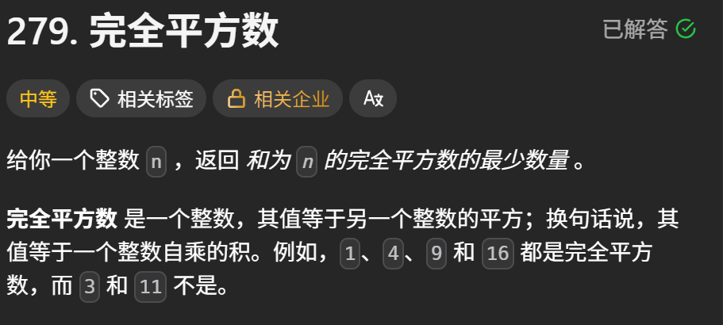

```python title="题解代码"
class Solution:
    def numSquares(self, n: int) -> int:
        # 等价于完全背包
        # f = [[0] * (n + 1) for _ in range(isqrt(n) + 1)]
        # f[0] = [0] + [inf]*n
        # for i in range(1,len(f)):
        #     for j in range(n+1):
        #         if j < i * i:
        #             f[i][j] = f[i-1][j]
        #         else:
        #             f[i][j] = min(f[i-1][j],f[i][j - i*i] + 1)
        # return f[isqrt(n)][n]
        f = [0] + [inf]*n
        for i in range(1,isqrt(n) + 1):
            for j in range(i*i,n+1):
                f[j] = min(f[j],f[j - i * i]  + 1)
        return f[n]
```


### 蓝桥寒假训练营2D4-T5

[https://www.wolai.com/M8tuLm8viHhjwJRoNiXKd#sGk1BLhkbmX6ah6i7i26CR](https://www.wolai.com/M8tuLm8viHhjwJRoNiXKd#sGk1BLhkbmX6ah6i7i26CR "https://www.wolai.com/M8tuLm8viHhjwJRoNiXKd#sGk1BLhkbmX6ah6i7i26CR")

### 蓝桥寒假训练营2D3-T6

- 问题描述
  - 有 `N` 个位置（最多贴 `N` 张邮票）。
  - 有 `M` 种邮票，面值为 `X_i`，每种邮票数量无限（但最多用 `N` 张）。
  - 求：用不超过 `N` 张邮票能组成的邮资中，从 `1` 开始连续的最大值。

```python title="完全背包"
def main():
    n = int(input())
    m = int(input())
    x = list(map(int, input().split()))
    max_ = max(x)
    max_pos = n * max_
    INF = n + 1
    dp = [[INF] * (max_pos + 1) for _ in range(m + 1)]
    dp[0][0] = 0
    for i in range(1, m + 1):
        xx = x[i - 1]
        for j in range(max_pos + 1):
            dp[i][j] = dp[i - 1][j]
            if j >= xx and dp[i][j - xx] + 1 <= n:
                dp[i][j] = min(dp[i][j], dp[i][j - xx] + 1)
    for j in range(1, max_pos + 1):
        if dp[m][j] > n:
            print(j - 1)
            return
    print(max_pos)
if __name__ == "__main__":
    main()
```


## 前缀和/差分

### AWC42-D-**板子**\*

**给定一个由 **$N$** 个元素组成的序列，求总和是的 **$K$** 倍的连续子序列的总数**

任意两个相同余数的前缀和位置，都对应一个和为 k 倍数的子段。

- 问题描述

  高桥有一个盒子，里面装着排成一排的 $N$ 糖果。左边第 $i$ 个糖果的重量是 $A  i$ 克。

  高桥想从这个盒子里连续选择一颗或多颗糖果，把它们装进袋子里，然后把它们作为礼物送给他的 $K$ 朋友。由于他想将糖果按重量平均分配给所有朋友，因此所选糖果的总重量必须是 $K$ 克的倍数。

  找出选择一种或多种连续糖果的方法数，使得所选糖果的总重量为 $K$ 的倍数。请注意，如果所选糖果的范围不同（即起始位置或结束位置不同），即使总重量相同，它们也会被视为不同的选择。

```python title="前缀和+组合数学"
from collections import Counter
import math
n,k = map(int,input().split())
a = list(map(int,input().split()))
cur = 0
s = Counter()
s[0] = 1
pre = [0]*(n+1)
for i,x in enumerate(a):
    pre[i+1] = (pre[i] + x)%k
    s[pre[i+1]] += 1
ans = 0
for c in s.values():
    if c >= 2:
        ans += math.comb(c,2)
print(ans)
```


- 题解思路

  给定一个由 $N$ 个元素组成的序列，求总和是 $K$ 倍的连续子序列的总数。

  选择连续子序列的方法有 $O(N^2)$ 种，其中我们选择左端点 $i$ 和右端点 $j$ 。如果我们计算每个子序列的和，并检查 $K$ 的可分割性，那么整体时间复杂度为 $O(N^3)$ ，即使使用前缀和也是 $O(N^2)$ 。考虑到 $N \leq 2 \times 10^5$ 的限制，计算速度太慢，无法满足时间限制。

  **前缀和与余数性质**

  为了有效处理连续子序列求和，我们使用前缀求和。假设 $S_i$ 是前 $i$ 项的总权重。那么从项目 $i+1$ 到项目 $j$ 的和可以表示为 $S_j - S_i$ 。

  这个和是 $K$ 的倍数的条件可以写成 $(S_j - S_i) \equiv 0 \pmod K$ 重排 $S_j \equiv S_i \pmod K$&#x20;

  高效计数

  如果有 $c$ 个指数具有相同的前缀和余数，那么从中选择 2 个指数的次数为 ${}_c\mathrm{C}_2 = \frac{c(c-1)}{2}$ 。通过对所有余数（从 $0$ 到 $K-1$ ）求和，我们可以计算出 $O(N)$ 中的答案。

  算法
  1. **计算前缀和**：从头开始扫描数组，计算当前前缀和除以 $K$ 的余数。
  2. **记录每个余数的频率**：使用哈希图（在 Python 中为 `collections.Counter` 或字典）来计算每个余数出现的次数。
     - 注意：您必须将初始前缀和 0（尚未选择任何项目的状态）包含在计数中。
  3. **计算组合**：对于频率为 $c$ 的每个余数，计算 $\frac{c(c-1)}{2}$ 并将所有这些值相加。

### AWC36-D

- 问题描述

  高桥负责管理他办公室的会议室。今天安排了 $N$ 会议，所有会议都必须分配到某个会议室。

  $N$ 会议编号从 $1$ 到 $N$ 。会议 $i$ ( $1 \leq i \leq N$ ) 于时间 $S i$ 开始，于时间 $Ei$ 结束。每个会议在半开放时间间隔内占用一个会议室 $[S i, E  i)$ 。

  对于要分配到同一会议室的两个会议 $i, j$ ，间隔 $[S  i, E  i)$ 和 $[S j, E  j)$ 不得重叠。特别是，如果一个会议的结束时间与另一个会议的开始时间一致，则可以在同一会议室连续举行。

  办公室有足够数量的可用会议室，但高桥希望使用尽可能少的会议室来容纳所有 $N$ 会议。

  将每个会议精确分配到一个会议室，这样就不会出现任何会议室包含时间间隔重叠的会议。找出所需的最少会议室数量。

```python title="差分+离散化"
n = int(input())
eve = []
tim = []
for _ in range(n):
    s,e = map(int,input().split())
    eve.append((s,e))
    tim.append(s)
    tim.append(e)
tim = sorted(set(tim))
tim_idx = {t:i for i,t in enumerate(tim)}
dif = [0]*(len(tim) + 1)
for s,e in eve:
    dif[tim_idx[s]] += 1
    dif[tim_idx[e]] -= 1
cur = ans = 0
for i in range(len(tim)):
    cur += dif[i]
    if cur > ans:
        ans = cur
print(ans)
```


### 力扣238

**前后缀分解**-**一维**

- 问题描述

  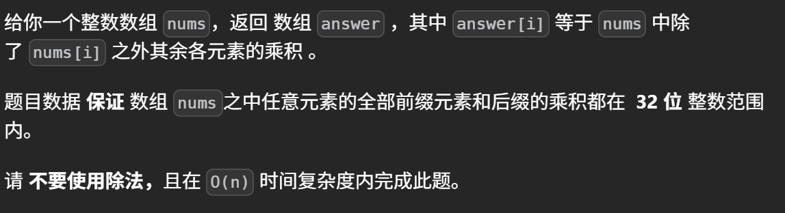

```python title="前后缀分解-一维"
class Solution:
    def productExceptSelf(self, nums: List[int]) -> List[int]:
        """
        pre[i]:从nums[0] 到 nums[i-1]的乘积
        suf[i]:从nums[i+1] 到 nums[n-1]的乘积
        ans[i] = pre[i]*suf[i]
        """
        n = len(nums)
        pre = [1] * n
        for i in range(1,n):
            pre[i] = pre[i-1]*nums[i-1]
        suf = [1] * n
        for i in range(n-2,-1,-1):
            suf[i] = suf[i+1] * nums[i+1]
        return [p*s for p,s in zip(pre,suf)]


```


**前后缀分解**-二**维**

- 问题描述

  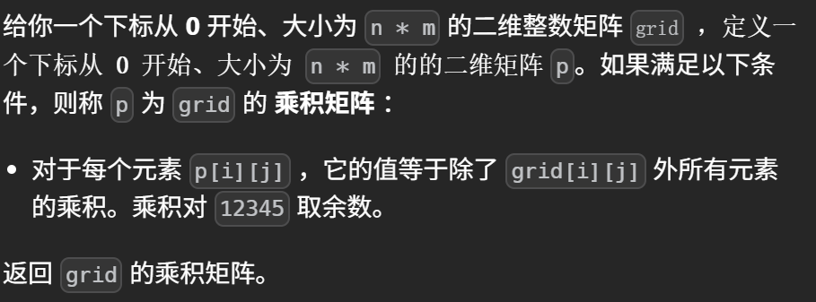

```python title="前后缀分解-二维"
class Solution:
    def constructProductMatrix(self, grid: List[List[int]]) -> List[List[int]]:
        MOD = 12345
        n,m = len(grid),len(grid[0])
        p = [[0]*m for _ in range(n)]
        pre = 1
        for i, row in enumerate(grid):
            for j, x in enumerate(row):
                p[i][j] = pre
                pre = pre * grid[i][j] % MOD
        suf = 1
        for i in range(n-1,-1,-1):
            for j in range(m-1,-1,-1):
                p[i][j] = p[i][j] * suf % MOD
                suf = suf * grid[i][j]%MOD
        return p

```


### 力扣1314

**二维前缀和**

[https://www.wolai.com/pHUVnCXG7vmjXk6xML6mEm](https://www.wolai.com/pHUVnCXG7vmjXk6xML6mEm "https://www.wolai.com/pHUVnCXG7vmjXk6xML6mEm")

- 问题描述

  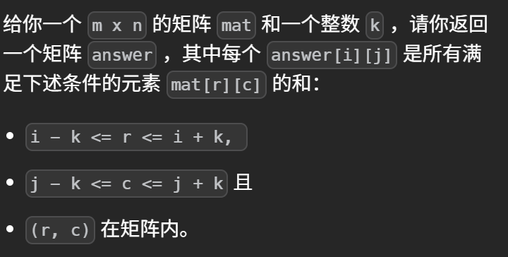

```python title="二位前缀和"
class Solution:
    def matrixBlockSum(self, grid: List[List[int]], k: int) -> List[List[int]]:
        n,m = len(grid),len(grid[0])
        pre = [[0]*(m+1) for _ in range(n+1)]
        for i,row in enumerate(grid):
            for j,x in enumerate(row):
                pre[i+1][j+1] = pre[i+1][j] + pre[i][j+1] - pre[i][j] + x
        ans = [[0]*(m) for _ in range(n)]
        for i in range(n):
            for j in range(m):
                x1 = max(0,i - k)
                y1 = max(0,j - k)
                x2 = min(n-1,i + k)
                y2 = min(m-1,j + k)
                ans[i][j] = pre[x2+1][y2+1] - pre[x2+1][y1] - pre[x1][y2+1] + pre[x1][y1]
        return ans
```


## 二分+双指针/滑动窗口

### AWC41-B

- 题目描述

  问题陈述

  高桥正在做一项在排成一排的 $M$ 方块上滚球的实验。

  这些方块的编号从 $1$ 到 $M$ ，其中方块 $1$ 位于最高位置，方块 $M$ 位于最低位置。每对相邻的方块之间有一个台阶，方块 $i$ （ $1 \leq i \leq M - 1$ ）和方块 $i + 1$ 之间的台阶有一个权重阈值 $W_i$ ，决定球是否可以通过。重量至少为 $W_i$ 的球可以滚过此台阶到达正方形 $i+1$ ，但重量小于 $W_i$ 的球无法通过此台阶并停在那里。

  高桥使用 $N$ 球进行实验。球 $j$ ( $1 \leq j \leq N$ ) 的重量为 $B_j$ 。对于每个球，独立于其他球进行以下实验。

  当高桥将球 $j$ 放在正方形 $1$ 上时，球按照以下规则滚动：
  1. 令 $p$ 为球的当前方格。最初， $p = 1$ 。
  2. 如果 $p<M$ 和 $B_j \geq W_p$ ，则球滚动到正方形 $p + 1$ （将 $p$ 更新为 $p + 1$ ）。只要满足条件，就重复此步骤。
  3. 如果 $p = M$ 或 $B_j < W_p$ ，则球停在方格 $p$ 。
     对于每个球，确定它最终停止的方格数。

```python title="前缀最大值+二分查找"
import bisect
def solve():
    n, m = map(int, input().split())
    w = list(map(int, input().split()))
    b = list(map(int, input().split()))
    pre = [0] * (m - 1)
    pre[0] = w[0]
    for i in range(1, m - 1):
        pre[i] = max(pre[i - 1], w[i])
    for t in b:
        ans = bisect.bisect_right(pre,t)
        print(ans+1)
if __name__ == "__main__":
    solve()
```


- 题解思路

  3\\.优化思路：前缀最大二分查找

  为了有效地找到每个球可以走多远，我们使用以下属性： - 克服步骤的条件是 $B_j \geq \max(W_1, \dots, W_k)$ 。 - 定义 $P_k = \max(W_1, \dots, W_k)$ ，数组 $P$ 满足 $P_1 \leq P_2 \leq \dots \leq P_{M-1}$ ，使其**非递减**（值永远不会递减）。

  当数组排序（单调非递减）时，我们可以使用**二分查找**来快速找到满足特定条件的边界。具体来说，通过使用二分搜索找到最大的 $k$ ，使得 $P_k \leq B_j$ ，我们获得“可以克服的步数”。

  算法
  1. **计算前缀最大值**：从步长权重数组 $W$ 中，创建前缀最大值数组 $P$ 。设置 $P_i = \max(W_1, W_2, \dots, W_i)$ 。
  2. **对每个球进行二分搜索**：对于每个球的重量 $B_j$ ，使用二分搜索（例如 Python 中的 `bisect_right`）来查找数组 $P$ 中小于或等于 $B_j$ 的值延伸了多远。
  3. **确定停止单元格**：如果克服的步数为 $k$ ，则小球停止的单元格编号为 $k+1$ 。
     具体示例
  - 步重 $W = [3, 5, 2, 8]$
  - 前缀最大值 $P = [3, 5, 5, 8]$
  - 对于重量为 $B_j = 6$ 的球：
    - $P$ 中的元素为 $\leq 6$ 为 $3, 5, 5$ — 总共为 $3$ 。
    - 这意味着可以克服 $3$ 步，因此球会停在单元格 $3 + 1 = 4$ 处。

### AWC36-C

- 问题描述

  高桥有一根由连续连接的 N 部分组成的原木。这些部分从左到右编号为 1,2,…,N ，部分 i 的长度为 Ai 。

  相邻部分之间存在边界，并且存在 N−1 这样的边界。即，部分 i 和部分 i+1 (1≤i≤N−1) 之间的边界。高桥选择这些边界中的 K 进行切割，将原木分成 K+1 片段。

  每个片段的长度由该片段中包含的部分的长度之和确定。令 M 为 K+1 片段中的最大长度。

  当切割位置选择最佳时，求 **M 的最小可能值**。

```python title="二分+贪心"
n,k = map(int,input().split())
a = list(map(int,input().split()))
def check(x):
    cnt = 1
    cur = 0
    for c in a:
        if c > x:
            return False
        if cur + c <= x:
            cur += c
        else:
            cnt += 1
            cur = c
            if cnt > k + 1:
                return False
    return True
l = -1
r = sum(a)
while l + 1 < r:
    mid = (l + r)//2
    if check(mid):
        r = mid
    else:
        l = mid
print(r)
```


### AWC41-C

- 问题描述

  青木老师班上共有 NN 名学生。每个学生都有一个从 1 到 N 的学号，第 i 号学生的成绩是 Ai分。

  青木老师想让两个不同的学生组成一组做小组作业，他定义这对组合的“组队分数”为两名学生成绩的和。

  老师想知道，有多少组队分数达到或超过某个阈值 K 的学生对。

  在所有不同学生对 (i,j) (1≤i\<j≤N) 中，找出满足 Ai+Aj≥K 的组合数量。

```python title="双指针"
n, k = map(int, input().split())
a = list(map(int, input().split()))
a.sort()
ans = 0
l = 0
r = n - 1
# 至少为k
# 从l到r-1都满足配对
while l < r:
    if a[l] + a[r] >= k:
        ans += (r - l)
        r -= 1
    else:
        l += 1
print(ans)
```


### 蓝桥寒假训练营2D1-T4

- 题目描述

  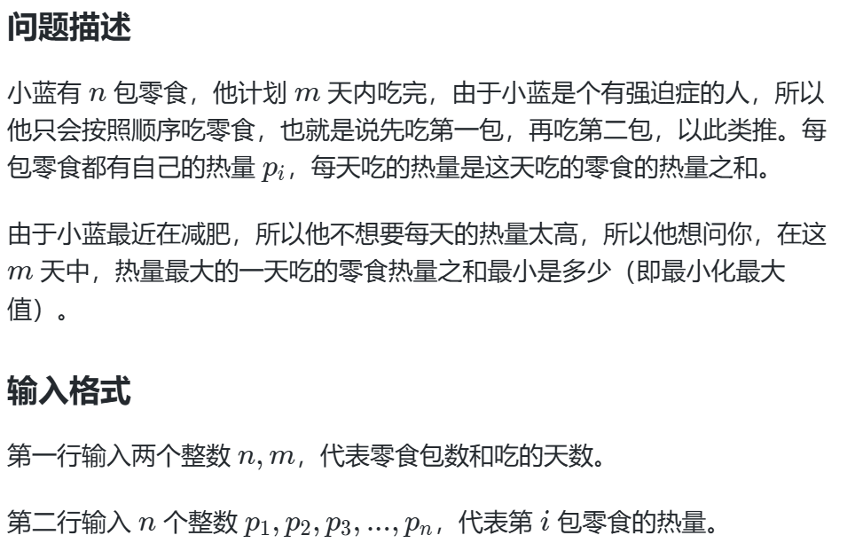

```python title="贪心+二分"
n,m = map(int,input().split())
p = list(map(int,input().split()))
def check(x):
    cnt = 1
    cur = 0
    i = 0
    while i < n:
        cur += p[i]
        if cur <= x:
            i += 1
        else:
            cnt += 1
            cur = p[i]
            i += 1
            if cnt > m:
                return False
    return cnt <= m
left = min(p) - 1
right = sum(p) + 1
while left + 1 < right:
    mid = (left + right)//2
    if check(mid):
        right = mid
    else:
        left = mid
print(right)
```


### 蓝桥寒假训练营2D3-T4

- 题目描述

  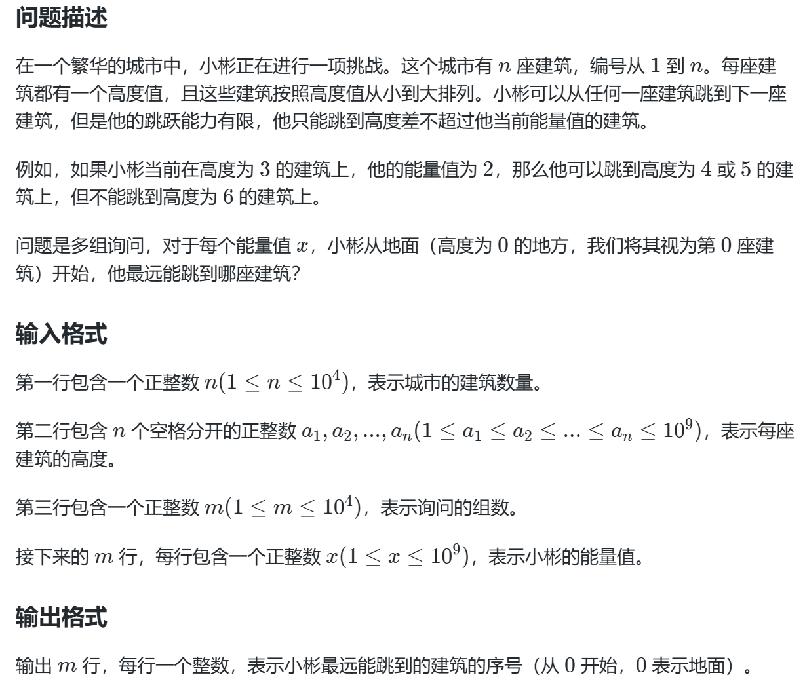

```python title="二分查找"
def main():
    import bisect
    n = int(input())
    # 注意加上[0]
    a = [0] + list(map(int, input().split()))
    m = int(input())
    for _ in range(m):
        x = int(input())
        p = 0
        while True:
            # 找到第一个大于能够跳跃到的位置，减1就是最后一个 ≤ max_height 的位置
            nxt = bisect.bisect_right(a, a[p] + x) - 1
            if nxt == p:
                break
            p = nxt
        print(p)
if __name__ == '__main__':
    main()
```


### 力扣719

- 问题描述

  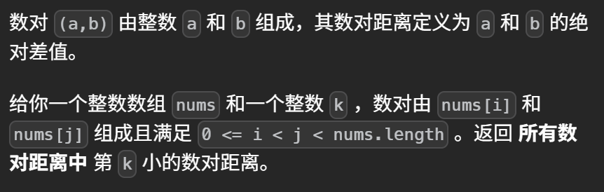

```python title="二分答案"
class Solution:
    def smallestDistancePair(self, nums: List[int], k: int) -> int:
        nums.sort()
        # 第k小等价于 "求最小的x，满足绝对差 <= x的数对至少有k个"
        # 给定整数mx，统计绝对差<=mx的数对个数cnt，判断是否满足cnt>=k
        def check(mx):
            cnt = 0
            i = 0
            for j,x in enumerate(nums):
                while x - nums[i] > mx:
                    i += 1
                cnt += j - i
            return cnt >= k
        left = -1
        right = nums[-1] - nums[0]
        while left + 1 < right:
            mid = (left + right)//2
            if check(mid):
                right = mid
            else:
                left = mid
        return righ

```


### 力扣287

**快慢指针**

- 问题描述

  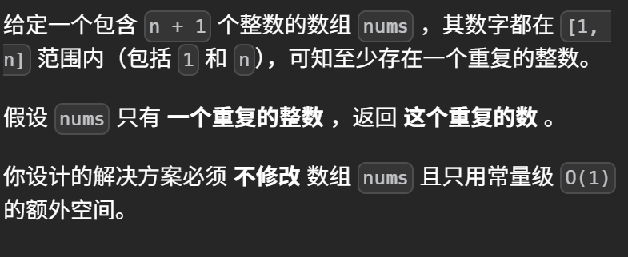

```python title="快慢指针"
class Solution:
    def findDuplicate(self, a: List[int]) -> int:
        if len(a) < 2:
            return -1
        slow = a[0]
        fast = a[a[0]]
        while slow != fast:
            slow = a[slow]
            fast = a[a[fast]]
        fast = 0
        while slow != fast:
            fast = a[fast]
            slow = a[slow]
        return slow
```


### AWC37-C

- 问题描述

  高桥有一个由 N 个正整数组成的序列。序列中的 i -th 元素 (1≤i≤N) 是 Ai 。

  高桥想要考虑这个序列中所有由 K 个连续元素组成的 \*\* 个区间，并计算每个区间中元素的乘积。

  由 K 个连续元素组成的区间有 N−K+1 个。对于每个 i=1,2,…,N−K+1 ，我们可以取由 K 个元素组成的区间，从 i -th 到 (i+K−1) -th 元素。

  计算每个区间中 K 个元素的乘积 $Ai×Ai+1×⋯×Ai+K−1$ ，然后求出所有区间的乘积之和，即

  $\begin{aligned} \sum_{i=1}^{N-K+1} \prod_{j=i}^{i+K-1} A_j \end{aligned}$

  由于答案可能很大，请输出除以 109+7 后的余数。

```python title="①滑动窗口②前缀积 + 逆元"
def main1():
    n,k = map(int,input().split())
    MOD = 10**9 + 7
    a = list(map(int,input().split()))
    if k == 0:
        print(0)
    for i in range(n):
        a[i] %= MOD
    left = 0
    cur = 1
    ans = 0
    for right in range(n):
        cur = (cur * a[right])%MOD
        if right - left + 1 == k:
            ans = (ans + cur)%MOD
            cur = (cur * pow(a[left],MOD-2,MOD))%MOD
            left += 1
    print(ans)
def main2():
    MOD = 10**9 + 7
    n,k = map(int,input().split())
    a = list(map(int,input().split()))
    if k == 0:
        print(0)
        return
    for i in range(n):
        a[i] %= MOD
    pre = [1]*(n + 1)
    for i in range(n):
        pre[i+1] = (pre[i] * a[i])%MOD
    ans = 0
    for i in range(n-k+1):
        cur = (pre[i+k] * pow(pre[i],MOD-2,MOD))%MOD
        ans = (ans + cur)%MOD
    print(ans)
if __name__ == "__main__":
    main2()

```


- **模运算-费马小定理**

  `(a + b) % MOD = (a % MOD + b % MOD) % MOD`

  `(a × b) % MOD = (a % MOD × b % MOD) % MOD`

  除法的模运算：

  **`a*pow(b, MOD-2, MOD)`** — a/b

### 蓝桥寒假训练营1D3-T3

- 问题描述

  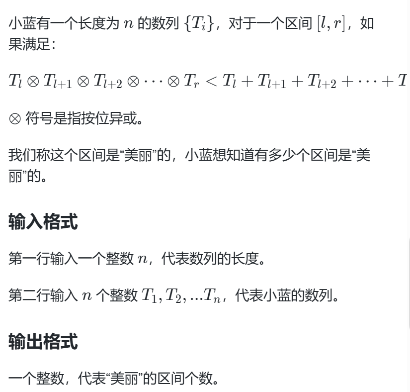

```python title="滑动窗口+位运算"
n = int(input())
a = list(map(int,input().split()))
tot = n * (n + 1)//2
l = 0
b = 0
bad = 0
for r in range(n):
    while (b & a[r]) != 0:
        b ^= a[l] # 移除左边元素
        l += 1
    b |= a[r] # 加入新元素
    bad += (r - l + 1)
print(tot - bad)
```


- 题目描述

  对于非负整数，异或和 ≤ 和，等号成立当且仅当**没有进位**，即所有数的二进制表示中，没有两个数在某一位同时为 1（即每个位最多出现一次）。

  换句话说，区间内所有数的二进制表示是**互不相交**的（每个位最多出现一次）。

  所以：
  $$
  \text{xor}(l, r) < \text{sum}(l, r) \iff \text{区间内存在至少两个数在某一位同时为 1}
  $$
  ***
  3\. 问题转化

  美丽区间 = 存在至少两个数在某个二进制位同时为 1 的区间。

  不美丽区间 = 区间内所有数的二进制位互不相交。
  ***
  4\. 计数方法

  总区间数 = $  \frac{n(n+1)}{2}  $。

  我们可以求**不美丽区间**的个数，然后用总数减去。

  不美丽区间：区间内所有数的位或（bitwise OR）等于它们的和（即没有进位）。
  ***
  5\. 如何求不美丽区间？

  由于 $  a_i < 2^{16}  $，只有 16 个二进制位。 &#x20;

  不美丽区间的条件是：对于每个位，区间内最多只有一个数在该位为 1。

  我们可以用**滑动窗口**（双指针）来统计以每个右端点结尾的不美丽区间个数。

  维护一个窗口 $[l, r]$，使得窗口内所有数的位或等于它们的和（即无冲突）。 &#x20;

  当加入新数 $  a[r]  $ 时，如果它和当前窗口的位或有冲突（即 `(bits & a[r]) != 0`），则移动左指针直到无冲突。

  然后以 $  r  $ 结尾的不美丽区间数为 `r - l + 1`。
  ***
  6\. 算法步骤
  1. 初始化 `left = 0`, `bits = 0`, `ans = 0`。
  2. 遍历 `right` 从 0 到 n-1：
     - 当 `(bits & a[right]) != 0` 时，移动 `left`，并从 `bits` 中移除 `a[left]`（`bits ^= a[left]`），直到无冲突。
     - 将 `a[right]` 加入 `bits`（`bits |= a[right]`）。
     - 以 `right` 结尾的不美丽区间数 = `right - left + 1`，累加到 `ans`。
  3. 美丽区间数 = 总区间数 - `ans`。
  ***

### AWC45-E

- 问题描述

  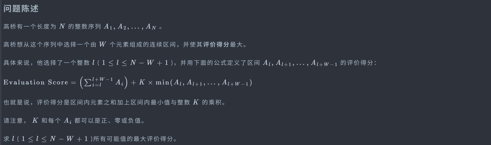

```python title="滑动窗口 + 优先队列"
from collections import deque
n,w,k = map(int,input().split())
a = list(map(int,input().split()))
dq = deque()
s = 0
ans = None
for i,x in enumerate(a):
    s += x
    if i >= w:
        s -= a[i-w]
    while dq and a[dq[-1]] >= x:
        dq.pop()
    dq.append(i)
    while dq[0] <= i - w:
        dq.popleft()
    if i >= w - 1:
        val = s + k * a[dq[0]]
        if ans is None or val > ans:
            ans = val
print(ans)
```


## 字典/集合

### 力扣3741

- 问题描述

  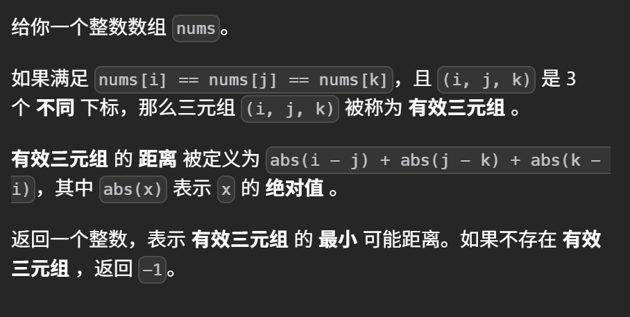

```python title="字典"
cnt = Counter(a)
candidates = {val for val, c in cnt.items() if c >= 3}
if not candidates:
    return -1
else:
    pos = {}
    for idx, val in enumerate(a):
        if val in candidates:
            if val not in pos:
                pos[val] = []
            pos[val].append(idx)
    ans = float('inf')
    for idx_list in pos.values():
        if len(idx_list) >= 3:
            for i in range(len(idx_list) - 2):
                left = idx_list[i]
                right = idx_list[i+2]
                d = 2 * (right - left)
                if d < ans:
                    ans = d
    return ans if ans != float('inf') else -1
```


### 力扣36有效的数独

## 优先队列heapq

### AWC41-D

- 问题描述

  作为公会会长，高桥必须组建一支冒险者队伍来挑战地下城。

  公会有 $N$ 冒险者。每个冒险家 $i$ （ $1 \leq i \leq N$ ）都有攻击力 $A  i$ 和防御力 $Bi$ 。

  高桥会从 $N$ 个冒险者中精确选出 $K$ 个冒险者组成队伍。同一个冒险家不能被多次选择。队伍战斗力按照以下规则计算：
  - 令 $S$ 为所选冒险家 $K$ 的攻击力总和。
  - 令 $M$ 为所选冒险者 $K$ 中的最低防御力。
  - 队伍战斗力为 $S \times M$ 。
    无论队伍的总攻击力有多高，如果最低防御力太小，队伍的战斗力就会受到影响。
  求当 $K$ 冒险者选择最优时，队伍可能的最大战斗力。

```python title="优先队列+贪心"
import heapq
n,k = map(int,input().split())
adv = []
for _ in range(n):
    a,b = map(int,input().split())
    adv.append((b,a))
# 按照防御力降序排序
# 保证当前防御力是所选人中的最小值
adv.sort(key = lambda x:-x[0])
print(adv)
heap = []
sum_ = 0
ans = 0
for b,a in adv:
    # 用最小堆维护最大的k个攻击力
    heapq.heappush(heap,a)
    sum_ += a
    if len(heap) > k:
        sum_ -= heapq.heappop(heap)
    if len(heap) == k:
        ans = max(ans,sum_*b)
print(ans)
```


### 力扣347

- 问题描述

  

```python title="优先队列"
class Solution:
    def topKFrequent(self, a: List[int], k: int) -> List[int]:
        fq = Counter(a)
        h = []
        for num,cnt in fq.items():
            heapq.heappush(h,(cnt,num))
            if len(h) > k:
                heapq.heappop(h)
        return [num for _,num in h]
```


## 双端队列

### 牛客周赛Round137-B

- 问题描述

  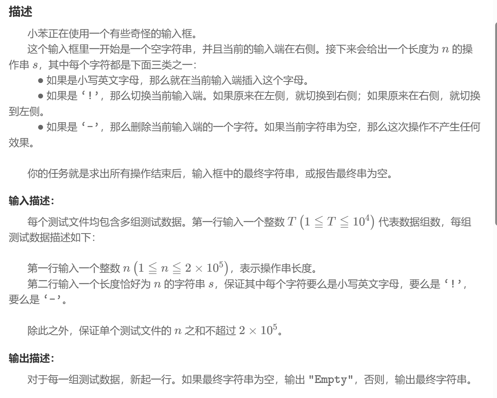

```python title="deque"
from collections import deque
T = int(input())
for _ in range(T):
    n = int(input())
    s = input().strip()
    s_ = list(s)
    ans = []
    ch = 0
    q = deque(ans)
    for i in range(n):
        c = s[i]
        if c.isalpha():
            if ch == 0:
                q.append(c)
            else:
                q.appendleft(c)
        elif c == '!':
            if ch == 0:
                ch = 1
            else:
                ch = 0
        else:
            if q and ch == 0:
                q.pop()
            elif q and ch == 1:
                q.popleft()
            elif not q:
                continue
    if q:
        print(''.join(q))
    else:
        print("Empty")
```


### 苯环杯蓝桥省赛模拟赛-E

- 问题描述

  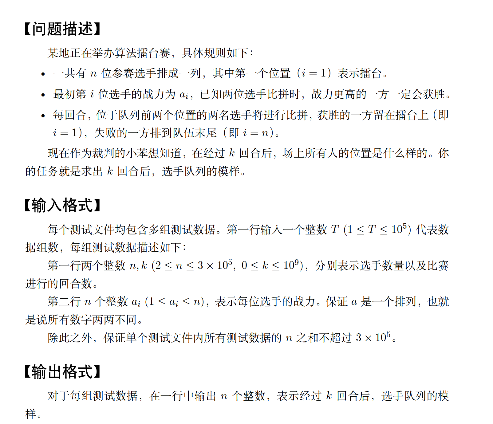

```python title="双端队列"
from collections import deque
for _ in range(int(input())):
    n,k = map(int,input().split())
    a = list(map(int,input().split()))
    if k == 0:
        print(' '.join(map(str,a)))
        continue
    q = deque(a)
    while k > 0 and q[0] != n:
        x,y = q.popleft(),q.popleft()
        if x > y:
            q.appendleft(x)
            q.append(y)
        else:
            q.appendleft(y)
            q.append(x)
        k -= 1
    if k == 0:
        print(*q)
    else:
        k %= n - 1
        q = list(q)
        print(*[q[0]] + q[k+1:] + q[1:k+1])
```


## 单调栈

### 力扣739

- 问题描述

  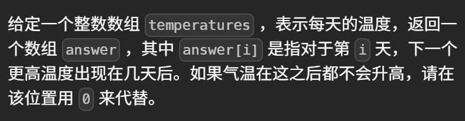

```python title="单调栈模板"
class Solution:
    def dailyTemperatures(self, t: List[int]) -> List[int]:
        n = len(t)
        ans = [0]*n
        st = []
        for i in range(n):
            while st and t[st[-1]] < t[i]:
                pos = st.pop()
                ans[pos] = i - pos
            st.append(i)
        return ans
```


### AWC41-E

- 问题描述

  高桥是一名城市规划测量师。沿着笔直的街道， N 建筑物鳞次栉比。从左到右依次编号为大楼 1 、大楼 2 、...、大楼 N ，大楼 i 的高度为 Hi 。所有建筑物的高度都是不同的。

  对于每个建筑物 i ( 1≤i≤N )，我们定义一个 **“观看分数”**，如下所示。

  首先，在建筑物 i 右侧的建筑物（编号大于 i 的建筑物）中比建筑物 i 高的建筑物中，让建筑物 Ri 为最近的建筑物。也就是说， Ri 是使得 Hj>Hi 最小的 j>i 。如果不存在这样的建筑物，则 Ri 不存在。

  同样，在建筑物 i 左侧的建筑物（编号小于 i 的建筑物）中，比建筑物 i 高的建筑物 Li 为最近的建筑物。也就是说， Li 是最大的 j\<i ，使得 Hj>Hi 如此。如果不存在这样的建筑物，则 Li 不存在。

  直观上，建筑物 i 的视图分数是包含建筑物 i 的连续区间中向左和向右延伸直到在每个方向上到达更高建筑物（或街道尽头）的建筑物数量。具体确定如下：
  - 如果 Li 和 Ri 都存在：分数为 Ri−Li−1 （建筑物 Li 和建筑物 Ri 之间的建筑物数量）
  - 如果仅存在 Ri 且不存在 Li ：分数为 Ri−1 （从建筑物 1 到建筑物 Ri−1 的建筑物数量）
  - 如果仅存在 Li 且不存在 Ri ：得分为 N−Li （从建筑物 Li+1 到建筑物 N 的建筑物数量）
  - 如果两者都不存在：得分为 N （建筑物总数）
    高桥需要回答 Q 个问题。对于每个问题，都会给出一个整数 Xk 。回答 \*\*视野分数至少为 Xk \*\* 的建筑物数量。

```python title="单调栈+二分查找"
import bisect
n,q = map(int,input().split())
h = list(map(int,input().split()))
# 右侧
r = [n]*n
st = []
for i in range(n):
    while st and h[st[-1]] < h[i]:
        idx = st.pop()
        r[idx] = i
    st.append(i)
# 左侧
l = [-1]*n
st = []
for i in range(n-1,-1,-1):
    while st and h[st[-1]] < h[i]:
        idx = st.pop()
        l[idx] = i
    st.append(i)
s = []
for i in range(n):
    left_idx = l[i] + 1
    right_idx = r[i] - 1
    score = right_idx - left_idx + 1
    s.append(score)
s.sort()
for _ in range(q):
    x = int(input())
    pos = bisect.bisect_left(s,x)
    print(n - pos)
```


### 苯环杯蓝桥省赛模拟赛-F

- 问题描述

  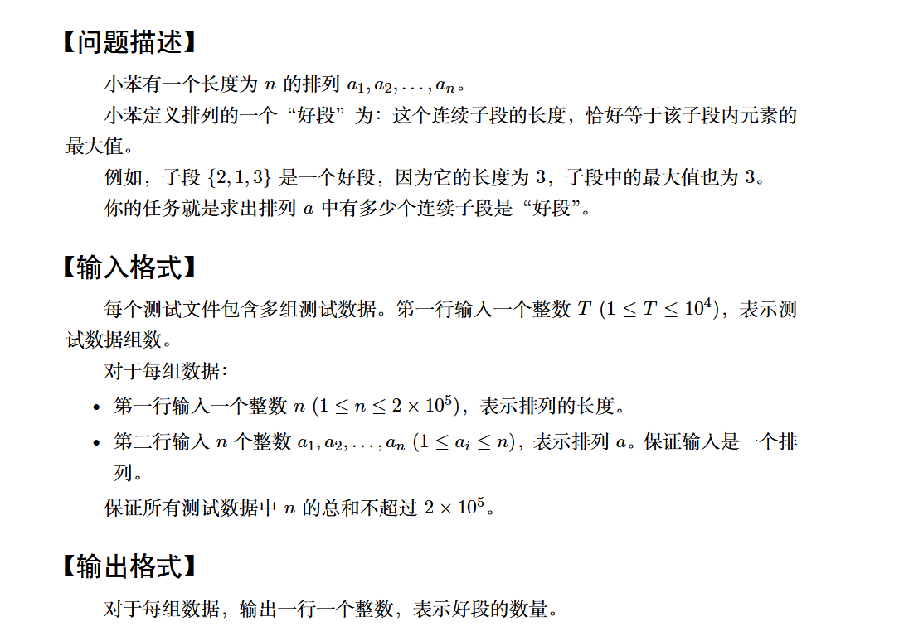

```python title="题解代码"
 for _ in range(int(input())):
    n = int(input())
    a = list(map(int,input().split()))
    pos = [0]*(n+1)
    for i,val in enumerate(a):
        pos[val] = i
    left = [-1]*n
    right = [n]*n
    st = []
    for i in range(n):
        while st and a[st[-1]] < a[i]:
            idx = st.pop()
            right[idx] = i
        st.append(i)

    st.clear()
    for i in range(n-1,-1,-1):
        while st and a[st[-1]] < a[i]:
            idx = st.pop()
            left[idx] = i
        st.append(i)

    ans = 0
    for val in range(1,n+1):
        i = pos[val]
        l = left[i] + 1
        r = right[i] - 1
        L = max(l,i - val + 1)
        R = min(i,r - val + 1)
        if L <= R:
            ans += (R - L + 1)
    print(ans)
```


## DFS

### 排列行回溯与子集型回溯

```python title="子集型回溯与排列型回溯"
# 子集型回溯
a = list(map(int,input().split()))
path = []
res = []
n = len(a)
def dfs(i):
    res.append(list(path))
    for j in range(i,n):
        path.append(a[j])
        dfs(j + 1)
        path.pop()
dfs(0)

# 排列型回溯
print(res)
a = list(map(int,input().split()))
path = []
res = []
n = len(a)
def dfs(i):
    if i == n:
        res.append(list(path))
        return
    for j in range(n):
        if a[j] not in path:
            path.append(a[j])
            dfs(i + 1)
            path.pop()
dfs(0)
print(res)


```


### 蓝桥寒假训练营2D4-T1

- 问题描述

  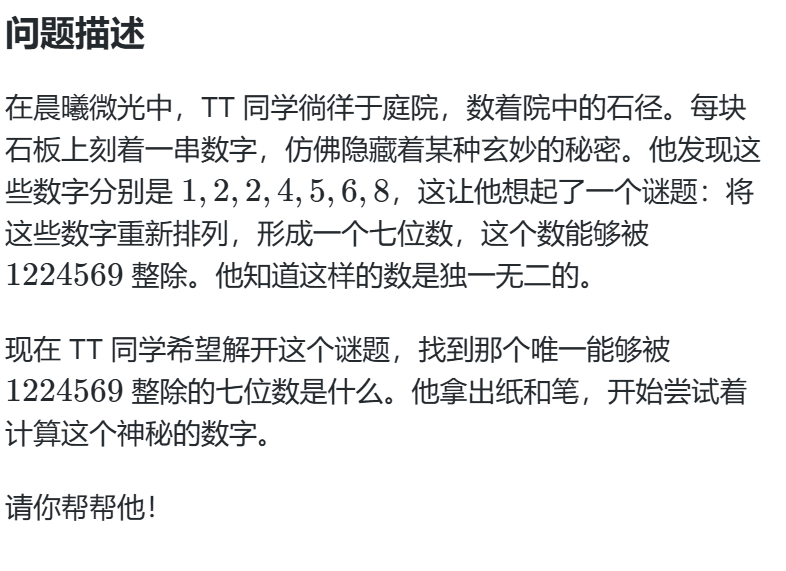

```python title="题解代码"
a = [0,1,2,2,4,5,6,8]
n = len(a)
ans = 0
use = [False]*n
def dfs(num,cnt):
    global ans
    if cnt == 7:
        if num % 1224569 == 0:
            ans = num
            return
    for i in range(n):
        if not use[i]:
            use[i] = True
            dfs(num*10 + a[i],cnt + 1)
            use[i] = False
dfs(0,0)
print(ans)
```


### 蓝桥寒假训练营2D3-T4

- 问题描述

  有一天桐桐做了一个梦,梦见一种很奇怪的电梯。大楼的每一层楼都可以停电梯，而且第I层楼（1<=i<=n）有一个数字Ki(0<=Ki<=N)。电梯只有四个按钮：开，关，上，下。上下的层数等于当前楼层上的那个数字。当然如果不能满足要求，相应的按钮就会失灵。例如：3 3 1 2 5代表了Ki(K1=3,k2=3……），从一楼开始。在一楼按“上”可以到4楼，按“下”是不起作用的，因为没有-2楼。 那么从A楼到B楼至少要按几次按钮呢？

  \[输入格式]

  第1行为三个正整数表示N，A，B（1<=N<=200,1<=A,B<=N)

  \[输出格式]

  1行即最少按键次数若无法到达则输出-1。

```python title="DFS"
def main():
    n, a, b = map(int, input().split())
    k = [0] + list(map(int, input().split()))
    INF = 10 ** 9
    ans = INF
    vis = [False] * (n + 1)
    def dfs(p, st):
        nonlocal ans
        if p == b:
            ans = min(st,ans)
            return
        if st >= ans:
            return
        vis[p] = True
        up = p + k[p]
        if up <= n and not vis[up]:
            dfs(up,st+1)
        down = p - k[p]
        if down >= 1 and not vis[down]:
            dfs(down,st+1)
        vis[p] = False
    dfs(a,0)
    print(ans if ans != INF else -1)
if __name__ == "__main__":
    main()
```


```python title="dp递推"
n,a,b = map(int,input().split())
k = [0] + list(map(int,input().split()))
INF = 10**9
dp = [INF]*(n+1)
dp[a] = 0
for _ in range(n):
    update = False
    for i in range(1,n+1):
        if dp[i] == INF:
            continue
        up = i + k[i]
        if up <= n and dp[up] > dp[i] + 1:
            dp[up] = dp[i] + 1
            update = True
        down = i - k[i]
        if down >= 1 and dp[down] > dp[i] + 1:
            dp[down] = dp[i] + 1
            update = True
    if not update:
        break
print(dp[b] if dp[b] != INF else -1)
```


### 蓝桥寒假训练营1D5-T2

- 问题描述

  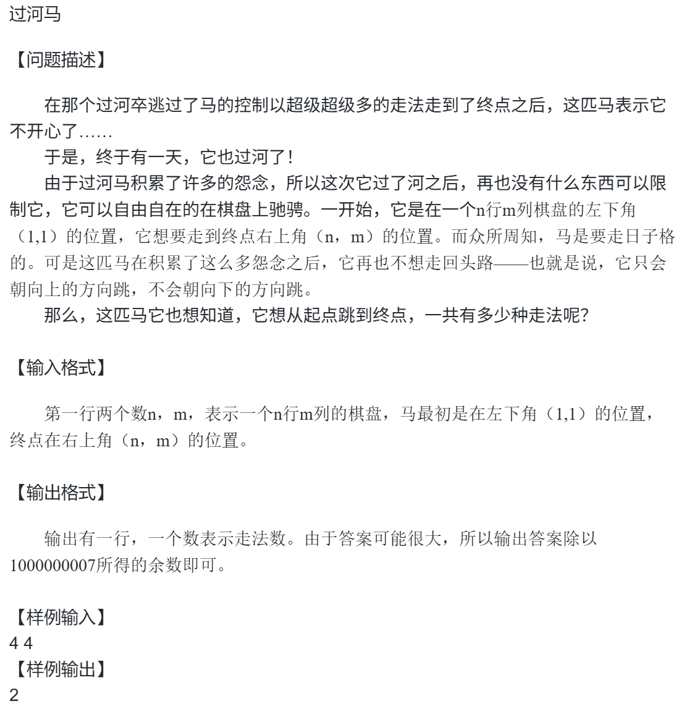

```python title="dfs(40%)+dp递推(100%)"
def main2():
    n, m = map(int, input().split())
    mo = [(1,-2),(2,-1),(1,2),(2,1)]
    ans = 0
    vis = [[False]*(m+1) for _ in range(n+1)]
    def dfs(i,j):
        nonlocal ans
        if i == n and j == m:
            ans += 1
            return
        if i < 1 or i > n or j < 1 or j >m or vis[i][j]:
            return
        for x,y in mo:
            vis[i][j] = True
            dfs(i+x,j+y)
            vis[i][j] = False
    dfs(1,1)
    print(ans)
# def main():
#     n,m = map(int,input().split())
#     x = [1,2,1,2]
#     y = [-2,-1,2,1]
#     MOD = 1_000_000_007
#     dp = [[0]*(m+5) for _ in range(n+5)]
#     dp[n][m] = 1
#     for i in range(n,0,-1):
#         for j in range(m,0,-1):
#             if i == n and j == m:
#                 continue
#             for k in range(4):
#                 xx = i + x[k]
#                 yy = j + y[k]
#                 if 1 <= xx <= n and 1 <= yy <= m:
#                     dp[i][j] = (dp[xx][yy] + dp[i][j])%MOD
#     print(dp[1][1]%MOD)
if __name__ == "__main__":
    main2()

```


### ABC451-D

- 问题描述

  如果一个正整数满足以下条件，我们称它为**好整数**。
  - 条件：可以通过选择 $2$ ( $1, 2, 4, 8, 16, \dots$ ) 的一个或多个幂（允许重复和重排），将它们连接成字符串，并将结果解释为整数。
    找出 $N$ -th 最小的好整数。保证 $N$ 个最小的好整数最多为 $10^9$ 。

```python title="DFS"
def main():
    n = int(input())
    good = set()
    po = []
    lim = 10**9
    p = 1
    while p <= lim:
        po.append(str(p))
        p *= 2
    def dfs(cur):
        x = int(cur)
        if x <= lim:
            good.add(x)
        else:
            return
        for pow in po:
            nex = cur + pow
            if len(cur) > 10:
                return
            dfs(nex)
    for pow in po:
        dfs(pow)
    good = sorted(good)
    print(good[n-1])
if __name__ == "__main__":
    main()
```


### 力扣-51

- 问题描述

  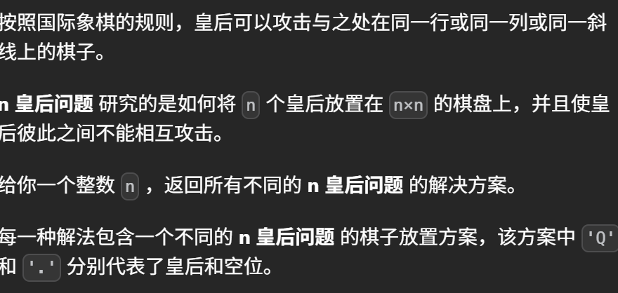

```python title="dfs+回溯"
def f(n):
    ans = []
    q = []
    col = [False]*n
    # 对角线不同：r+c 与 r-c为不同值
    dig1 = [False]*(2*n-1)
    dig2 = [False]*(2*n-1)
    def dfs(r):
        if r == n:
            ans.append(['.'*c + 'Q' + '.'*(n-c-1) for c in q])
            return
        for c,ok in enumerate(col):
            if not ok and not dig1[r+c] and not dig2[r-c]:
                q.append(c)
                col[c] = dig1[r+c] = dig2[r-c] = True
                dfs(r+1)
                col[c] = dig1[r+c] = dig2[r-c] = False
                q.pop()
    dfs(0)
    return ans
```


## 并查集

### **蓝桥寒假训练营2D1-T6板子\***

- **问题描述**

  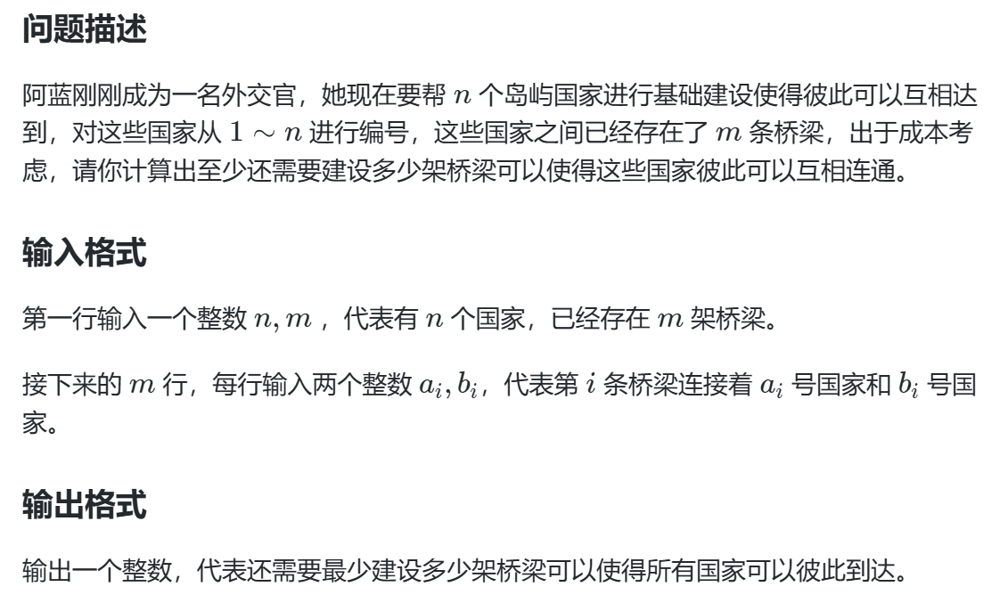

```python title="连通分量dfs"
n,m = map(int,input().split())
g = [[] for _ in range(n+1)]
for _ in range(m):
    a,b = map(int,input().split())
    g[a].append(b)
    g[b].append(a)
vis = [False]*(n+1)
def dfs(u):
    vis[u] = True
    for v in g[u]:
        if not vis[v]:
            dfs(v)
cnt = 0
for i in range(1,n+1):
    if not vis[i]:
        cnt += 1
        dfs(i)
print(cnt - 1)
```


```python title="并查集模板"
def find(p,x):
    if p[x] != x:
        p[x] = find(p,p[x])
    return p[x]
def union(p,rank,x,y):
    rx,ry = find(p,x),find(p,y)
    if rx == ry:
        return
    if rank[rx] < rank[ry]:
        p[rx] = ry
    elif rank[rx] > rank[ry]:
        p[ry] = rx
    else:
        p[ry] = rx
        rank[rx] += 1
def main():
    n,m = map(int,input().split())
    p = list(range(n+1))
    rank = [0]*(n+1)
    for _ in range(m):
        a,b = map(int,input().split())
        union(p,rank,a,b)
    com = set()
    for i in range(1,n+1):
        com.add(find(p,i))
    print(len(com) - 1)
if __name__ == "__main__":
    main()
```


### 洛谷P1551

- **问题描述**

  若某个家族人员过于庞大，要判断两个是否是亲戚，确实还很不容易，现在给出某个亲戚关系图，求任意给出的两个人是否具有亲戚关系。

  规定：$x$ 和 $y$ 是亲戚，$y$ 和 $z$ 是亲戚，那么 $x$ 和 $z$ 也是亲戚。如果 $x$，$y$ 是亲戚，那么 $x$ 的亲戚都是 $y$ 的亲戚，$y$ 的亲戚也都是 $x$ 的亲戚。

  **输入格式**

  第一行：三个整数 $n,m,p$，（$n,m,p \le 5000$），分别表示有 $n$ 个人，$m$ 个亲戚关系，询问 $p$ 对亲戚关系。

  以下 $m$ 行：每行两个数 $M_i$，$M_j$，$1 \le M_i,~M_j\le n$，表示 $M_i$ 和 $M_j$ 具有亲戚关系。

  接下来 $p$ 行：每行两个数 $P_i,P_j$，询问 $P_i$ 和 $P_j$ 是否具有亲戚关系。

  **输出格式**

  $p$ 行，每行一个 `Yes` 或 `No`。表示第 $i$ 个询问的答案为“具有”或“不具有”亲戚关系。

  输入 #1
  ```text 
  6 5 3
  1 2
  1 5
  3 4
  5 2
  1 3
  1 4
  2 3
  5 6
  ```

  输出 #1
  ```text 
  Yes
  Yes
  No
  ```


```python title="并查集"
def find(p,x):
    if p[x] != x:
        p[x] = find(p,p[x])
    return p[x]
def union(p,rank,x,y):
    rx,ry = find(p,x),find(p,y)
    if rx == ry:
        return
    if rank[rx] < rank[ry]:
        p[rx] = ry
    elif rank[rx] > rank[ry]:
        p[ry] = rx
    else:
        p[ry] = rx
        rank[rx] += 1
def main():
    n,m,q = map(int,input().split())
    p = list(range(n+1))
    rank = [0]*(n+1)
    for _ in range(m):
        a,b = map(int,input().split())
        union(p,rank,a,b)
    for _ in range(q):
        a,b = map(int,input().split())
        if find(p,a) == find(p,b):
            print("Yes")
        else:
            print("No")
if __name__ == "__main__":
    main()
```


### CF227A

[Problem - 277A - Codeforces](https://codeforces.com/problemset/problem/277/A "Problem - 277A - Codeforces")

- 问题描述

  BerCorp" 公司有 *n* 名员工。这些员工可以在正式通信中使用 *m* 种经批准的官方语言。这些语言的编号为从 1 到 *m* 的整数。对于每个员工，我们都有他所掌握的语言列表。这个列表可能是空的，也就是说，员工可能不懂任何正式语言。但只要公司支付学费，员工愿意学习任何数量的官方语言。一名员工学习一种语言的费用为 1 伯元。

  求公司至少需要花费多少钱，才能使任何一名员工都能与其他任何一名员工通信 （他们的通信可以是间接的，即其他员工可以帮助翻译）。

  输入

  第一行包含两个整数 *n* 和 *m* ( 2 ≤*n*,*m* ≤ 100 ) - 员工人数和语言数。

  随后 *n* 行是每位员工的语言列表。第 *i* 行开头是整数 *k\*\*i* （ 0 ≤*k\*\*i*≤*m* ）--第 *i* 名员工掌握的语言数量。接下来，第 *i* 行包含 *k\*\*i* 个整数-- *a\*\*ij* （ 1 ≤*a\*\*ij*≤*m* ）--第 *i* 位员工所掌握语言的标识符。保证一个列表中的所有标识符都是不同的。请注意，一名员工可能不懂任何语言。

  各行中的数字以单个空格分隔。

  打印一个整数--最低支付金额，以便最终每个员工都能给其他员工写一封信（其他员工可以帮忙翻译）。

```python title="并查集"
def find(p,x):
    if p[x] != x:
        p[x] = find(p,p[x])
    return p[x]
def union(p,rank,x,y):
    rx,ry = find(p,x),find(p,y)
    if rx == ry:
        return
    if rank[rx] < rank[ry]:
        p[rx] = ry
    elif rank[rx] > rank[ry]:
        p[ry] = rx
    else:
        p[ry] = rx
        rank[rx] += 1
def main():
    n,m = map(int,input().split())
    p = list(range(n+1))
    rank = [0]*(n+1)
    l = [[] for _ in range(m+1)]
    al = True
    for i in range(1,n+1):
        data = list(map(int,input().split()))
        if len(data) > 1 and data[0] > 0:
            al = False
            for ll in data[1:]:
                l[ll].append(i)
    if al:
        print(n)
        return
    for ll in range(1,m+1):
        if len(l[ll]) >= 2:
            fir = l[ll][0]
            for pe in l[ll][1:]:
                union(p,rank,fir,pe)
    com = set()
    for i in range(1,n+1):
        com.add(find(p,i))
    print(len(com) - 1)
if __name__ == "__main__":
    main()
```


## 时间处理datetime

### 蓝桥寒假训练营2D1-T3

[py中的datetime模块](https://www.wolai.com/8CAKHffcHwfNjtmQgsp3Sb "py中的datetime模块")

- 问题描述

  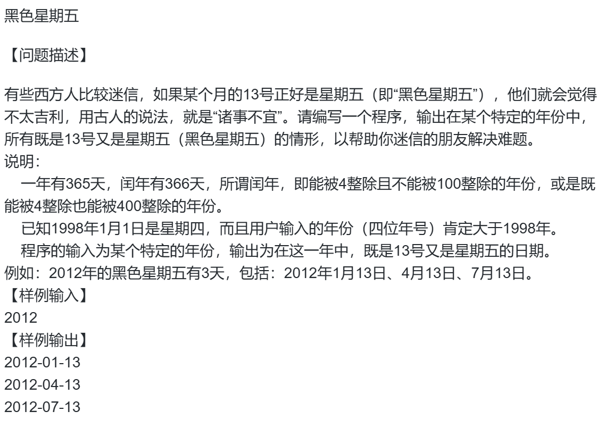

```python title="datetime"
from datetime import *
n = int(input())
st = date(n,1,1)
en = date(n,12,31)
while st <= en:
    if st.weekday() == 4 and st.day == 13:
        print(st.strftime("%Y-%m-%d"))
    st += timedelta(days = 1)

```


## 矩阵问题

### 力扣48

**原地反转矩阵90°**

- 问题描述

  

```python title="反转90°"
class Solution:
    def rotate(self, grid: List[List[int]]) -> None:
        n = len(grid)
        for i in range(n):
            # 转置
            for j in range(i+1,n):
                grid[i][j],grid[j][i] = grid[j][i],grid[i][j]
            # 反转
        for i in range(n):
            grid[i].reverse()
```


### 力扣36

- 问题描述

  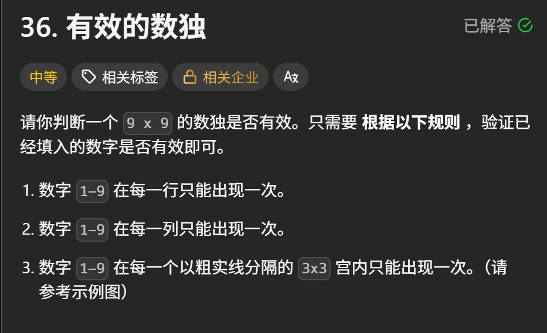

```python title="set"
class Solution:
    def isValidSudoku(self, board: List[List[str]]) -> bool:
        row_ = set()
        col_ = set()
        sub_ = set()
        for i,row in enumerate(board):
            for j,x in enumerate(row):
                if x == '.':
                    continue
                if (i,x) in row_ or (j,x) in col_ or (i//3,j//3,x) in sub_:
                    return False
                row_.add((i,x))
                col_.add((j,x))
                sub_.add((i//3,j//3,x))
        return True
```


### 洛谷1784

```python title="填充数独"
sd = [[0] * 10 for _ in range(10)]
row = [[False] * 10 for _ in range(10)]
col = [[False] * 10 for _ in range(10)]
box = [[False] * 10 for _ in range(10)]
def out():
    for i in range(1, 10):
        print(' '.join(str(sd[i][j]) for j in range(1, 10)))
    return True
def dfs(x, y):
    if sd[x][y] != 0:
        if x == 9 and y == 9:
            return out()
        elif y == 9:
            return dfs(x + 1, 1)
        else:
            return dfs(x, y + 1)
    else:
        box_idx = (x - 1) // 3 * 3 + (y - 1) // 3 + 1
        for i in range(1, 10):
            if not row[x][i] and not col[y][i] and not box[box_idx][i]:
                sd[x][y] = i
                row[x][i] = col[y][i] = box[box_idx][i] = True
                if x == 9 and y == 9:
                    if out():
                        return True
                elif y == 9:
                    if dfs(x + 1, 1):
                        return True
                else:
                    if dfs(x, y + 1):
                        return True
                # 回溯
                sd[x][y] = 0
                row[x][i] = col[y][i] = box[box_idx][i] = False
        return False
def main():
    for i in range(1, 10):
        a = list(map(int, input().split()))
        for j in range(1, 10):
            t = a[j - 1]
            sd[i][j] = t
            if t != 0:
                box_idx = (i - 1) // 3 * 3 + (j - 1) // 3 + 1
                row[i][t] = col[j][t] = box[box_idx][t] = True
    dfs(1, 1)
if __name__ == "__main__":
    main()
```


## 数学-GCD

### 蓝桥寒假训练营2D1-T5

- 问题描述

  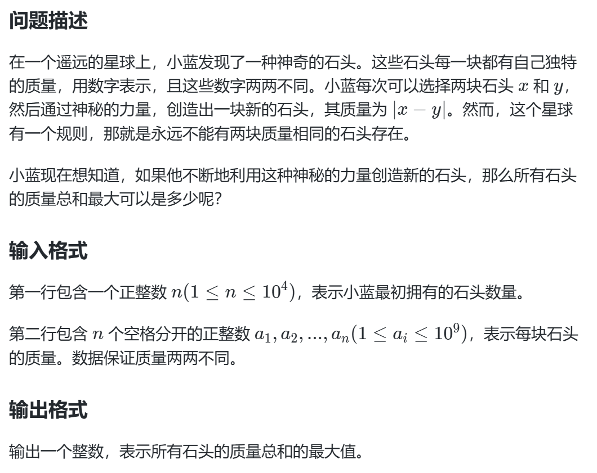

```python title="gcd"
import math
n = int(input())
a = list(map(int,input().split()))
g = a[0]
for x in (a[1:]):
    g = math.gcd(g,x)
t = max(a)//g
ans = g*(1+t)*t//2
print(ans)
```


- 题解思路
  ***
  **1. 问题本质**

  我们有若干不同的正整数，每次可以取两个数 $x, y$，产生新数 $|x - y|$，且不能有重复的数。问最终能得到的数的总和最大是多少。

  这本质上是一个**生成所有 gcd 的倍数**的过程。
  ***
  **2. 辗转相减法与欧几里得算法**

  回顾：欧几里得算法（辗转相除法）用于求两个数的最大公约数（gcd）。 &#x20;

  它基于一个关键性质：
  $$
  \gcd(a, b) = \gcd(a - b, b) \quad (a > b)
  $$
  也就是说，通过反复做减法，我们可以得到 gcd。

  例如：$  \gcd(12, 8)  $：
  - 12 - 8 = 4 → 得到 4
  - 8 - 4 = 4 → 得到 4（重复，忽略）
  - 最终得到 4，即 gcd。
  ***
  **3. 从 gcd 到所有倍数**

  一旦我们得到了 gcd = $d$，那么通过减法我们可以得到 $d$ 的任意倍数（不超过最大值）。

  例如：有 $d$ 和某个数 $k d$（$k > 1$），那么：
  - $k d - d = (k-1)d$ → 得到 $(k-1)d$
  - 继续，我们可以得到所有 $d, 2d, 3d, \dots, kd$。
    这个过程类似于“用减法实现加法”：
  - 从 $d$ 和 $2d$ 得到 $d$（已有）
  - 从 $2d$ 和 $d$ 得到 $d$（已有）
  - 但如何得到 $3d$？ &#x20;

    实际上，如果我们有 $2d$ 和 $d$，我们只能得到 $d$，不能得到 $3d$。 &#x20;

    所以我们需要一个更大的数作为“种子”。 &#x20;

    初始集合中最大的数 $M$ 就是最大的种子，我们可以从 $M$ 和 $d$ 得到 $M-d$，然后从 $M$ 和 $M-d$ 得到 $d$，再从 $M$ 和 $d$ 得到 $M-d$，这样反复，实际上我们无法得到大于 $M$ 的数，但可以得到所有小于等于 $M$ 的 $d$ 的倍数吗？

    其实，经典结论是：通过反复取差，可以得到的数集是初始数集的 **整数线性组合** 的集合，即所有形如 $c_1 a_1 + c_2 a_2 + \dots + c_n a_n$ 的整数（$c_i$ 为任意整数，可正可负）。 &#x20;

    由于我们可以取差（相当于加负数），实际上我们得到的数集就是所有数的整数线性组合，即它们的 **最大公约数** 的倍数。

    因此，最终能得到的数就是所有 $d$ 的倍数，且不超过初始最大值（因为差不会变大，只会变小）。
  ***
  **4. 为什么不能超过最大值？**

  因为每次操作产生的差一定小于较大的那个数，所以所有新数都小于当前最大值。因此，最终集合中所有数都不超过初始最大值。
  ***
  **5. 最终集合**

  因此，从初始数集出发，通过反复取差，最终能得到且仅能得到所有不超过 $\max(a)$ 的 $d$ 的倍数。 &#x20;

  其中 $d = \gcd(a_1, a_2, \dots, a_n)$。

  所以最大可能的总和就是：
  $$
  S = d + 2d + 3d + \dots + \left\lfloor \frac{\max(a)}{d} \right\rfloor \cdot d
  $$
  即
  $$
  S = d \cdot \frac{t(t+1)}{2}, \quad \text{其中 } t = \left\lfloor \frac{\max(a)}{d} \right\rfloor
  $$
  ***
  **6. 数学证明概要**
  1. 任何两个数的差都是它们的整数线性组合。
  2. 所有数的整数线性组合的集合就是 $d\mathbb{Z}$（$d$ 的整数倍）。
  3. 由于操作只能产生小于当前最大值的数，所以最终得到的数都在 $1$ 到 $\max(a)$ 之间。
  4. 因此，最终得到的数就是所有不超过 $\max(a)$ 的 $d$ 的倍数。
  5. 能否得到所有？可以：通过辗转相减法得到 $d$，然后从 $d$ 和某个 $k d$ 得到 $(k-1)d$，从而递归得到所有。
  ***
  **7. 示例**

  初始：$[4, 8, 10]$
  - $\gcd = 2$
  - 最大数 = 10
  - $t = 10/2 = 5$
  - 倍数：2,4,6,8,10
  - 总和 = $2 \times (5 \times 6 / 2) = 30$
  ***
  **8. 结论**

  这道题的核心数学背景是：
  - **欧几里得算法**：辗转相减得到 gcd。
  - **整数线性组合**：所有数的整数线性组合就是 gcd 的倍数。
  - **生成所有倍数**：通过反复取差，可以得到所有不超过最大值的 gcd 倍数。
    最终答案 = $\gcd \times \frac{t(t+1)}{2}$，其中 $t = \lfloor \max / \gcd \rfloor$。

## 数学-质因数分解

### 蓝桥寒假训练营2D4-T5

- 问题描述

  

```python title="质因数分解+动态规划"
n = int(input())
# 求1~n所有数的最小质因子
lpf = [0]*(n+1)
for i in range(2,n+1):
    if lpf[i] == 0:
        for j in range(i,n+1,i):
            lpf[j] = i
# 质因数分解
def fa(x):
    f = []
    while x > 1:
        p = lpf[x]
        cnt = 0
        while x%p == 0:
            x//=p
            cnt += 1
        f.append((p,cnt))
    return f
dp = [0]*(n+1)
for m in range(1,n+1):
    ff = fa(m)
    for pp,cnt in ff:
        if pp * pp <= m and m >= 2*pp:
            dp[m] = max(dp[m],dp[m - 2*pp] + pp)
print(dp[n])
```


### 洛谷1414-快速求一个数的所有正因子

- 问题描述

  题目背景

  “叮铃铃铃”，随着高考最后一科结考铃声的敲响，三年青春时光顿时凝固于此刻。毕业的欣喜怎敌那离别的不舍，憧憬着未来仍毋忘逝去的歌。一千多个日夜的欢笑和泪水，全凝聚在毕业晚会上，相信，这一定是一生最难忘的时刻！

  题目描述

  彩排了一次，老师不太满意。当然啦，取每位同学的号数来找最大公约数显然不太合理。于是老师给每位同学评了一个能力值。于是现在问题变为，从 $n$ 个学生中挑出 $k$ 个人使得他们的默契程度（即能力值的最大公约数）最大。但因为节目太多了，而且每个节目需要的人数又不知道。老师想要知道所有情况下能达到的最大默契程度是多少。这下子更麻烦了，还是交给你吧\~

  PS：一个数的最大公约数即本身。

  输入格式

  第一行一个正整数 $n$。

  第二行为 $n$ 个空格隔开的正整数，表示每个学生的能力值。

  输出格式

  总共 $n$ 行，第 $i$ 行为 $k=i$ 情况下的最大默契程度。

  输入输出样例 #1

  输入 #1
  ```markdown 
  4
  1 2 3 4

  ```

  输出 #1
  ```text 
  4
  2
  1
  1

  ```


```python title="质因数分解+一个数的所有正因子"
def solve():
    n = int(input())
    a = list(map(int,input().split()))
    max_a = max(a)
    # 筛法求最小质因数
    lpf = list(range(max_a + 1))
    for i in range(2, int(max_a ** 0.5) + 1):
        if lpf[i] == i:
            for j in range(i * i, max_a + 1, i):
                if lpf[j] == j:
                    lpf[j] = i
    def fa(x):
        f = []
        while x > 1:
            p = lpf[x]
            cnt = 0
            while x % p == 0:
                x //= p
                cnt += 1
            f.append((p, cnt))
        return f
    # 生成一个数的所有因子
    def get_factors(x):
        factors = [1]
        for p, exp in fa(x):
            new_factors = []
            for f in factors:
                mul = 1
                for _ in range(exp + 1):
                    new_factors.append(f * mul)
                    mul *= p
            factors = new_factors
        return set(factors)

    cnt = [0] * (max_a + 1)
    for x in a:
        for f in get_factors(x):
            cnt[f] += 1

    ans = [0] * (n + 1)
    for d in range(max_a, 0, -1):
        for k in range(1, cnt[d] + 1):
            if ans[k] == 0:
                ans[k] = d

    for k in range(1, n + 1):
        print(ans[k])


if __name__ == "__main__":
    solve()
```


- 问题描述

  1\. 问题理解
  - 有 nn 个学生，每个学生有一个能力值 aiai。
  - 对于每个 k=1,2,…,nk=1,2,…,n，要选出 **恰好 kk 个学生**，使得他们的 **最大公约数 (GCD)** 最大。
  - 输出这 nn 个最大值。
  ***
  2\. 思路分析

  直接枚举所有组合不可行（C(n,k)C(n,k) 太大）。
  我们换个角度：考虑 **可能的最大公约数 dd**，然后判断能否选出至少 kk 个能力值是 dd 的倍数的学生。
  - 对于每个 dd，统计能力值是 dd 的倍数的学生个数，记为 `cnt[d]`。
  - 如果 `cnt[d] >= k`，那么 dd 就是 kk 个人的一个可能的 GCD（不一定最大，但至少可行）。
  - 对于固定的 kk，我们想要最大的 dd 使得 `cnt[d] >= k`。
  ***
  3\. 算法步骤
  1. 找出能力值的最大值 `max_a`。
  2. 开一个数组 `cnt` 长度为 `max_a + 1`，统计每个数值出现的次数。
  3. 对于每个 `d` 从 1 到 `max_a`，计算 `cnt[d]` 为所有 `d` 的倍数的出现次数之和（类似埃氏筛）。
  4. 对于每个 `k` 从 1 到 `n`，我们需要找到最大的 `d` 使得 `cnt[d] >= k`。
     - 可以倒着遍历 `d`，记录每个 `k` 对应的最大 `d`。

### 34蓝桥算法入门赛-T5

**原问题转化为求 S=n(n+1)/2 的因数个数**

- 问题描述

  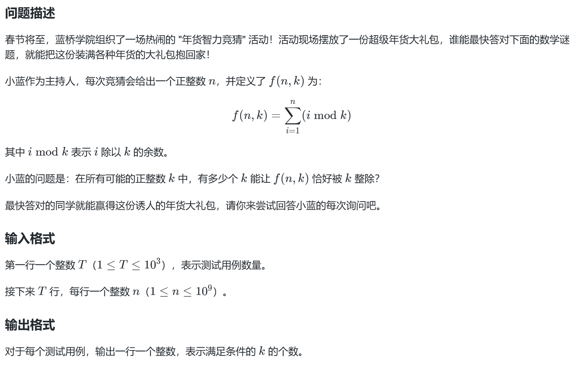

```python title="题解代码"
# 素数筛
MX = 10**6
is_p = [False] * 2 + [True] * (MX - 2)
p_ = []
for i in range(2, MX):
    if is_p[i]:
        p_.append(i)
        for j in range(i * i, MX, i):
            is_p[j] = False

# 质因数分解
def f1(x):
    f = []
    for p in p_:
        if p * p > x:
            break
        if x%p==0:
            cnt = 0
            while x % p == 0:
                x //= p
                cnt += 1
            f.append((p,cnt))
    if x > 1:
        f.append((x,1))
    return f
  
# 所有因数个数
def cnt_(fa):
    cnt = 1
    for exp in fa.values():
        cnt *= (exp + 1)
    return cnt

# 所有因数的集合
def get_(x):
    fact = [1]
    for p, cnt in f1(x):
        new_fact = []
        for f in fact:
            mul = 1
            for _ in range(cnt + 1):
                new_fact.append(f * mul)
                mul *= p
        fact = new_fact
    return fact
    
from collections import Counter
for _ in range(int(input())):
    n = int(input())
    fa_n = f1(n)
    fa_n1 = f1(n+1)

    cnt = Counter()
    for p,exp in fa_n:
        cnt[p] += exp
    for p,exp in fa_n1:
        cnt[p] += exp
    if 2 in cnt:
        cnt[2] -= 1
        if cnt[2] == 0:
            del cnt[2]
    print(cnt_(cnt))
```


### AWC45-D

- 问题描述

  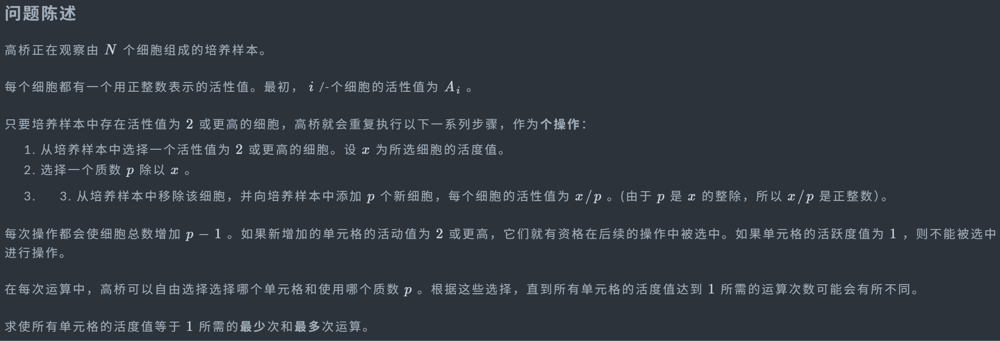

```python title="最小质因数+最大质因数"
n = int(input())
MX = 1000000
a = list(map(int,input().split()))
# 求最小质因数
min_lpf = list(range(MX+1))
for i in range(2,int(MX**0.5) + 1):
    if min_lpf[i] == i:
        for j in range(i*i,MX+1,i):
            if min_lpf[j] == j:
                min_lpf[j] = i
# 求最大质因子
max_lpf = list(range(MX+1))
for i in range(2,MX+1):
    if max_lpf[i] == i:
        if i * 2 <= MX:
            x = (MX - i)//i
            max_lpf[i*2:MX+1:i] = [i]*x

f_min = [0] * (MX + 1)
f_max = [0] * (MX + 1)
for x in range(2,MX + 1):
    s = min_lpf[x]
    f_min[x] = 1 + s*f_min[x//s]
    l = max_lpf[x]
    f_max[x] = 1 + l*f_max[x//l]
tot_min = tot_max = 0
for c in a:
    tot_min += f_min[c]
    tot_max += f_max[c]
print(f"{tot_min} {tot_max}")
```


## 数学-博弈

### CF-1033

- 问题描述

  经过漫长的一天，爱丽丝和鲍勃决定玩一个小游戏。游戏棋盘由 n 个单元格组成，这些单元格排成一条直线，编号从 1 到 n ，其中每个单元格包含的数字 ai 介于 1 和 n 之间。此外，没有两个单元格包含相同的数字。

  在其中一个单元格中放置一个令牌。两人轮流在棋盘上移动令牌，爱丽丝先移动。只有满足以下两个条件，当前玩家才能从 i 单元移动到 j 单元：
  - 新格 j 中的数字必须严格大于旧格 i 中的数字（即 aj>ai ），并且
  - 令牌在这一轮中移动的距离必须是旧格中数字的倍数（即 |i−j| mod ai=0 ）。
    无法移动的一方输。对于每种可能的起始位置，如果双方都以最佳方式下棋，那么谁会赢呢？可以证明博弈总是有限的，即总有一方的策略是赢的。

```python title="博弈+数学+DP"
n = int(input())
a = list(map(int,input().split()))
pos = [0]*(n+1)
for i,val in enumerate(a):
    pos[val] = i
dp = [False]*n
for val in range(n,0,-1):
    # |i - j| % a[i] == 0 等价于 j = i ± k * a[i]
    i = pos[val]
    st = val
    for j in range(i+st,n,st):
        if a[j] > val and not dp[j]:
            dp[i] = True
            break
    for j in range(i - st,-1,-st):
        if a[j] > val and not dp[j]:
            dp[i] = True
            break
print(''.join("A" if dp[i] else 'B' for i in range(n)))
```


- 题解思路
  - 有一个排列 `a[1..n]`（1 到 n 的每个数恰好出现一次）。
  - 从位置 `i` 可以移动到 `j`，当且仅当：
    1. `a[j] > a[i]`（数值更大）
    2. `|i - j|` 能被 `a[i]` 整除。
  - 无法移动的人输。
  - 问：对于每个起始位置，先手是否必胜？
  ***
  2\. 思路
  - 定义 `dp[i]` 表示从位置 `i` 出发，当前玩家是否必胜（`True` 表示先手赢）。
  - 如果从 `i` 出发能走到**任意一个必败态**，则 `dp[i] = True`。
  - 否则 `dp[i] = False`。
  ***
  4\. 关键点解释

  ① 为什么按数值从大到小处理？
  - 因为只能移动到数值更大的位置，所以数值大的位置是“终点”，没有出边。
  - 先处理数值大的位置，得到它们的胜负态，然后数值小的位置才能正确转移。
    ② 为什么只检查步长为 `val` 的位置？
  - 条件 `|i - j| % a[i] == 0` 等价于 `j = i ± k * a[i]`（k 为正整数）。
  - 所以我们只需要检查 `i + val`、`i + 2*val`、... 和 `i - val`、`i - 2*val`、... 这些位置。
    ③ 为什么检查到第一个必败态就停止？
  - 因为只要有一个后继是必败态，当前玩家就可以选择走到那里，从而获胜。
  - 所以一旦找到，立即标记 `dp[i] = True` 并跳出循环。
    ④ 为什么先向右再向左？
  - 顺序不重要，只要检查完所有步长的位置即可。先右后左只是习惯。
  ***
  5\. 示例模拟

  输入：
  ```text 
  5
  3 1 2 5 4
  ```

  - `a = [3,1,2,5,4]`
  - `pos`：值 1→1, 2→2, 3→0, 4→4, 5→3
    处理 `val=5`（位置 3）：
  - 向右：4,5... 越界
  - 向左：2,1,0... 检查位置 2（a\[2]=2<5 不满足 a\[j]>5）... 没有
  - `dp[3]=False`
    处理 `val=4`（位置 4）：
  - 向右：越界
  - 向左：位置 0（a\[0]=3<4 不满足），位置 -4 越界
  - `dp[4]=False`
    处理 `val=3`（位置 0）：
  - 向右：位置 3（a\[3]=5>3 且 `dp[3]=False`）→ 找到必败态 → `dp[0]=True`
    处理 `val=2`（位置 2）：
  - 向右：位置 4（a\[4]=4>2 且 `dp[4]=False`）→ `dp[2]=True`
    处理 `val=1`（位置 1）：
  - 向右：位置 2（a\[2]=2>1 且 `dp[2]=True` → 必胜态，不是我们想要的）
  - 继续：位置 3（a\[3]=5>1 且 `dp[3]=False`）→ 找到必败态 → `dp[1]=True`？等等，这里发现位置 3 是必败态，所以 `dp[1]=True`。但之前我们以为 1 是必败？需要重新检查。
    实际上，在向右检查时，我们找到第一个满足条件的就 break，所以位置 1 会先检查到位置 2（dp\[2]=True），此时条件成立，但 `dp[2]` 是 True，不是 False，所以不会触发 `dp[1]=True`。继续检查位置 3（dp\[3]=False），满足条件，所以 `dp[1]=True`。因此最终 `dp[1]=True`。
  最终 dp = \[True, True, True, False, False] &#x20;

  输出：`A A A B B`，即 `AAABB`。
  ***
  7\. 总结
  - 核心：**按数值从大到小 DP** + **步长跳跃检查**。
  - 状态转移：`dp[i] = True` 当且仅当存在一个可达位置 `j` 且 `dp[j] = False`。
  - 输出 `'A'` 表示先手赢，`'B'` 表示先手输。

## 数学-进制转换-板子\*

**进制转换**

```python title="板子"
# 将b进制数转换为十进制
def f1(s,b):
    d = 0
    for c in s:
        if '0' <= c <= '9':
            val = int(c)
        else:
            val = ord(c.upper()) - ord('A') + 10
        d = d * b + val
    return d
# 将一个十进制数转换为指定进制数
def f2(x,b):
    if x == 0:
        return '0'
    d = []
    while x > 0:
        rem = x % b
        if rem < 10:
            d.append(str(rem))
        else:
            d.append(chr(ord('A') + rem - 10))
        x //= b
    return ''.join(reversed(d))
# 将一个进制转换为另一进制
def f3(s,from_base,to_base):
    d = f1(s,from_base)
    return f2(d,to_base)
    
n = int(input().strip())
s = input().strip()
m = int(input().strip())
print(f3(s,n,m))
```


## 数学-奇偶

### 蓝桥寒假训练营2D5-T5

- 问题描述

  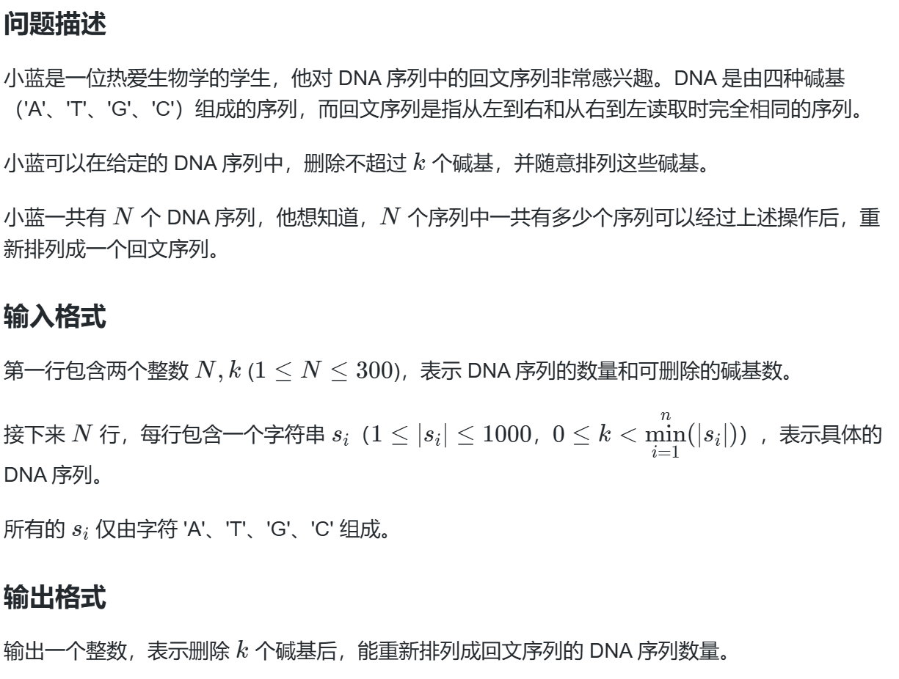

```python title="题解代码"
def solve():
    N, k = map(int, input().split())
    ans = 0
    for _ in range(N):
        s = input().strip()
        cnt = [0] * 4  # A,T,G,C
        for ch in s:
            if ch == 'A':
                cnt[0] += 1
            elif ch == 'T':
                cnt[1] += 1
            elif ch == 'G':
                cnt[2] += 1
            else:  # 'C'
                cnt[3] += 1
        odd = sum(1 for c in cnt if c % 2 == 1)
        if odd <= 1:
            ans += 1
        else:
            if k >= odd - 1:
                ans += 1
    print(ans)
if __name__ == "__main__":
    solve()
```


## 数学-逆元/组合数学

### AWC42-C

- 在模运算中，除法没有定义，所以要用**乘法逆元**：`a / b ≡ a * b^{-1} (mod MOD)`。
- 根据费马小定理，当 `MOD` 是质数且 `b` 不是 `MOD` 的倍数时，`b^{-1} ≡ b^{MOD-2} (mod MOD)`

```python title="逆元"
s_inv = pow(s, MOD-2, MOD)   # 计算 s_ 的模逆元
t = (sinv * w_) % MOD       # 相当于 w_ / s_  (模 MOD 下)
```


- 问题描述

  高桥担任总裁的公司有 $N$ 名员工，每人的编号从 $1$ 到 $N$ 。该公司在 $D$ 个月内发放奖金。

  每个员工的 $i$ （ $1 \leq i \leq N$ ）都有一个正整数 $P_i$ ，代表他们的 "贡献水平"，总贡献为 $S = P_1 + P_2 + \cdots + P_N$ 。

  每月 $j$ ( $1 \leq j \leq D$ )，公司的奖金总额为 $W_j$ 。这笔资金按照每位员工的贡献水平比例进行分配。也就是说，员工 $i$ 在 $j$ 月份获得的奖金额为

  $\frac{P_i \times W_j}{S}$

  在 $D$ 个月结束后，员工 $i$ 获得的奖金总额为

  $T_i = \frac{P_i}{S} \times \sum_{j=1}^{D} W_j$

  青木作为会计经理，希望计算所有员工奖金总额的**积**：

  $R = \prod_{i=1}^{N} T_i$

  $R$ 是一个非负有理数。将 $R$ 表示为不可约分数 $\frac{A}{B}$ （ $A \geq 0$ , $B > 0$ , $\gcd(A, B) = 1$ ）。特别是，当 $R = 0$ 时，让 $A = 0$ 和 $B = 1$ .

  计算 $A \times B^{-1} \bmod 998244353$ ，其中 $B^{-1}$ 表示 $B$ modulo $998244353$ 的模逆。

  可以保证在此问题的限制条件下， $B$ 与 $998244353$ 是共素数，这意味着模逆总是存在的。

[https://www.wolai.com/kiN5GrJsVn2cN1GCsaENTR#pdrVFMpncX4PYJTBoAd4y8](https://www.wolai.com/kiN5GrJsVn2cN1GCsaENTR#pdrVFMpncX4PYJTBoAd4y8 "https://www.wolai.com/kiN5GrJsVn2cN1GCsaENTR#pdrVFMpncX4PYJTBoAd4y8")

### AWC38-D

- 题目描述

  高桥是一个拥有 N 名球员的体育俱乐部的教练。球员的编号从 1 到 N ，不同编号的球员被认为是不同的。球员 i ( 1≤i≤N ) 的技能值是整数 Wi 。

  高桥打算用 N 名棋手组成一支队伍。对于每个球员，他只需决定一次是 "选中 "还是 "不选中"（同一球员不能被选中多次）。包括没有人被选中的情况在内，有 2N 种可能的组队方式。

  让 ⌊x⌋ 表示不超过 x 的最大整数。在 2N 种可能的选择中，被选中的人数至少为 ⌊N/2⌋+1 的选择称为**有效选择**。例如，当 N=5 时，至少要有 3 名棋手被选中，而当 N=6 时，至少要有 4 名棋手被选中。

  对于每个有效的选择，**分数**被定义为所选球员技能值的总和。对于所有有效的选择，计算每个得分并找出所有得分的总和。如果不同选中的球员得分相同，则分别计入总和。

  由于答案可能很大，请输出除以 998244353 后的余数。

```python title="DFS暴力"
# 暴力
def main():
    MOD =  998244353
    n = int(input())
    w = list(map(int,input().split()))
    ww = {i:w[i-1] for i in range(1,n+1)}
    path = []
    res = []
    def dfs(i,cnt):
        if cnt > n:
            return
        if cnt >= n//2+1:
            res.append(list(path))
        if i > n:
            return
        for j in range(i+1,n+1):
            path.append(j)
            dfs(j,cnt+1)
            path.pop()
    dfs(0,0)
    ans = 0
    for row in res:
        for x in row:
           ans = (ans + ww[x])%MOD
    print(ans)
```


```python title="组合数学+逆元"
def main2():
    MOD = 998244353
    n = int(input())
    w = list(map(int,input().split()))
    m = n // 2 + 1
    ##
    fa = [1]*(n+5)
    inv_fa = [1]*(n+5)
    for i in range(2,n+5):
        fa[i] = fa[i-1] * i %MOD
    inv_fa[n+4] = pow(fa[n+4],MOD-2,MOD)
    for i in range(n+4,0,-1):
        inv_fa[i-1] = inv_fa[i]*i%MOD
    def comb(x, y):
        if y < 0 or y > x:
            return 0
        return fa[x] * inv_fa[y] % MOD * inv_fa[x-y] % MOD
    ##
    cnt = 0
    for k in range(m-1,n):
        cnt = (cnt + comb(n-1,k))%MOD
    tot = sum(w)%MOD
    ans = tot*cnt%MOD
    print(ans)
```


### AWC37-D

- 问题描述

  高桥计划沿一条笔直的道路在 N 块土地上种植树木。这些地块从左到右依次编号为地块 1 、地块 2 、地块 … 、地块 N 。

  高桥将从这 N 个地块中准确选择 K 个地块，并在每个选择的地块上种植一棵树（未选择的地块不种树）。但是，为了确保树木之间有足够的间距，必须遵循以下规则：
  - 不得同时选择相邻的两个地块。也就是说，对于所有的 i ( 1≤i≤N−1 )，不能同时选择地块 i 和地块 i+1 。
    在满足规则的前提下，有多少种选择地块的方法？如果所选地块的集合不同，则认为两种方法不同。求 109+7 的答案。如果没有有效的选择方式，答案为 0

```python title="组合数学"
# dfs暴力
def main1():
    import sys
    sys.setrecursionlimit(1000000)
    n,k = map(int,input().split())
    ans = 0
    if k == 0:
        print(0)
        return
    def dfs(i,cnt):
        nonlocal ans
        if cnt == k:
            ans += 1
            return
        if i > n:
            return
        # 不选当前位置，下一个位置+1
        dfs(i+1,cnt)
        # 选择当前位置，下一个位置+2
        dfs(i+2,cnt+1)
    dfs(1,0)
    print(ans)
# 记忆化搜索
from functools import lru_cache
def main2():
    import sys
    sys.setrecursionlimit(1000000)
    n, k = map(int, input().split())
    @lru_cache(None)
    def dfs(i,cnt):
        if cnt == k:
            return 1
        if i > n:
            return 0
        return dfs(i+1,cnt) + dfs(i+2,cnt+1)
    print(dfs(1,0))
# 二维DP
def main3():
    n, k = map(int, input().split())
    MOD = 10 ** 9 + 7
    if k == 0:
        print(1)
        return
    dp = [[0]*(k+1) for _ in range(n+1)]
    for i in range(n+1):
        dp[i][0] = 1
    for i in range(1,n+1):
        for j in range(1,min(i,k) + 1):
            dp[i][j] = dp[i-1][j]
            if i >= 2:
                dp[i][j] = (dp[i][j] + dp[i-2][j-1])%MOD
            elif j == 1:
                dp[i][j] = (dp[i][j] + 1)%MOD
    print(dp[n][k]%MOD)
# 组合数
import math
def main4():
    n,k = map(int,input().split())
    MOD = 10**9 + 7
    if k == 0:
        print(1)
        return
    if n < 2 * k - 1:
        print(0)
        return
    ans = math.comb(n-k+1,k)
    print(ans%MOD)
# 高效计算组合数

def main5():
    import sys
    MOD = 10 ** 9 + 7
    def modinv(a):
        return pow(a, MOD - 2, MOD)
    N, K = map(int, sys.stdin.readline().split())
    n = N - K + 1
    if n < K:
        print(0)
        return
    fact = [1] * (n + 1)
    for i in range(1, n + 1):
        fact[i] = fact[i - 1] * i % MOD
    invfact = [1] * (n + 1)
    invfact[n] = modinv(fact[n])
    for i in range(n, 0, -1):
        invfact[i - 1] = invfact[i] * i % MOD
    ans = fact[n] * invfact[K] % MOD * invfact[n - K] % MOD
    print(ans)
if __name__ == '__main__':
    main5()
```


### 蓝桥寒假训练营1D4-T5

在 `n` 天中选 `k` 个位置作为休息，要求这些位置两两不相邻，求方案数。

- 问题描述

  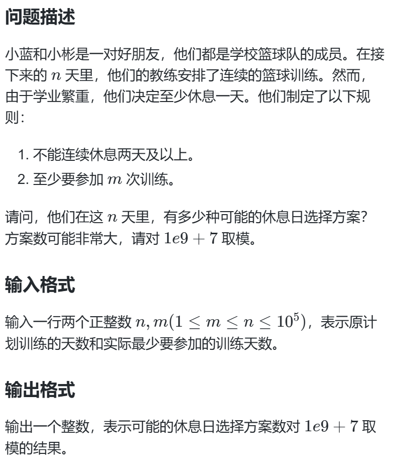

```python title="使用内置库-过25%"
import math
MOD = 10**9 + 7
def main():
    n, m = map(int, input().split())
    max_ = n - m
    if max_ < 1:
        print(0)
        return
    ans = 0
    for k in range(1, max_ + 1):
        ans = (ans + math.comb(n - k + 1, k)) % MOD
    print(ans)
if __name__ == "__main__":
    main()
```


```python title="逆元解法-正解"
MOD = 10 ** 9 + 7
def modinv(x):
    return pow(x, MOD - 2, MOD)
def solve():
    n, m = map(int, input().split())
    max_k = n - m
    if max_k < 1:
        print(0)
        return
    ## 预处理阶乘到 n+1
    fact = [1] * (n + 5)
    for i in range(2, n + 5):
        fact[i] = fact[i - 1] * i % MOD
    inv_fact = [1] * (n + 5)
    inv_fact[n + 4] = modinv(fact[n + 4])
    for i in range(n + 4, 0, -1):
        inv_fact[i - 1] = inv_fact[i] * i % MOD
    def C(a, b):
        if b < 0 or b > a:
            return 0
        return fact[a] * inv_fact[b] % MOD * inv_fact[a - b] % MOD
    ##
    ans = 0
    for k in range(1, max_k + 1):
        ans = (ans + C(n - k + 1, k)) % MOD
    print(ans)
if __name__ == "__main__":
    solve()
```


- 题解思路

  好的，我们先一步步分析。
  ***
  1\. 题意理解
  - 有 `n` 天，每天可以选择“参加训练”或“休息”。
  - 规则：
    1. 不能连续休息两天及以上（即休息的天数不能相邻）。
    2. 至少参加 `m` 次训练（即休息的天数 ≤ `n - m`）。
  - 求满足条件的方案数（对 `1e9+7` 取模）。
  ***
  2\. 转化

  设 `k` 为休息的天数，则 `0 ≤ k ≤ n - m`（因为至少参加 m 次，所以休息最多 n-m 天）。

  并且休息的天数不能相邻。

  问题转化为：在 `n` 天中选 `k` 个位置作为休息，要求这些位置两两不相邻，求方案数。
  ***
  3\. 经典组合数学公式

  在 `n` 天中选 `k` 个不相邻的休息日的方案数为：
  $$
  \binom{n - k + 1}{k}
  $$
  解释：先放 `n - k` 个“参加”的天，它们之间有 `n - k + 1` 个空隙（包括两端），从这些空隙中选 `k` 个放入“休息”天，每个空隙最多放一个，即可保证不相邻。
  ***
  4\. 总方案数

  因此，总方案数为：
  $$
  \sum_{k=1}^{n-m} \binom{n - k + 1}{k}
  $$
  ***
  5\. 计算

  由于 `n ≤ 1e5`，可以直接用组合数公式计算，预处理阶乘和逆元，然后累加。
  ***

### 蓝桥寒假训练营2D5-T4

- 问题描述

  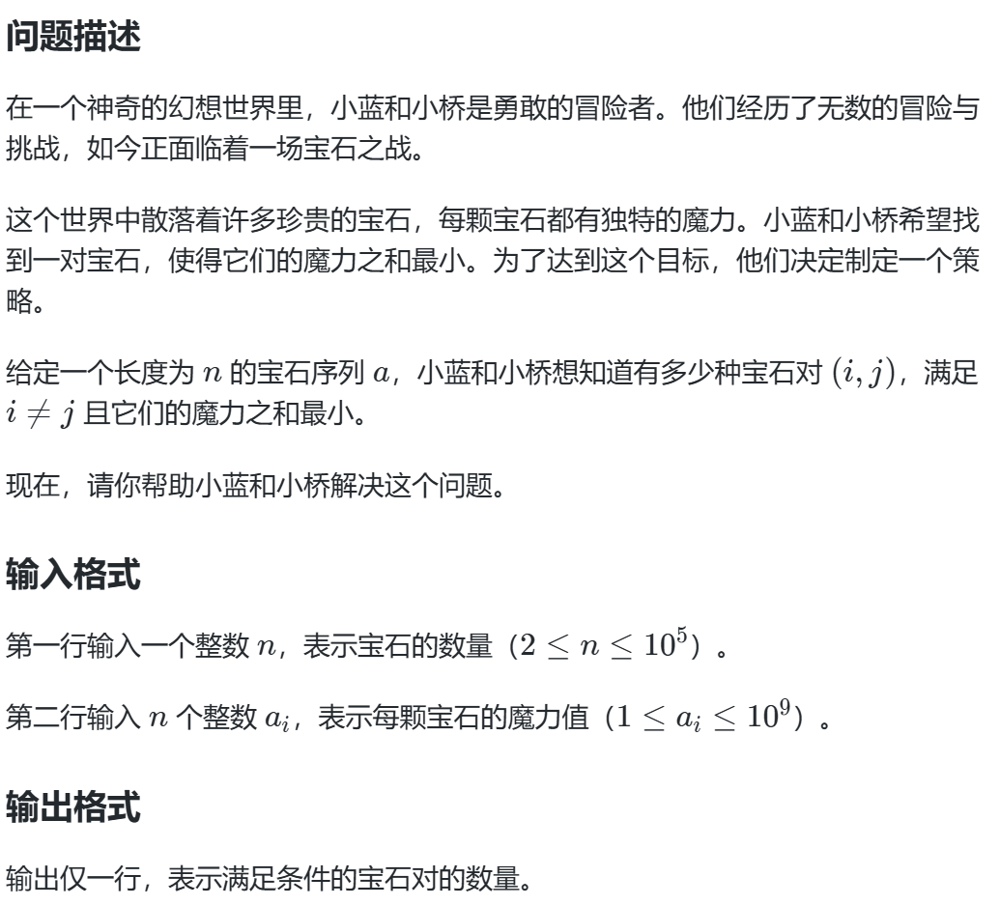

```python title="题解代码"
from collections import Counter
import math
def f3(n,a):
    cnt = Counter(a)
    min_ = min(a)
    c = cnt[min_]
    if c >= 2:
        ans = math.comb(c,2)
    else:
        sec_ = min(x for x in a if x != min_)
        ans = cnt[min_] * cnt[sec_]
    return ans
n = int(input())
a = list(map(int,input().split()))
print(f3(n,a))
```


## 数学-位运算

- 问题描述

  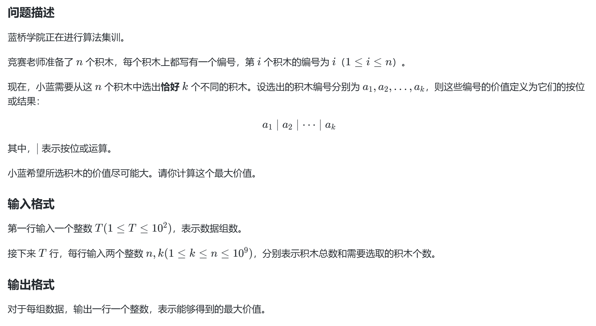
- 题解思路

  这道题是一道非常经典的**位运算（Bitwise Operations）** 贪心题。核心在于理解“按位或（OR，`|`）”运算的单调递增性质：**参与“或”运算的数字越多，结果的二进制位上的 **$1$** 只会多不会少，数值也就可能越大**。

  下面为你详细梳理这道题的推导思路和极简的代码实现。

  我们的目标是从 $1$ 到 $n$ 中选出 $k$ 个不同的数，使得它们的按位或结果最大。

  根据可选的数量 $k$，我们可以将问题分为两种情况：

  **情况一：**$k = 1$

  只能选择 $1$ 个积木。为了让价值最大，显然我们直接选择编号最大的那一个即可。
  - \*\*最大价值 = \*\*$n$**情况二：**$k \ge 2$
  当我们可以选择 $2$ 个或更多积木时，情况就变得非常巧妙了。
  1. **寻找理论上限**：

     假设 $n$ 的二进制最高位处于第 $p$ 位（例如 $n=10$ 的二进制是 `1010`，最高位在第 $3$ 位，对应的权值是 $2^3 = 8$）。

     因为我们只能从 $\le n$ 的数字里选，所有可选数字都不会触及第 $p+1$ 位。因此，我们能达到的**绝对理论最大值**，就是把第 $p$ 位及以下的所有低位全部填满 $1$。

     这个全部是 $1$ 的数等于 $2^{p+1} - 1$。
  2. **证明一定能达到理论上限**：

     只要 $k \ge 2$，我们能否一定凑出这个全 $1$ 的数呢？答案是**一定能**。
     - 由于 $n$ 的最高位权值是 $2^p$，说明 $2^p \le n$。我们一定可以选择 $2^p$（它的二进制形式为 `100...0`）。
     - 因为 $n \ge 2^p$，且 $k \ge 2$ 意味着 $n \ge 2$，所以 $2^p - 1 \ge 1$。我们一定可以选择 $2^p - 1$（它的二进制形式为 `011...1`）。
     - 这两个数不仅都在 $[1, n]$ 范围内，而且肯定是不同的两个数。
     - 将它们进行按位或运算：$2^p \mid (2^p - 1) = 2^{p+1} - 1$。完美凑成了理论最大值！
       如果 $k > 2$，剩下的 $k-2$ 个数我们可以从剩下的积木中随便挑，因为“按位或”运算并不会抹去已经变成 $1$ 的位，结果将始终保持在 $2^{p+1} - 1$。

```python title="位运算"
for _ in range(int(input())):
    n,k = map(int,input().split())
    if k == 1:
        print(n)
    else:
        p = n.bit_length()
        print((1 << p) - 1)
```
