# 某傻子的前半生

## 目录

- [前言](#前言)
- [一、初生](#一初生)
- [二、拼音](#二拼音)
- [三、水痘](#三水痘)
- [四、别离](#四别离)
- [五、期望](#五期望)
- [六、转折](#六转折)
- [七、自欺欺人](#七自欺欺人)
- [八、中考](#八中考)
- [九、冰窟](#九冰窟)
- [十、落差](#十落差)
- [十一、起舞](#十一起舞)
- [十二、天才](#十二天才)
- [十三、无名](#十三无名)
- [十四、日记](#十四日记)
- [十五、暗恋](#十五暗恋)
- [十六、高考](#十六高考)
- [十七、否定](#十七否定)
- [十八、白象](#十八白象)
- [十九、物哀](#十九物哀)
- [二十、苏州](#二十苏州)
- [二十一、恶之花](#二十一恶之花)
- [二十二、无名的人](#二十二无名的人)
- [二十三、花火](#二十三花火)
- [二十四、画像](#二十四画像)
- [二十五、释怀](#二十五释怀)
- [二十六、看见](#二十六看见)
- [二十七、素昧平生](#二十七素昧平生)
- [二十八、失眠](#二十八失眠)
- [二十九、药物](#二十九药物)
- [三十、偶遇](#三十偶遇)
- [三十一、背影](#三十一背影)
- [三十二、窄门](#三十二窄门)
- [三十三、A6](#三十三A6)
- [三十四、龙华](#三十四龙华)
- [三十五、梦话](#三十五梦话)
- [三十六、期待](#三十六期待)
- [三十七、尝试](#三十七尝试)
- [三十八、秋冬](#三十八秋冬)
- [三十九、戏](#三十九戏)
- [四十、病](#四十病)
- [四十一、草稿](#四十一草稿)
- [四十二、局促不安](#四十二局促不安)
- [四十三、合谋](#四十三合谋)
- [四十四、加戏](#四十四加戏)
- [四十五、虚度年华](#四十五虚度年华)
- [四十六、尝试](#四十六尝试)
- [四十七、戏作三昧](#四十七戏作三昧)
- [四十八、梨云梦远](#四十八梨云梦远)
- [四十九、冰淇淋](#四十九冰淇淋)
- [五十、抱怨](#五十抱怨)
- [五十一、火树银花](#五十一火树银花)
- [五十二、追忆](#五十二追忆)

2025/12/28

### 前言

“人生像是缺页很多的书，很难把它说成是一部书。然而，它好歹是一部书。”

这不是一篇文学作品，因为我完全不懂语法，不会使用标点符号，不懂遣词造句，更不擅长编织语言。这更像是随手写下的流水账，他混乱的20年走来的路程应该同样用混乱的语言来进行记录。

此文中表现出的傻劲供你一笑。

### 一、初生

二零零五年的农历六月六日，六点六斤的他初次来到这个世界。当初的他并不知道，他的生活将会充满破桐之叶。

在之后的几年间，他随父母四处“逃窜”，逃避一些人的抓捕。迷迷糊糊中，他想起在当时，有西装革履的人来到房前，每当他们到来，他的母亲都告诉他，要躲起来，不要被发现。

于是，床底成了他幼年时的避风港，灰尘在他的衣服上留下层层印记。

### 二、拼音

他跟随父亲来到爷爷奶奶家，熟睡八小时让他白天迷迷糊糊，当他再次清醒时，房间里只剩下三个人。毫无疑问，他人生的前十二年，对父母的印象寥寥无几。

课堂铃声响起，他看向课本上的拼音字母不足为意。

然而多年后，他想不到的是，他还是不会拼音。

他的语言系统像是遭受了巨大破坏。

### 三、水痘

那是他的第一场大病，觉得自己像个累赘。

没日没夜的输液，让他弱不经风。然而有那么一天，在他输液完后的下午，他看见了自己的母亲，那是他最久的一顿饭，第一次觉得，简单的咀嚼是如此的治愈人心。待他长大后，他很少再感受到那种感觉。那是一种只有在他生病时，有他人给予一句安慰时，才会让他想起的感觉。

然而有幸的是，他经常生病，身体羸弱。这倒是上天赐予他的嘉奖。

第二天清晨醒来，又像平常一样。

### 四、别离

六年级毕业时，他还没有可用于留下同学联系方式的工具，因而在这六年间，他没能留下一个人。此时，他略微懂得离别这个词，而在今后的日子，他每日都在经历别离。

最后一次走出校园时，他看见了一年级的学生。他庆幸自己这六年默默无闻。

### 五、期望

他的家人并不觉得他会成为好学生，如果不出意外，他会在初中毕业后，读一所最烂的高中，然后在那里虚度光阴，最后进入电子厂。他的第一场初中考试的成绩也印证了这一点，数学六十分、英语二十四分。

### 六、转折

数学老师叫他上去做一道题。三人中，就他幸运的写了出来，或许那时的他还不知道，这将改变他的人生。

那是一条他之前包括他的所有家人都不会设想到的道路。

### 七、自欺欺人

他迷上了数学，从那时起，他早上6点起床到校后，便拿起资料，午睡、课间都是如此。他的努力对得起他的付出。从那以后，他的数学一直是这所农村初中的第一名。他曾靠数学的分数达到年级第二，第一的英语比他高了六十分。

他天真的认为，或许努力真的会改变很多事情。的确，在这期间，偏头痛、低血糖、鼻炎、贫血等等症状都在生根。

直到他看到外面的世界。

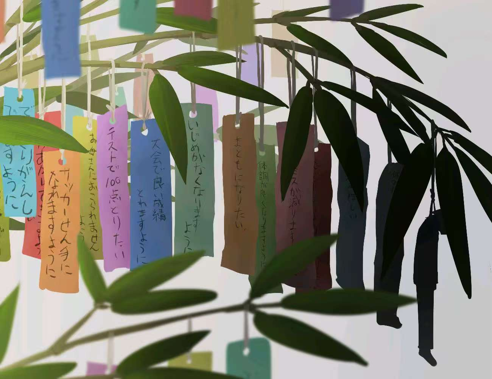

### 八、中考

一场大雨在这个特殊的日子袭来，积雨的厚度已经淹没到了他的膝盖。

在他的这一所初中，整个初三一百八十人，考上高中的人数只有寥寥三十八人。

然而幸运的是，他凭借农村初中加分四十分的成绩，进入了县里最好的高中。或许当时的他是非常兴奋的，整个村里面，他是第一个不依靠复读便考进去的。

然而，他不会想到，在此后的三年，他都在为那四十分还债。

### 九、冰窟

报道的第一天，他的父亲随他一起前往这所高校。他第一次进入县城，也进入了让他感到巨大落差的冰窟。

在那里，他遇见了很多他初中老师的孩子，那些平日里上课时常听到的名字，现在都在他的眼前。

### 十、落差

进入高中班级后，他理所应当的被安排在最后一排，尽管他非常矮。

在课间，他偶然听到前排在讨论成绩，他凑过去，听到了他的成绩在这里多么可笑。

随着班主任公布的中考成绩，他彻底落入了巨大冰窟，近三分之二的学生，中考数学都是近乎满分。

他曾以为的努力在这一刻变得稀碎，连同带着他最初的幻想。

### 十一、起舞

在充满焦躁气味的风中，一只蝴蝶在蹁跹起舞。一眨眼的功夫，他感到这只蝴蝶的翅膀碰了一下他那朴素的衣裳。可是沾在他衣服上的翅粉却在几年后还闪着光。

### 十二、天才

这在学校的几年间，他见识到了很多天才，以至于他更加认定自己的平庸。这些天才曾经或是物化生从来没低于过九十五的，或是英语从和他一样的六十分历经三个月便从未低于过一百三的，或是从老师口中知道的每天九点起床，从不来教室最后考进清华的上一届学长......

他曾想，学习不是一个人的全部。

然而可笑的是，除了学习，他再也没有拿得出手的了。

现在在这里，他更像是一只一无所有的蠹虫。从农村来到县城，觉得自己应该烂死在曾经。

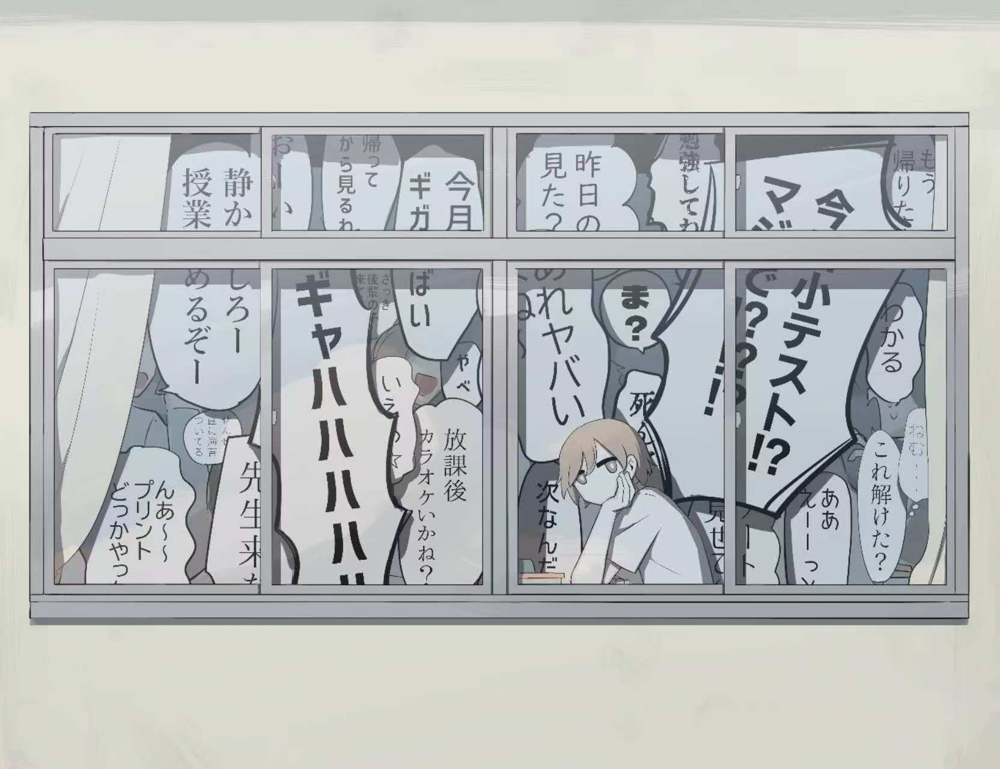

### 十三、无名

“无名”席卷了全国，他是班里最早中招的学生之一。那一天傍晚，最后一节课前，他拿起温度计，39.8℃。平时一惯忍受的他，也受不了“无名”的摧残。

拿到老师的假条后，他说再等最后一节课下课后回家。他的脑子很热。

他的同桌趴下去，用温和的口吻问了他一句，“你还好吗？”。

他感受到了许久未曾感受到的关怀，追溯上一次这种感受，还是六年前。这四个字，骗了他整整一年。

他这是自作自受。

### 十四、日记

那是他高中最后阶段的同桌。

某日中午，他独自在教室，他的同桌桌面放着一本日记本。

好奇心催使他翻看了它，在这本日记中，他读到了关于另一个男孩。

### 十五、暗恋

她与那位男生从小学到高中都是一所学校。这位男生从幼儿园开始便是所有老师的焦点。聪明、活泼以及运动天赋，数之不尽的优点集于他一身。在聚光灯下，男孩主持大大小小的活动；在操场上，男生带领队伍踢足球，打篮球；在学习上，男生一直名列前茅......

她对这位男生在日记中曾这样写到：

“每天晚上，我回到家，都会趴在阳台，往下看，他回家时会经过这里。我的妈妈在一次学校校会上对我说，台上的男孩真帅。当时我还不足为意的说道，就一般般吧。实际上，我已经暗恋了他六年了！”

他读到这，心里一酸。

他知道了这位描述的男孩，是学校实验班的一名学生。从小到大，他一直是口中别人家的孩子，学习、运动、乐器·······。这光环太热烈，刺伤了无数男生和女生。再后来，他考上了复旦大学。

他虽然和这位男生在同一所高中，但是天差地别，一个实验班数一数二，另一个仅仅是普通班的中游。

他想起了自己那一文不值的过去。

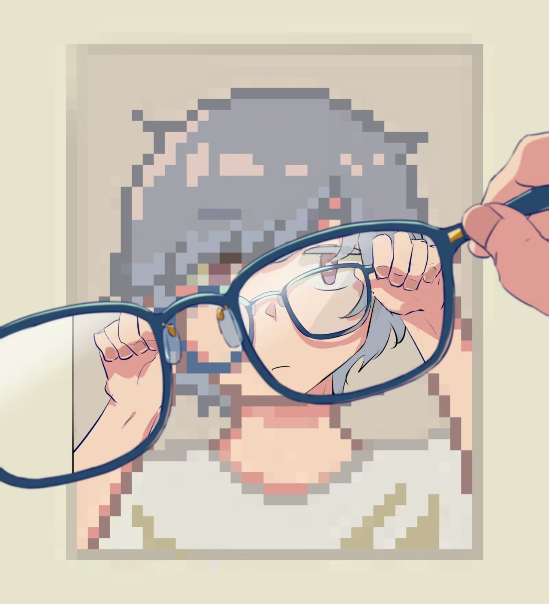

### 十六、高考

在高考最后一门结束后，他没有像大多数一样冲出学校。

在考场走廊，他想起来自己曾经阴差阳错来到这里，阴差阳错的变成她的邻桌。很多巧合看似让他生活充满希望，但最终结局，还不如夏日蝉鸣的聒噪。

但是这一切都要马上结束了。

六点四十分，他晃悠出了校门，门口还有星星零零的家长在与他们的孩子合影，手捧鲜花。

当他们按下快门的瞬间，是否会把他拍进去，让他也感受一下高考结束后的欢闹？

他找到陪了自己三年的车子，但是不幸的是，人流已经把它和他推倒在地。

回到家后，他打开手机，看见了很多同学与家长的合影，并配上高考结束的相关文案。

他打开聊天框，欲言又止。

他想为自己的高中生活写下一个句号，但他还有一件事没做。

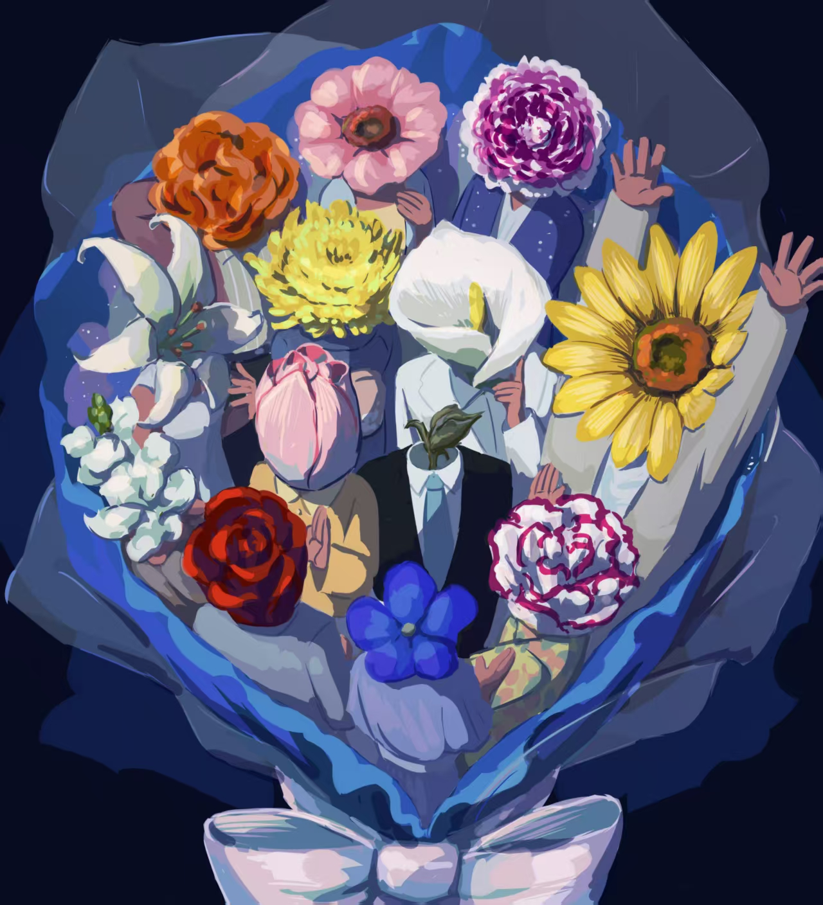

### 十七、否定

他专门挑选了一个日子，用朴素的摩斯密码编写了表明心意的话语。

三十秒后，他的高中就这样落幕了。

此后几天，他泄入了极大的自我怀疑。

她完全没有在意他，那句关心话，只不过是她对谁都会说出的。那只是一个位置，而我只是因巧合坐在那个位置上的俗人。

他又重新想起了那个男孩。他拿出了很少用过的镜子，又站了起来，想起了自己比她低了五十分的成绩。

“她值得更好”。

此后的两年里，他未曾主动接触过任何一个女生。他知道，很多人都值得更好。他不想再耽搁别人。

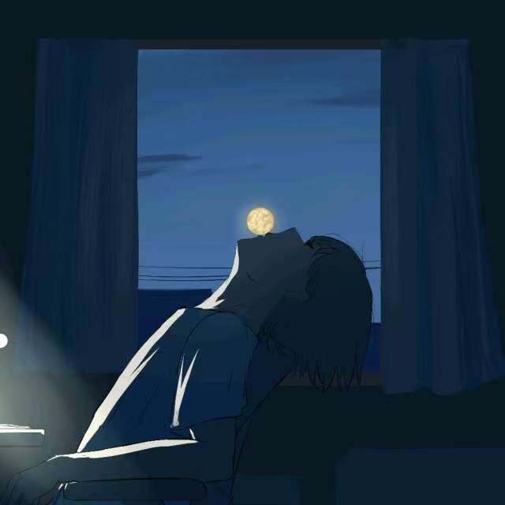

### 十八、白象

他慢慢走出过去。

谢师宴、同学聚会、同学的升学宴以及他自己的升学宴他都没有出席，蜗居在家里的三个月，让他喜欢上了读小说。

他喜欢上了海明威，他的短篇小说令他感到无比的震撼。《乞力马扎罗的雪》《雨中的猫》《在异乡》《白象似的群山》……他痴迷了于这位硬汉写下的细腻文笔。

他本身并不懂文学。

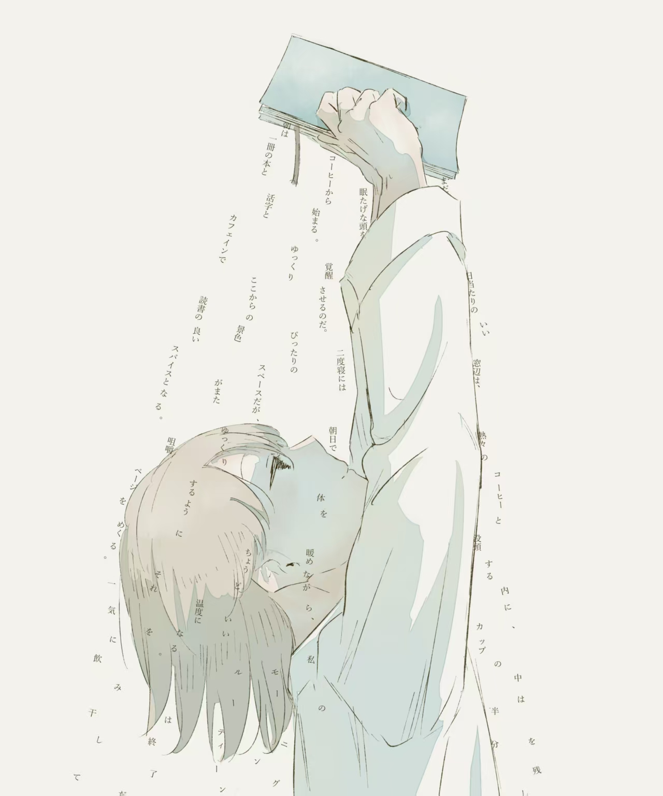

### 十九、物哀

他又拿起了高中时的语文资料，读遍了里面所涉及的小说。

他注意到了这么几个作家：芥川龙之介、川端康成、夏目漱石，经过这三个作家，他又了解到了太宰治和三岛由纪夫。他近乎痴迷的喜欢上了川端康成，笔下的物哀之美让他感受到痴迷。

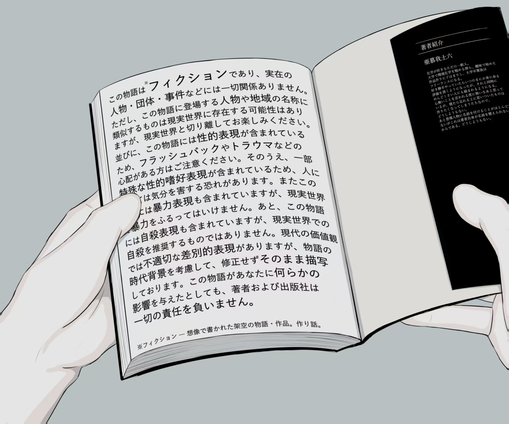

### 二十、苏州

这是他第一次离开市区。

早在暑假期间，他已经看遍了高中同学游遍中国，他并不羡慕。他很少出门，出门会给他带来严重的偏头痛，要靠药物止痛。这成了他蜗居的借口。

在开学的前几天，他发现她把他的所有联系方式全部拉黑了。

望向手机里面零星的几个联系人，他将他们一个个删去，只保留了曾经和他一起谈心的一位高中同学。他们到现在还在联系，他帮助了他很多，教会了他如何坐地铁、看地图、坐火车、坐高铁，如何打车、如何生活.......

### 二十一、恶之花

五点五十份，他起床晨跑，好好看了看从入校到迄今为止从没有好好观察过的校园。

在过去的几年，他一直是鼠辈，在热闹的人群中寻找出口窜逃。

他时常想起，要是自己再高一点，再漂亮一点，是不是就不再当那只老鼠。

美貌是盔甲也是软肋。

他想起了自己的过去，只觉得自己的人生还不如波德莱尔的一行诗。

### 二十二、无名的人

他喜欢上了毛不易的歌曲。喜欢他歌词中与自己一样碌碌无为的人。

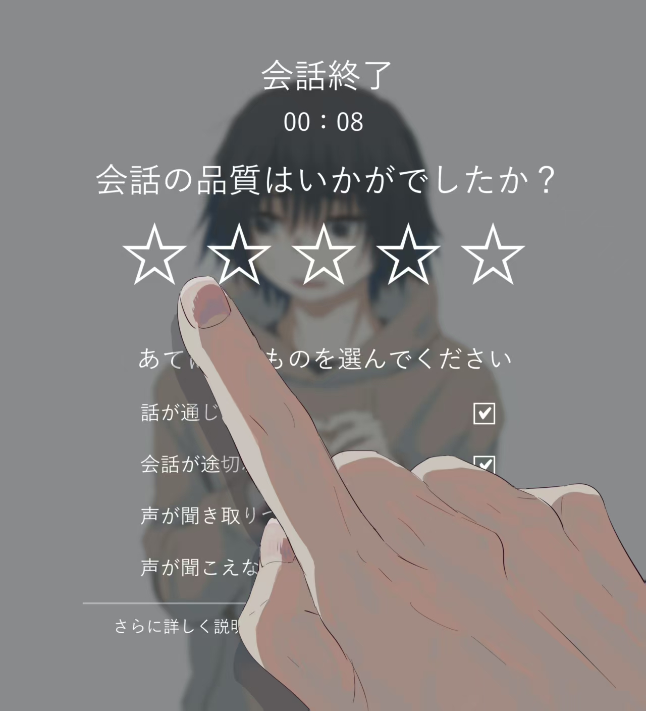

### 二十三、花火

他展望人生，发现并没有特别稀罕的东西。

### 二十四、画像

在一个冬日傍晚，他因看到一株玉米，蓦地联想起一位画家。长的高高的玉米，披着粗糙的叶子，培在根部的土里露出像神经那样纤细的根须。

### 二十五、释怀

他已经彻底忘记了她。

这两年间，他只将其看作是自己欺骗过去的自己。

### 二十六、看见

在焦躁的校园，他注意到一个安静的女生。

不过当时他不想走进其他人的生活。

他自己的生活一直是一团糟。

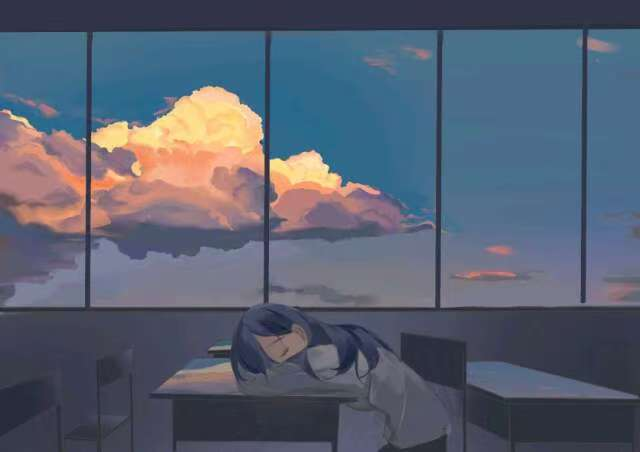

### 二十七、素昧平生

他在食堂的就餐桌上偶然遇见了她。就连在这样的白昼，他的脸也跟在月光下一样。他偷偷地目送着她（她俩素昧平生），感到从来没有过的寂寞。

### 二十八、失眠

他患了严重的失眠症，并且体力也开始衰弱了。医生给他的病做了一种判断：神经衰弱…

在很多夜晚，呼吸声都让他神经高度紧绷。

在宿舍，他开始耳机不离身的日子，通过耳机的声音，完全隔离外界，欺骗着自己的大脑。

### 二十九、药物

他开始囤积各种各样的药物，头痛对应的，睡眠对应的，感冒发烧对应的，牙炎对应的，胃痛对应的......

他自夸道，我这辈子像个医师。

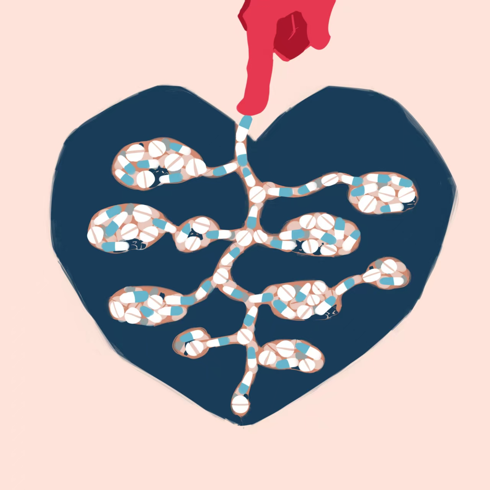

### 三十、偶遇

他同他的朋友在一条走道里走着。出人意料的正巧遇见她。在这样的白昼，她的面容恍若沐浴在月光下。他当着朋友的面，当然他连打招呼的勇气都没有。

### 三十一、背影

他走在她身后，望向她的背影。

他认为自己过于平庸。

### 三十二、窄门

他读到了安德烈纪德，读到了他的《窄门》。

他想，他倒是一直走在这窄门里。

### 三十三、A6

通过他的朋友推荐，他认识了Avogado6，一位插画师、影像作家、漫画家。

他被这位作家的作品深深吸引，他从中感到莫大的救赎。

### 三十四、龙华

他读到了一年高考语文的小说《千里江山图》。书中有一封未署名的信：

> 我一直想给你写一封信，但是不知道怎么落笔才不会泄露。
>
> 也许该用密写的方式写在纸上，或者用莫尔斯电码编成一段话，但是所有这些方式，都只是试图在万一被发现时无法破译。而我真正想对你说的并非秘密，可以写在云上，或者写在水上，世间任何人都可以看到，但那只是写给你的。犹如我此生说过的所有的话，被你的眼睛、耳朵捕获，像是盲文或者世界语，它的凸起，它对自然语言的模仿，那隐约的刺痛或者句法，为你的指端所记取。
>
> 我从来没有想过我们会分别。虽然，每分每秒都可能是我们永别的时刻。而如果我们能看着彼此分开，那已经是幸运了。
>
> 你大概读不到这封信，我也许已经不在了，已经离你很远，在某个我不知道的地方。
>
> 我不知道我应该在哪里等你，你才能找到我。但你会知道的吧？
>
> 我们并不指望在另一个世界重聚，我们挚爱的只有我们曾经所在的地方，即使将来没有人记得我们，这也是我们唯一愿意为之付出一切的地方。
>
> 我爱听你讲那些植物的故事，那些重瓣花朵，因为雄蕊和雌蕊的退化与变异显得更为艳丽，而那些单瓣花朵的繁衍能力更强。
>
> 什么时候你再去龙华吧，三四月间，桃花开时，上报恩塔，替我再看看龙华，看看上海。还有报恩塔东面的那片桃园，看看那些红色、白色和红白混色的花朵。
>
> 我们见过的，没见过的。听你讲所有的事，我们的过去，这个世界的未来。
>
> 有时候，我仿佛在暗夜中看见了我自己。看见我在望着你，在这个世界上，任何地方，一直望着你，望着夜空中那幸福迷人的星辰。

### 三十五、梦话

他的舍友对他说，他隔三岔五就会说梦话......

他希望自己不要无意中说出大逆不道的话......

### 三十六、期待

他背负太多人的期待，当他失败时，他觉得自己亏欠了很多人，唯独没有觉得亏欠了自己。

### 三十七、尝试

我告诉他，你还是要去试一试。

在1GB的日子他迈出了这一步。

### 三十八、秋冬

这个秋冬让他内心滚烫。

### 三十九、戏

他自导自演了这场戏，一切从他口里自圆其说。

这不是一个好借口，在外人看来，心机不正。

### 四十、病

他发觉她生病很重，但是他又能做什么呢？

他们之间只有寥寥数语。

他一向说不出令人暖心的话，一句谢谢他都说不出口。

他甚至连一句招呼都开不了口。

木讷是他觉得最丑陋的词，偏偏他自己就是。

他还是未能说出口，觉得自己很荒唐。

### 四十一、草稿

他向她聊天时都会打起草稿，但是每次回答都和他的稿子完全不同。

他觉得他像个傻子。

她觉得他像个疯子。

### 四十二、局促不安

这一场意外。

这场场意外。

### 四十三、合谋

他处处留意。

### 四十四、加戏

他总为自己加戏，没有回应时，他觉得就应该停止。但我觉得这或许是他自己的问题。

我尽可能说服他。

### 四十五、虚度年华

他好好想了想自己的前半生，觉得自己一直在虚度年华。

大学的时光，他几乎没有出过校门。我告诉他，你需要一场电影，或者和一顿火锅，或者一次闲庭漫步，或者一次旅行。

“和谁？”

“你自己一个人。”

“你知道的，陌生的地方容易迷路啊。”

“你对哪里不陌生？”

“我对什么都陌生。”

“矫揉造作。”

“我像一只老鼠。”

“老鼠还会过街。”

“人人喊打。”

“你要一直这样下去吗？”

“有什么不好。”

“你自己清楚。”

他当然清楚，这样的他自己也觉得令人不待见。

他需要一个向导。

### 四十六、尝试

他太笨拙，笨拙到需要手把手教他做事。

他太懦弱，懦弱到没有一点勇气去尝试。

他这样无名的人，这世上还有多少人。

### 四十七、戏作三昧

他拿起手帐，想记录下什么，可是发现，他的生活太乏味，没什么值得记录的。

望向其他人光鲜亮丽的人生，他觉得自己的存在可以一笔带过。

他的人生一直是贬义词。

### 四十八、梨云梦远

他发觉很多事情的可能性越来越小了。

像是黄粱一梦。

### 四十九、冰淇淋

他想尝尝冰淇淋的味道。

### 五十、抱怨

他总是向别人说出自己的软肋和无能，他对自己都觉得不耐烦。

### 五十一、火树银花

他再次展望自己的人生，仍是没有特别稀罕的东西。

他已经21岁了，本应人生而立，而他还是碌碌无为，找不到东南西北。

### 五十二、追忆

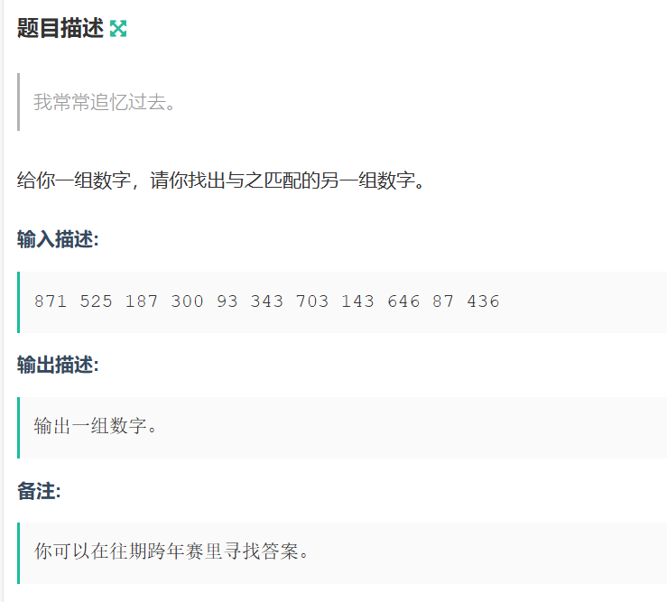
